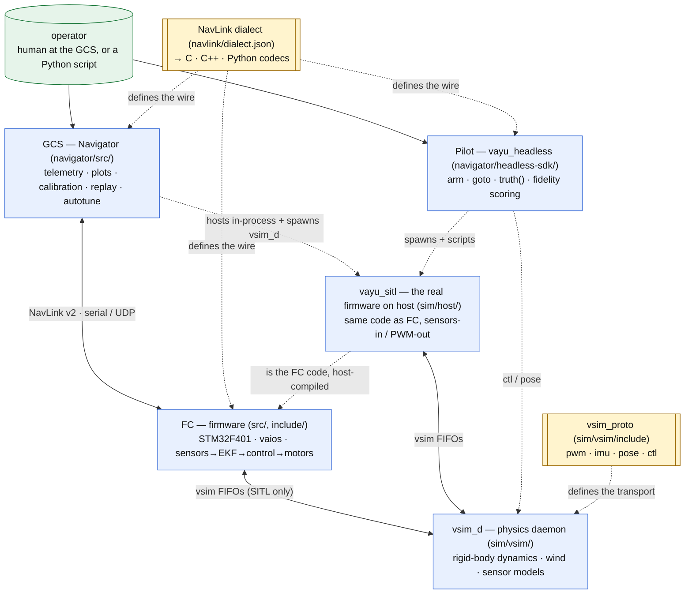

# Vayu — system architecture

Vayu is a full drone stack: real-time **flight-controller firmware**, a desktop
**ground station**, a **physics simulator** that runs the real firmware in the loop
(SITL), and a **headless scripting SDK** to fly it from Python. This page is the
map of how those pieces fit together and where to read deeper.

Four components, two shared contracts:

| Component | Lives in | What it is | Deep dive |
|-----------|----------|------------|-----------|
| **FC** (firmware) | `src/`, `include/` | STM32F401 @ 84 MHz, vaios RTOS: sensors → EKF → cascade control → motors | [docs/reference/software-flow.md](docs/reference/software-flow.md) |
| **NavLink** (wire) | `navlink/` | The message dialect; one spec generates C / C++ / Python codecs | [navlink/docs/reference/navlink-v2-spec.md](navlink/docs/reference/navlink-v2-spec.md) |
| **GCS** (Navigator) | `navigator/src/` | Qt6 ground station: telemetry, plots, calibration, replay, autotune | [navigator/docs/reference/gcs-architecture.md](navigator/docs/reference/gcs-architecture.md) |
| **Sim + Pilot** | `sim/vsim/`, `sim/host/`, `navigator/headless-sdk/` | `vsim_d` physics daemon, the SITL host, and the `vayu_headless` Pilot scripting API | [sim/vsim/docs/reference/sim-architecture.md](sim/vsim/docs/reference/sim-architecture.md) |

The two contracts are the seams that keep components decoupled: **NavLink** (the
FC↔GCS↔Pilot wire) and **vsim_proto** (the FC↔sim transport).

---

## System context



The same firmware control logic runs in all paths: on the board as **FC**, and on the
host as **vayu_sitl**. NavLink is generated from a single dialect, so the FC, the GCS,
and the Python SDK can never drift on the wire format.

---

## Runtime topologies

The pieces compose into three ways to fly, plus the tuner:

| Topology | Who runs | Link | Use |
|----------|----------|------|-----|
| **Hardware flight** | FC board + GCS | NavLink v2 over serial/UDP | real flying; GCS shows telemetry, sends commands |
| **In-app SITL** | GCS hosts the firmware **in-process** + spawns `vsim_d` | vsim FIFOs (PWM/IMU/pose) + in-process UART2 telemetry | fly the real firmware from the UI / a joystick, no hardware |
| **Headless SITL** | `vayu_headless` spawns `vayu_sitl` + `vsim_d` | vsim FIFOs + RC/UART PTYs | scripted missions, CI, fidelity tests — `Pilot.arm_takeoff` / `goto` |
| **Autotune** | an isolated `vayu_sitl` + `vsim_d` pair | vsim `ctl` test-rig + NavLink telemetry | search PID gains against step responses |

The **SITL seam** is a hard contract: the firmware only ever consumes sensors (IMU FIFO)
and RC, and emits PWM + telemetry — it never reads ground truth. The operator/Pilot *may*
read ground truth (the `pose` FIFO). This is what makes a SITL result trustworthy; it is
enforced at runtime (see the sim doc).

---

## SITL execution model (timing, pacing, determinism)

How the host SITL is *clocked* matters as much as what it runs. There are two host
backends and a shared virtual-clock foundation. See
[docs/plans/sitl-lockstep-sim.md](docs/plans/sitl-lockstep-sim.md) for the full design.

**Shared foundation — the virtual sim clock (always on in SITL).** The firmware's
timing (`v_get_ticks`, control-loop cadence, telemetry timestamps) is slaved to **sim
time**, not the wall clock — one tick per IMU sample. So sim time is exactly the sample
count, independent of how fast the host runs. This removes wall-clock `dt` jitter and is
the basis for running faster than realtime.

**Backend A — pthread SITL (`vayu_sitl`, default).** Each vaios task is a host pthread;
the virtual clock is a mutex/condvar driven by the IMU feeder. Faithful and battle-tested.
Pace it with vsim:

| vsim pacing | how | speed | fidelity |
|---|---|---|---|
| realtime (default) | `vsim_d` sleeps to `imu_hz` | 1× | full |
| lockstep (opt-in env `VSIM_LOCKSTEP=1`) | vsim runs as fast as the firmware returns PWM, bounded by a credit window (`VSIM_LOCKSTEP_CREDIT`, default **2**) | ~3× | faithful at credit≤2; higher credit is faster but adds control latency that can destabilise a *marginal* loop (validated — see `tools/autotune/validate_lockstep_determinism.py`) |

**Backend B — real vaios scheduler, in-process (`vayu_sitl_rtos`, opt-in build).** Runs
the **actual RTOS scheduler** on the host (ucontext port) instead of free pthreads, driven
by a single-threaded stepper, with **vsim physics linked in-process** (no FIFO, no second
process). Per sample: step physics → inject IMU → SysTick+1 → run the scheduler to idle
(firmware writes PWM) → read PWM back inline. Properties:

- **~57× realtime** — the two-process FIFO round-trip (which was ~98% of wall time) is gone.
- **Faithful** — PWM is read inline, never stale (no credit-window latency).
- **Deterministic** — single-threaded + seeded ⇒ **bit-identical** across runs.
- **Maximum fidelity** — the real scheduler (priorities, delays, semaphores) is under test,
  not a pthread approximation.

Backend B is the path to fast, reproducible autotune/regression; Backend A remains the
default and the one the GCS hosts in-process. Build/run commands for both are in
[Building and running](#building-and-running) below.

---

## Data-flow seams

- **FC ↔ GCS (NavLink v2):** telemetry down (attitude, IMU, RC, motors, health, control
  trace…) and commands up (arm, calibrate, set-PID, set-mode, time-sync). Sync `0x56`,
  version `0x02`, 24-bit msgids, CRC-16. Decoded identically for live, sim, and replay.
- **FC ↔ Sim (vsim_proto):** four `/tmp` FIFOs — `pwm` (FC→sim duty), `imu` (sim→FC
  sample), `pose` (sim→operator ground truth), `ctl` (operator→sim: reset/world/wind/
  rates/rig/faults). Per-session `VSIM_FIFO_SUFFIX` isolation.
- **Pilot ↔ SITL (scripting):** Python reads telemetry (`lab.telem`) and ground truth
  (`lab.truth()`), and actuates **only via RC sticks** — the same seam a human pilot uses.

---

## Repository map

| Path | Role |
|------|------|
| `src/`, `include/` | FC firmware (control, estimation, sensors, comm, RTOS glue) |
| `navlink/` | NavLink dialect (`dialect.json`), code generator, ABI, integration notes |
| `navigator/src/` | GCS Navigator (Qt6) |
| `navigator/headless-sdk/` | `vayu_headless` — the Pilot scripting SDK + fidelity scoring |
| `sim/vsim/` | `vsim_d` physics daemon + `vsim_proto.h` |
| `sim/host/` | the SITL host seam — pthread backend (`vayu_sitl`) + opt-in real-RTOS in-process backend (`vayu_sitl_rtos`, `host_rtos_*`), IMU/RC feeders, PWM/UART shims, virtual clock |
| `tools/autotune/` | PID autotuner (drives `vsim_d` directly) |
| `docs/` | documentation, organized per component into reference / plans / journal / scratch |

Documentation is organized **per component**, each with the same four lifecycle layers
(reference / plans / journal / scratch). Start at the
[documentation index](docs/README.md) for the taxonomy and the component map.

## Building and running

Each component is its own CMake project (or a Python package). All builds are
out-of-source into a `build*` dir. `-j$(nproc)` parallelises.

### 1. FC firmware (the board target)
ARM cross-build; the `arm-none-eabi-` toolchain is pinned in the firmware `CMakeLists.txt`.
```sh
cmake -S firmware -B build_flash                 # configure (ARM)
cmake --build build_flash -j$(nproc)      # -> build_flash/main(.elf), prints size
cmake --build build_flash --target flash  # objcopy -> .bin, flash via st-flash
```
Firmware options (append to the configure line): `-DEKF_SELFTEST=ON` (EKF self-test at
boot), `-DUSE_STANDARD_MATH=OFF` (use the firmware math backend; default ON).

### 2. vsim_d — physics daemon
```sh
cmake -S sim/vsim -B build_vsim && cmake --build build_vsim -j$(nproc)   # -> build_vsim/vsim_d
```

### 3. SITL host A — pthread (default backend)
```sh
cmake -S sim/host -B build_sitl && cmake --build build_sitl -j$(nproc)  # -> build_sitl/vayu_sitl + tests
ctest --test-dir build_sitl --output-on-failure                              # host unit tests
```
Options: `-DVAYU_SANITIZE=ON` (ASan+UBSan), `-DVAYU_COVERAGE=ON` (gcov; then
`cmake --build build_sitl --target coverage`).

### 4. SITL host B — real vaios scheduler, in-process (opt-in)
```sh
cmake -S sim/host -B build_sitl_rtos -DVAYU_SITL_RTOS_BUILD=ON
cmake --build build_sitl_rtos --target vayu_sitl_rtos -j$(nproc)   # -> build_sitl_rtos/vayu_sitl_rtos
./build_sitl_rtos/vayu_sitl_rtos                                   # self-contained: physics in-process, ~57x, deterministic
```
Self-contained — it does **not** need a separate `vsim_d` (physics is linked in).

### 5. GCS — Navigator (Qt6)
```sh
cmake -S navigator -B navigator/build && cmake --build navigator/build -j$(nproc)
```
Requires Qt6 (Core, Widgets, SerialPort, Network, OpenGL/Widgets). The GCS can host the
pthread SITL in-process and spawn `vsim_d` for in-app simulation.

### 6. Headless SDK — the Pilot scripting API
```sh
python3 -m venv .venv
./.venv/bin/pip install -e "navigator/headless-sdk[test]"
# point it at the binaries from steps 2 + 3:
export VSIM_BIN=$PWD/build_vsim/vsim_d VAYU_SITL_BIN=$PWD/build_sitl/vayu_sitl
```

### 7. Autotune (Python; drives `vsim_d` + `vayu_sitl` directly)
Needs steps 2 + 3 built, then:
```sh
cd tools/autotune && python3 autotune.py --optimizer spsa --budget 50 --apply
python3 validate_lockstep_determinism.py          # lockstep fidelity/credit sweep
```

### Running standalone SITL (backend A)
Start `vsim_d`, then `vayu_sitl`, sharing one `VSIM_FIFO_SUFFIX`:
```sh
export VSIM_FIFO_SUFFIX=_s1
./build_vsim/vsim_d &                  # realtime by default
VSIM_LOCKSTEP=1 ./build_vsim/vsim_d &  # OR: ~3x faster-than-realtime pacing
./build_sitl/vayu_sitl
```

### Opt-in flags reference
| Flag | Kind | Default | Effect |
|---|---|---|---|
| `VAYU_SITL_RTOS_BUILD` | CMake (`-D…=ON`) | OFF | build the real-RTOS in-process SITL (`vayu_sitl_rtos`, backend B) |
| `VAYU_SANITIZE` | CMake | OFF | ASan + UBSan on SITL + tests |
| `VAYU_COVERAGE` | CMake | OFF | gcov instrumentation + `coverage` target |
| `EKF_SELFTEST` | CMake (firmware) | OFF | run the EKF self-test at boot |
| `USE_STANDARD_MATH` | CMake (firmware) | ON | `math.h` backend vs the firmware's |
| `VSIM_LOCKSTEP` | env (runtime) | unset (realtime) | `vsim_d` runs faster than realtime via PWM-backpressure pacing (backend A) |
| `VSIM_LOCKSTEP_CREDIT` | env | 2 | lockstep credit window; ≤2 faithful, higher = faster but risks desync on a marginal loop |
| `VSIM_FIFO_SUFFIX` | env | empty | per-session FIFO/pty isolation (run many SITL stacks at once) |
| `VAYU_UART_RC_PATH`, `VAYU_VFS_DIR` | env | pty / `/tmp/vayu_vfs` | RC serial path; on-disk backing for the host VFS (persisted `pid.bin`) |

Not opt-in (always on in SITL): the **virtual sim clock** — firmware timing is slaved to
sim time in both host backends.

---

## Where to go next

- New to the firmware? → [docs/reference/software-flow.md](docs/reference/software-flow.md)
- Wire format / adding a message? → [navlink/docs/reference/navlink-v2-spec.md](navlink/docs/reference/navlink-v2-spec.md)
- Hacking the ground station? → [navigator/docs/reference/gcs-architecture.md](navigator/docs/reference/gcs-architecture.md)
- Scripting a SITL flight? → [sim/vsim/docs/reference/sim-architecture.md](sim/vsim/docs/reference/sim-architecture.md) (§5, the Pilot API)
