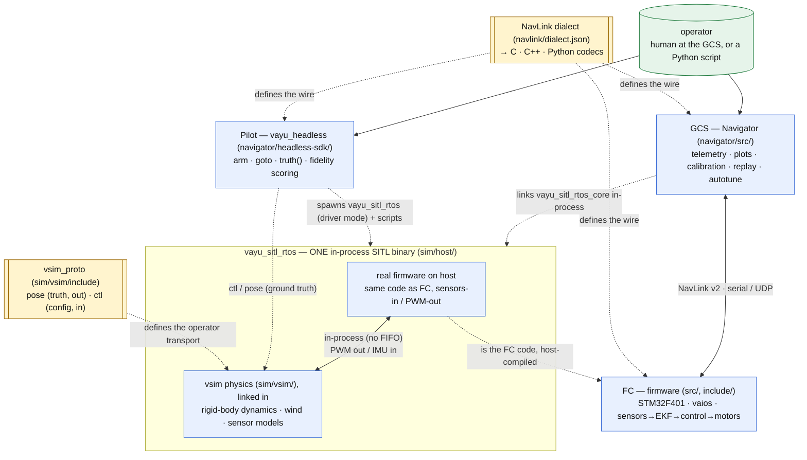

# Vayu — system architecture

Vayu is a full drone stack: real-time **flight-controller firmware**, a desktop
**ground station**, a **physics simulator** that runs the real firmware in the loop
(SITL), and a **headless scripting SDK** to fly it from Python. This page is the
map of how those pieces fit together and where to read deeper.

Four components, two shared contracts:

| Component | Lives in | What it is | Deep dive |
|-----------|----------|------------|-----------|
| **FC** (firmware) | `src/`, `include/` | STM32F401 @ 84 MHz, vaios RTOS: sensors → EKF → cascade control → motors | [firmware/docs/reference/software-flow.md](firmware/docs/reference/software-flow.md) |
| **NavLink** (wire) | `navlink/` | The message dialect; one spec generates C / C++ / Python codecs | [navlink/docs/reference/navlink-v2-spec.md](https://github.com/ragnar-vallhala/navlink/blob/main/docs/reference/navlink-v2-spec.md) |
| **GCS** (Navigator) | `navigator/src/` | Qt6 ground station: telemetry, plots, calibration, replay, autotune | [navigator/docs/reference/gcs-architecture.md](https://github.com/ragnar-vallhala/vayu-navigator/blob/main/navigator/docs/reference/gcs-architecture.md) |
| **Sim + Pilot** | `sim/vsim/`, `sim/host/`, `navigator/headless-sdk/` | `vayu_sitl_rtos` — the real firmware **and** the vsim physics fused into one in-process binary — plus the `vayu_headless` Pilot scripting API | [sim/vsim/docs/reference/sim-architecture.md](sim/vsim/docs/reference/sim-architecture.md) |

The two contracts are the seams that keep components decoupled: **NavLink** (the
FC↔GCS↔Pilot wire) and **vsim_proto** (the physics↔operator transport; the
FC↔physics hop is now in-process, not a wire).

---

## System context



The same firmware control logic runs in all paths: on the board as **FC**, and on the
host inside **vayu_sitl_rtos** (which fuses that firmware with the vsim physics in one
deterministic process). NavLink is generated from a single dialect, so the FC, the GCS,
and the Python SDK can never drift on the wire format.

---

## Runtime topologies

All three ways to fly drive the **one** SITL binary, `vayu_sitl_rtos` (firmware +
physics fused in-process); plus the tuner:

| Topology | Who runs | Link | Use |
|----------|----------|------|-----|
| **Hardware flight** | FC board + GCS | NavLink v2 over serial/UDP | real flying; GCS shows telemetry, sends commands |
| **In-app SITL** | GCS links `vayu_sitl_rtos_core` **in-process** (no subprocess) | in-process; UART2 telemetry via callback | fly the real firmware from the UI / a joystick, no hardware |
| **Headless SITL** | `vayu_headless` spawns `vayu_sitl_rtos` in driver mode | `pose`/`ctl` FIFOs + RC/UART2 PTYs | scripted missions, CI, fidelity tests — `Pilot.arm_takeoff` / `goto` |
| **Autotune** | `tools/autotune` spawns `vayu_sitl_rtos` in driver mode (or the faster in-process `rtos_eval.py` batch backend) | `ctl` test-rig + NavLink telemetry / `#RTOS-TUNE` | search / analytically place PID gains against step responses |

The **SITL seam** is a hard contract: the firmware only ever consumes sensors (IMU) and
RC, and emits PWM + telemetry — it never reads ground truth. The operator/Pilot *may*
read ground truth (the `pose` FIFO). This is what makes a SITL result trustworthy; it is
enforced at runtime (see the sim doc).

---

## SITL execution model (timing, determinism)

How the host SITL is *clocked* matters as much as what it runs. SITL is a **single
in-process binary**, `vayu_sitl_rtos`, that runs the **actual vaios scheduler** on the
host (ucontext port) with the **vsim physics linked in** — one deterministic process, no
FIFO round-trip, no second process. See
[firmware/docs/plans/sitl-lockstep-sim.md](firmware/docs/plans/sitl-lockstep-sim.md) for the full design.

**The virtual sim clock (always on in SITL).** The firmware's timing (`v_get_ticks`,
control-loop cadence, telemetry timestamps) is slaved to **sim time**, not the wall clock
— one tick per IMU sample. So sim time is exactly the sample count, independent of how
fast the host runs. This removes wall-clock `dt` jitter and is the basis for running
faster than realtime.

**The stepper.** A single-threaded loop drives the whole stack. Per sample: step physics
→ inject IMU → SysTick+1 → run the scheduler to idle (firmware writes PWM) → read PWM back
inline. Properties:

- **~57× realtime** — the old two-process FIFO round-trip (which was ~98% of wall time) is gone.
- **Faithful** — PWM is read inline, never stale.
- **Deterministic** — single-threaded + seeded ⇒ **bit-identical** across runs.
- **Maximum fidelity** — the real scheduler (priorities, delays, semaphores) is under test,
  not a pthread approximation.

This is the path to fast, reproducible autotune/regression, and it is also what the GCS
links in-process for in-app SITL. (The former pthread host `vayu_sitl` and the standalone
`vsim_d` physics daemon have been retired; the `vayu_sitl_core` static library survives
only as the link target for the firmware **unit-test** suite, not as a runnable SITL.)
Build/run commands are in [Building and running](#building-and-running) below.

---

## Data-flow seams

- **FC ↔ GCS (NavLink v2):** telemetry down (attitude, IMU, RC, motors, health, control
  trace…) and commands up (arm, calibrate, set-PID, set-mode, time-sync). Sync `0x56`,
  version `0x02`, 24-bit msgids, CRC-16. Decoded identically for live, sim, and replay.
- **FC ↔ physics:** now **in-process** inside `vayu_sitl_rtos` — PWM out / IMU in are
  direct calls, no FIFO. Only the **operator** transport remains on the wire (vsim_proto):
  `pose` (physics→operator ground truth, out) and `ctl` (operator→physics: reset/world/
  wind/rates/rig/faults, in), plus the UART2 telemetry PTY. Per-session `VSIM_FIFO_SUFFIX`
  isolation. (The old `pwm`/`imu`/`baro` FIFOs are gone — that hop is fused.)
- **Pilot ↔ SITL (scripting):** Python reads telemetry (`lab.telem`) and ground truth
  (`lab.truth()`), and actuates **only via RC sticks** — the same seam a human pilot uses.

---

## Repository map

| Path | Role |
|------|------|
| `src/`, `include/` | FC firmware (control, estimation, sensors, comm, RTOS glue) |
| `navlink/` | NavLink dialect (`dialect.json`), code generator, ABI, integration notes |
| `navigator/src/` | GCS Navigator (Qt6) |
| `navigator/headless-sdk/` | `vayu_headless` — the Pilot scripting SDK + fidelity scoring |
| `sim/vsim/` | vsim physics sources (`sim_controller`/`physics_core`/`motor_model`/`sensor_models`) + `vsim_proto.h` — linked in-process into `vayu_sitl_rtos`, not a standalone daemon |
| `sim/host/` | the SITL host seam — builds `vayu_sitl_rtos` (real vaios scheduler + vsim physics fused, `host_rtos_*`), IMU/RC feeders, PWM/UART shims, virtual clock; also the `vayu_sitl_core` unit-test link lib |
| `tools/autotune/` | PID autotuner (spawns `vayu_sitl_rtos` in driver mode; `rtos_eval.py` is the in-process batch backend) |
| `docs/` | documentation, organized per component into reference / plans / journal / scratch |

Documentation is organized **per component**, each with the same four lifecycle layers
(reference / plans / journal / scratch). Start at the
[documentation index](firmware/docs/README.md) for the taxonomy and the component map.

## Building and running

Each component is its own CMake project (or a Python package). All builds are
out-of-source into a `build*` dir. `-j$(nproc)` parallelises.

### 1. FC firmware (the board target)
ARM cross-build; the `arm-none-eabi-` toolchain is pinned in the firmware `CMakeLists.txt`.
```sh
cmake -S firmware -B build_flash                 # configure (ARM)
cmake --build build_flash -j$(nproc)      # -> build_flash/main(.elf), prints size
cmake --build build_flash --target flash  # objcopy -> .bin, flash via st-flash
```
Firmware options (append to the configure line): `-DEKF_SELFTEST=ON` (EKF self-test at
boot), `-DUSE_STANDARD_MATH=OFF` (use the firmware math backend; default ON).

### 2. SITL — the one in-process binary (`vayu_sitl_rtos`)
The real firmware and the vsim physics fused into one deterministic process (real vaios
scheduler + physics linked in, ~57× realtime). This is the SITL binary all consumers drive.
```sh
cmake -S sim/host -B build_sitl_rtos -DVAYU_SITL_RTOS_BUILD=ON
cmake --build build_sitl_rtos --target vayu_sitl_rtos -j$(nproc)   # -> build_sitl_rtos/vayu_sitl_rtos
./build_sitl_rtos/vayu_sitl_rtos                                   # self-contained: physics in-process, deterministic
```
Self-contained — it does **not** need a separate physics daemon (physics is linked in).

### 3. Firmware host unit tests
The `vayu_sitl_core` static library survives only as the link target for the host
unit-test suite (**not** a runnable SITL):
```sh
cmake -S sim/host -B build_sitl && cmake --build build_sitl -j$(nproc)  # -> unit tests
ctest --test-dir build_sitl --output-on-failure
```
Options: `-DVAYU_SANITIZE=ON` (ASan+UBSan), `-DVAYU_COVERAGE=ON` (gcov; then
`cmake --build build_sitl --target coverage`).

### 4. GCS — Navigator (Qt6)
```sh
cmake -S navigator -B navigator/build && cmake --build navigator/build -j$(nproc)
```
Requires Qt6 (Core, Widgets, SerialPort, Network, OpenGL/Widgets). The GCS links
`vayu_sitl_rtos_core` **in-process** for in-app simulation — no subprocess.

### 5. Headless SDK — the Pilot scripting API
```sh
python3 -m venv .venv
./.venv/bin/pip install -e "navigator/headless-sdk[test]"
# point it at the SITL binary from step 2:
export VAYU_SITL_RTOS_BIN=$PWD/build_sitl_rtos/vayu_sitl_rtos
```
The SDK spawns `vayu_sitl_rtos` in **driver mode** (`VAYU_RTOS_SCENARIO=driver`).

### 6. Autotune (Python; spawns `vayu_sitl_rtos`)
Needs step 2 built, then:
```sh
cd tools/autotune && python3 autotune.py --optimizer spsa --budget 50 --apply
python3 rtos_eval.py                              # in-process batch eval backend
```

### Running standalone SITL (driver mode)
`vayu_sitl_rtos` in driver mode is a drop-in for the old daemon+host pair over the same
wire contract: it creates the `pose` (ground-truth, out) + `ctl` (config, in) FIFOs,
advertises the UART2 telemetry PTY, and reads RC over `VAYU_UART_RC_PATH`:
```sh
export VSIM_FIFO_SUFFIX=_s1
VAYU_RTOS_SCENARIO=driver ./build_sitl_rtos/vayu_sitl_rtos
```

### Opt-in flags reference
| Flag | Kind | Default | Effect |
|---|---|---|---|
| `VAYU_SITL_RTOS_BUILD` | CMake (`-D…=ON`) | OFF | build the in-process SITL binary (`vayu_sitl_rtos`) |
| `VAYU_SANITIZE` | CMake | OFF | ASan + UBSan on the host tests |
| `VAYU_COVERAGE` | CMake | OFF | gcov instrumentation + `coverage` target |
| `EKF_SELFTEST` | CMake (firmware) | OFF | run the EKF self-test at boot |
| `USE_STANDARD_MATH` | CMake (firmware) | ON | `math.h` backend vs the firmware's |
| `VAYU_SITL_RTOS_BIN` | env (runtime) | — | path to the `vayu_sitl_rtos` binary (SDK / autotune / harness spawn it) |
| `VAYU_RTOS_SCENARIO` | env | built-in | `driver` = interactive/headless driver mode (pose/ctl FIFOs + UART2/RC PTYs) |
| `VSIM_FIFO_SUFFIX` | env | empty | per-session FIFO/pty isolation (run many SITL sessions at once) |
| `VAYU_UART_RC_PATH`, `VAYU_VFS_DIR` | env | pty / `/tmp/vayu_vfs` | RC serial path; on-disk backing for the host VFS (persisted `pid.bin`) |

Not opt-in (always on in SITL): the **virtual sim clock** — firmware timing is slaved to
sim time.

---

## Where to go next

- New to the firmware? → [firmware/docs/reference/software-flow.md](firmware/docs/reference/software-flow.md)
- Wire format / adding a message? → [navlink/docs/reference/navlink-v2-spec.md](https://github.com/ragnar-vallhala/navlink/blob/main/docs/reference/navlink-v2-spec.md)
- Hacking the ground station? → [navigator/docs/reference/gcs-architecture.md](https://github.com/ragnar-vallhala/vayu-navigator/blob/main/navigator/docs/reference/gcs-architecture.md)
- Scripting a SITL flight? → [sim/vsim/docs/reference/sim-architecture.md](sim/vsim/docs/reference/sim-architecture.md) (§5, the Pilot API)
