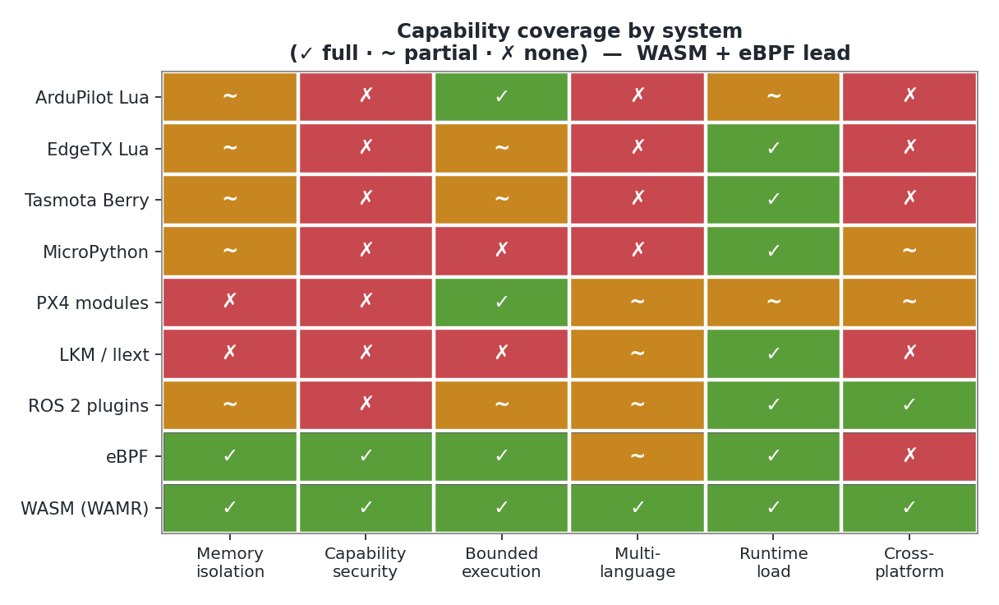
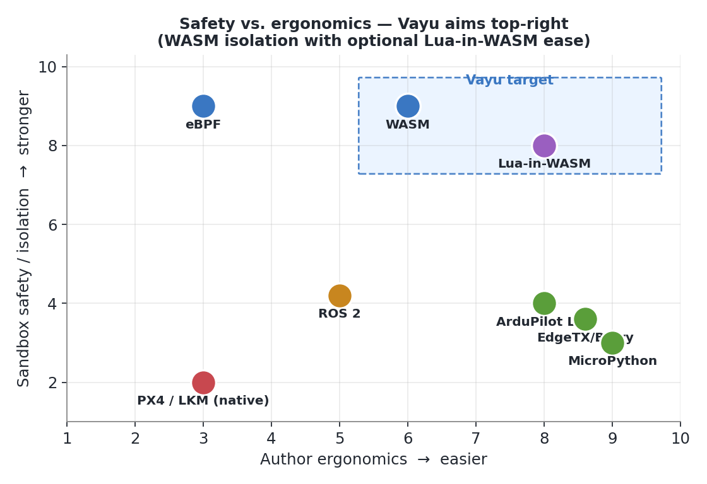
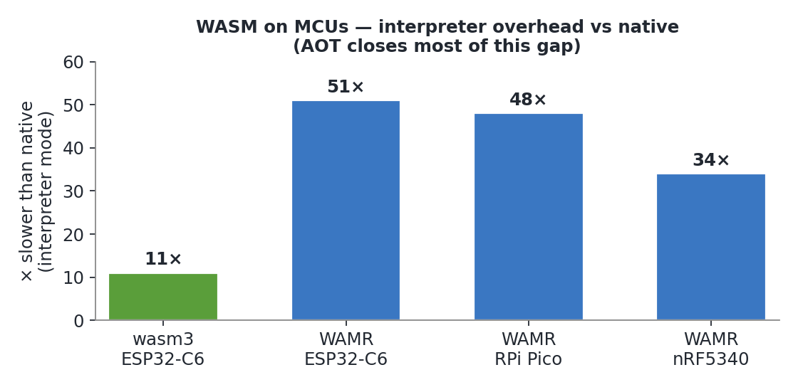
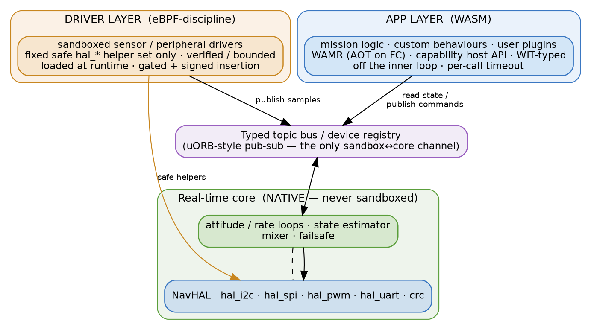

# Vayu Application Layer & Sandboxed Driver Modules — Design Analysis

**Status:** Draft / design study
**Audience:** Vayu firmware + platform architects
**Scope:** A sandboxed *application layer* (WASM and/or Lua) that runs the same on the
flight controller (STM32-class MCU), desktop, and phone, **plus** an eBPF-style
*loadable driver layer* — "kernel modules you can insert safely" — for sensors and
peripherals, binding to NavHAL.

---

## 0. Why this document exists

Vayu wants an extensibility story that is **better than ArduPilot's Lua scripting**:

1. **An application layer** — mission logic, custom estimators/behaviours, user
   plugins — running in a **sandbox** so a bad app cannot take down the flight stack.
2. **Loadable sensor/peripheral drivers** — inserted at runtime like kernel modules,
   but **safe**: a buggy driver must not be able to corrupt or crash the core.
3. **One model across targets** — the same app/driver concept on the **FC firmware**,
   the **desktop GCS**, and a **phone** app.

Two technologies are on the table — a **WASM sandbox** and a **Lua sandbox** — and the
"kernel module" idea points at a third, less obvious reference: **eBPF**, the only
mainstream system that lets you insert code into a privileged context *and proves it
safe before it runs*.

This document surveys how the existing systems work, where they fall short, and
proposes a two-layer architecture for Vayu. Claims are cited; figures that vary by
build/version are flagged. The research behind it is summarised in
[Appendix A](#appendix-a-system-survey) with sources in [References](#references).

---

## 1. Requirements & success criteria

| # | Requirement | Why it matters |
|---|---|---|
| R1 | App code **cannot crash or hang** the flight-control loop | Safety of flight is non-negotiable |
| R2 | **Memory isolation** between app code and core (and between apps) | A leak/overrun in an app must stay contained |
| R3 | **Bounded execution** — per-invocation CPU budget, no unbounded loops on the RT core | Determinism / scheduling guarantees |
| R4 | **Capability security** — an app/driver only touches what it is granted | Run untrusted/community modules without trusting them with the airframe |
| R5 | **Loadable at runtime** without reflashing firmware | Field updates, rapid iteration, third-party drivers |
| R6 | **Typed, stable driver/sensor interface** decoupled from core internals | Avoid ArduPilot's binding-maintenance tax |
| R7 | **Same module concept on FC + desktop + phone** | One SDK, portable apps, sim/HIL parity |
| R8 | **Hot-reload / fast iteration** (at least on desktop/sim) | Developer experience |
| R9 | Suitable language(s) for app authors (not just C) | Lower the contribution barrier |

The hard constraint is **R1–R3 on a Cortex-M MCU**: whatever we run on the FC shares a
processor with a hard-real-time control loop (Vayu's attitude/rate loops). The
universal lesson from every system below is: **keep the sandboxed layer OFF the inner
control loop.** Apps and loadable drivers run in the *supervisory / glue / slow-driver*
band; stabilization stays native.

---

## 2. The landscape in one table

| System | Language | Sandbox / safety model | Isolation | Runtime cost | Key limitation |
|---|---|---|---|---|---|
| **ArduPilot AP_Scripting** | Lua 5.3 (interpreted) | Sandbox table + instruction watchdog + separate low-prio thread/heap | Soft (shared VM/heap) | 43–200 KB heap default | Interpreted, no JIT; jitter; reboot to load; **no capability security**; binding tax |
| **EdgeTX / OpenTX** | Lua | Reactive "kill on error/low-mem" | Soft | 128 KB–8 MB RAM by radio | Tiny RAM; reactive-only safety |
| **Tasmota Berry** | Berry (Lua-like) | Embedded VM | Soft | **core <40 KiB / <4 KiB heap** (Cortex-M4) | Interpreted, not hard-RT |
| **MicroPython / CircuitPython** | Python subset | Embedded VM + GC | Soft | ~256 KB flash / 32 KB RAM floor | **~1 ms GC pauses** → not hard-RT |
| **PX4 modules + uORB** | C/C++ (native) | **None** — single address space | **None** | native | Trusted code only; no isolation |
| **eBPF** | restricted C → bytecode | **Static verifier + restricted helpers + maps + cap-gated load** | **Verified-safe** | near-native (JIT) | Restrictive: bounded loops, 512 B stack, ~1 M insn cap |
| **Linux LKM / Zephyr llext** | C (native ELF) | **None** (kernel privilege) unless MPU | None (default) | native | Unsandboxed; can crash host — the anti-pattern |
| **ROS 2 components / pluginlib** | C++ (`dlopen`) | None in-container; OS process isolation across | Optional (process) | native + DDS | `dlopen` shares address space |
| **WASM (WAMR / wasm3 / Wasmtime)** | Rust/C/AS/TinyGo/Zig → WASM | **Linear-memory isolation + import boundary + WASI capabilities** | **Hard (per-module)** | interp ~11–51× native; AOT near-native | Toolchain/AOT complexity; Component Model immature on MCU |



*Figure 1 — Capability coverage across systems. WASM (WAMR) and eBPF are the only rows
that satisfy memory isolation **and** capability security **and** bounded execution; the
interpreted-scripting systems are soft on isolation/capabilities, and the native module
systems (PX4/LKM/ROS 2) have no isolation at all.*



*Figure 2 — The core design tension. Interpreted scripting (ArduPilot/EdgeTX/Berry/
MicroPython) is easy but weakly isolated; native modules are powerful but unsafe; eBPF
and WASM are strongly isolated. Vayu targets the top-right: WASM isolation, with an
optional Lua-in-WASM "easy mode" to recover scripting ergonomics without giving up the
sandbox.*

Two of these are the load-bearing references for Vayu:

- **WASM** — the only option that gives **hard memory isolation + capability security +
  multi-language** with a footprint that fits an MCU (via WAMR/wasm3) *and* runs
  natively on desktop/phone. This is the **app layer**.
- **eBPF** — the only model that lets you **safely insert driver-like code into a
  privileged context** via a *verifier + restricted helper API + maps*. This is the
  template for the **loadable driver layer**.

Everything else is either *unsafe by design* (PX4, LKM, llext, ROS 2 — great interface
patterns, no isolation) or *soft-sandboxed interpreted scripting* (ArduPilot, EdgeTX,
Tasmota, MicroPython — fine for glue, weak on isolation/capabilities/determinism).

---

## 3. Deep dive: ArduPilot Lua (the bar we must clear)

ArduPilot's `AP_Scripting` is the most directly comparable system and the one Vayu
wants to beat, so it gets the most detail.

**How it works**
- Vendored **Lua 5.3** interpreter (source header on master reads `5.3.6`; the user
  wiki still says `5.3.5` — verify per branch). **No LuaJIT** on embedded.
- Runs in its **own low-priority thread** (`PRIORITY_SCRIPTING`), separate from the
  real-time main loop — the core safety property. Stack default 17 KB (8–64 KB);
  priority configurable via `SCR_THD_PRIORITY`.
- **Cooperative scheduler**: a script's `update()` does a little work and returns
  `update, delay_ms` to reschedule. Docs explicitly state scripts "are not guaranteed
  to be run on a reliable schedule"; ~50 Hz is the practical ceiling.
- **Instruction watchdog**: `lua_sethook` enforces a per-slice budget
  (`SCR_VM_I_COUNT`, default 10 000, range 1 000–1 000 000); overrun throws a Lua error.
- **Separate heap** `SCR_HEAP_SIZE`: board-dependent default (≈43 KB small boards,
  100 KB / 200 KB larger; range 1 KB–1 MB). Over-sizing starves the EKF / terrain
  following; under-sizing → pre-arm OOM.
- **Bindings are code-generated** from `bindings.desc` (singletons, methods, userdata,
  compile-time range checks); dynamic glue (MAVLink, I2C, sockets) is hand-written in
  `lua_bindings.cpp`. Scripts reach AHRS, GCS, params, servos/relays, SERIALx, I2C
  (max 4 devices), SPI, CAN, EFI, sockets, and can add their own parameters.
- **Loading**: scripts live on the SD card (`APM/scripts`), loaded at boot; aux
  function 316 restarts scripting without a full reboot, but there is no live REPL.

**What it gets right (and we should keep)**
- Off-RT-path execution on a dedicated low-priority thread.
- A per-invocation instruction budget + separate heap.
- A declarative, auto-generated binding layer (typed, range-checked).
- A rich applet ecosystem (aerobatics, ship landing, EFI drivers, NTRIP, payload
  damping) proving the *value* of an app layer.

**Where it falls short (R-numbers map to §1)**

1. **No capability security (R4).** The sandbox curates the stdlib but every enabled
   script gets the *full* binding surface — servos, params, MAVLink, I2C. There is no
   per-script permission model and no signing/trust model. Running an untrusted applet
   is trusting it with the airframe.
2. **Soft isolation (R2).** All scripts share one VM, one thread, one heap. One
   script's memory hunger affects all; a Lua panic / OOM **terminates all scripts at
   once**; there have been "stuck in GC on OOM" lockups.
3. **Interpreted, jittery, not deterministic (R3).** Plain Lua 5.3 bytecode on
   Cortex-M; heavy work blows the instruction budget; callback timing is best-effort.
   Unusable for anything near a control loop.
4. **Reboot-centric loading (R5/R8).** Edit → copy to SD → reboot. No real hot-reload,
   no on-vehicle debugger; feedback is `gcs:send_text` + pre-arm errors.
5. **Binding-maintenance tax (R6).** Every new core API a script needs must be
   hand-added to `bindings.desc` + `docs.lua` and the firmware rebuilt. "Feature X
   isn't exposed to Lua yet" is a constant friction point.
6. **Single language (R9).** Lua only.
7. **No portability story (R7).** The scripting layer is FC-centric; there is no
   first-class "same module on desktop/phone."

> **Conclusion:** ArduPilot proves the *demand* and a workable *off-loop scheduling
> model*, but its sandbox is soft, uncapability'd, single-language, FC-only, and
> reboot-bound. Those seven gaps are precisely Vayu's opportunity.

---

## 4. The two enabling technologies

### 4.1 WebAssembly — the app-layer sandbox

WASM gives, out of the box, the three things Lua scripting lacks:

- **Hard memory isolation (R2).** A module sees only its own linear memory; all host
  interaction crosses the **import boundary**, which the host fully controls.
- **Capability security (R4).** The host decides exactly which functions a module can
  import. With **no WASI** on the FC, a module can touch *only* the narrow host API we
  expose (`read_sensor`, `set_actuator`, …) — the strictest possible attack surface.
  WASI Preview 2 / the **Component Model** formalise capability passing for the
  desktop/phone side.
- **Bounded execution (R3).** Wasmtime's **fuel** metering is deterministic ("the same
  program with the same fuel interrupts at the same instruction"); **epoch** is a
  ~10% cheaper non-deterministic alternative. On the FC, **WAMR has no built-in fuel**
  today — bound execution with **AOT compilation + a host-side watchdog timeout +
  stack/heap limits** instead.

Runtime choice by target:

| Target | Runtime | Mode | Rationale |
|---|---|---|---|
| **FC (STM32)** | **WAMR** | **AOT** (`wamrc` thumbv7) | Runs on Cortex-M; AOT removes interpreter jitter; one module format shared with desktop. (wasm3 only if flash/RAM is brutally tight — pure interpreter, ~11–51× native.) |
| **Desktop GCS** | **Wasmtime** (or WAMR) | JIT/AOT | Mature Component Model + WASI 0.2 + **fuel** determinism for sim/HIL |
| **Phone** | **WAMR** (embeddable, Android/iOS) or platform host | interp/AOT | One runtime with the FC; small embed |

**Multi-language (R9):** Rust and C are the safe bets for small predictable modules;
AssemblyScript / TinyGo widen the contributor pool at some size/perf cost.

**Typed driver interfaces (R6):** define interfaces in **WIT** (the Component Model
IDL) with **worlds** (the import/export contract) and **resource handles** (pass a
*capability by reference* — a `sensor` or `actuator` handle — without exposing raw
pointers). Run them as real components on desktop/phone; bridge to plain WAMR host
functions on the FC until the Component Model matures on MCUs.

**Footprint reality check:** WAMR README text-section sizes are ~29–59 KB and a
"3 KB-DRAM hello world" is cited, but an independent MCU study measured ~280–480 KB
*working set* for a real app+heap on Pico/ESP32-C6/nRF5340 (interpreter mode). **Measure
on the actual STM32 + build flags before committing a memory budget.**



*Figure 3 — Interpreter-mode slowdown vs native on Cortex-M-class MCUs (independent
study). This is the worst case — **AOT compilation closes most of the gap** — but it is
exactly why the sandbox must stay off the inner control loop.*

### 4.2 eBPF — the safe-loadable-driver template

The "kernel module you can insert" requirement is exactly what eBPF solves for Linux,
and it does so **without** the LKM/llext/PX4 danger of unsandboxed kernel-privilege
code. The transferable pieces:

1. **A verifier.** eBPF programs are statically proven safe at *load* time (abstract
   interpretation over all paths) before they ever run: **512-byte stack**, bounded
   loops only, mandatory bounds checks, all paths must terminate, instruction-count
   cap (~1 M privileged). Rejected programs never execute → "zero runtime impact" from
   bad code.
2. **A restricted helper API.** Programs cannot make arbitrary calls; they may only
   call a small, **program-type-specific** set of kernel helpers. *This is our model
   for sensor/peripheral access:* a fixed, audited set of `hal_i2c_read`,
   `hal_spi_xfer`, `hal_pwm_set`, `hal_gpio` helpers — nothing else.
3. **Maps.** The controlled key/value channel for state shared between a module and the
   trusted core (and between modules). *Our analog:* a typed topic/registry the driver
   publishes samples into and reads config from — never raw core memory.
4. **Capability-gated insertion.** Loading is privileged; insertion is the trust
   boundary.

For Vayu, the **driver layer** should adopt this shape: a **verified or
capability-confined bytecode module** with a **fixed safe HAL-helper API** and a
**typed data channel**, *loadable at runtime* but unable to crash the core.

**What NOT to copy:** LKMs, Zephyr **llext**, PX4 modules, and ROS 2 `dlopen` plugins
all give you the *loading mechanism* (ELF relocation, registration, containers) but run
in a **shared address space with full privilege** — a faulty module crashes the host.
Use llext-style relocation (or WASM loading) as the *mechanism*; use eBPF's
verifier+helper+maps as the *safety model*; reject their default trust posture.

---

## 5. Proposed architecture for Vayu

A **two-layer** model sitting beside the native real-time core, both bound to NavHAL.



*Figure 4 — Proposed architecture. The real-time core and NavHAL stay native. The WASM
app layer and the eBPF-discipline driver layer reach the core only through a typed topic
bus (never shared memory), and the driver layer reaches hardware only through a fixed,
audited set of safe `hal_*` helpers.*

```
┌──────────────────────────────────────────────────────────────────┐
│  Vayu firmware (STM32) / GCS (desktop) / phone app                 │
│                                                                    │
│  ┌── Real-time core (NATIVE, never sandboxed) ───────────────────┐ │
│  │  attitude/rate loops · state estimator · mixer · failsafe      │ │
│  │  NavHAL: hal_i2c / hal_spi / hal_pwm / hal_uart / crc ...       │ │
│  └───────▲───────────────────────────────▲──────────────────────┘ │
│          │ typed topics (maps)            │ safe HAL helpers        │
│  ┌───────┴───────────────┐   ┌────────────┴─────────────────────┐  │
│  │ APP LAYER (WASM)       │   │ DRIVER LAYER (eBPF-style)         │  │
│  │ mission logic, custom  │   │ sandboxed sensor/peripheral       │  │
│  │ behaviours, user apps  │   │ drivers, verified + helper-only   │  │
│  │ • WAMR (AOT on FC)     │   │ • restricted bytecode/WASM        │  │
│  │ • capability host API  │   │ • fixed hal_* helper set          │  │
│  │ • WIT-typed interfaces │   │ • publishes into topics/maps      │  │
│  │ • off the inner loop   │   │ • loaded at runtime, gated        │  │
│  └────────────────────────┘   └──────────────────────────────────┘  │
└──────────────────────────────────────────────────────────────────┘
```

**Layer A — Application layer (WASM).** Supervisory and glue logic: missions, custom
flight behaviours, telemetry transforms, user plugins. WAMR + AOT on the FC; Wasmtime
on desktop; WAMR embed on phone. Capability-secured host API, WIT-typed. Scheduled on a
**low-priority worker** with a **per-invocation timeout** — never on the rate loop.

**Layer B — Driver layer (eBPF-inspired).** Sandboxed sensor/peripheral drivers loaded
at runtime. A driver may call **only** the fixed safe HAL-helper set (a thin, audited
shim over NavHAL `hal_i2c`/`hal_spi`/`hal_pwm`/`hal_gpio`) and publishes samples into
**typed topics** the estimator subscribes to (the uORB/maps pattern). It is **verified
or capability-confined at load**, so a bad driver is rejected or contained, not fatal.

**Shared bus — typed topics / registry.** Borrow PX4's **uORB pub/sub + device
registry**: producers (drivers) and consumers (estimator, apps) are decoupled by typed
topics. This is also the only channel the sandboxes use to reach the core — never
shared pointers (the eBPF "maps, not memory" rule).

### 5.1 Could one technology do both layers?

Yes — **WASM can host the driver layer too**, with a *driver world* that imports only
the `hal_*` helpers and exports `init/read/close`. That collapses two runtimes into one
SDK and one module format. The eBPF-style **verifier** then becomes optional hardening
(WASM already gives memory isolation + import-boundary capability control; a verifier
adds *termination/instruction bounds* that WASM alone does not guarantee — which is why
fuel/AOT-timeout matters). **Recommendation:** one **WASM** substrate for both layers;
apply eBPF's *discipline* (fixed helper API, maps-not-memory, gated load, bounded
execution) rather than building a separate bytecode + verifier from scratch.

### 5.2 Language choice for the sandbox: WASM vs Lua

| | **WASM (recommend)** | **Lua / Berry** |
|---|---|---|
| Memory isolation | **Hard** (linear memory) | Soft (shared VM) |
| Capability security | **Yes** (import boundary) | No (curated stdlib only) |
| Determinism | AOT + fuel/timeout | Interpreted, GC jitter |
| Multi-language | Rust/C/AS/TinyGo/Zig | One language |
| Desktop/phone parity | **Same module everywhere** | Re-embed interpreter |
| Footprint on MCU | WAMR ~tens of KB code (measure working set) | Berry **<40 KiB / <4 KiB heap**; Lua larger |
| Author ergonomics / hot-reload | Toolchain heavier; AOT compile step | **Very easy**, instant load, REPL |
| Maturity on MCU | Emerging (WAMR/wasm3 solid; Component Model partial) | Mature |

**Recommendation:** **WASM as the primary substrate** (it is the only one satisfying
R2+R4+R7 simultaneously). **Optionally offer a Lua/Berry "easy mode"** for quick
scripts by compiling/embedding a tiny interpreter *inside a WASM module* — authors get
Lua ergonomics, the system still gets WASM's isolation and capability boundary. This
gives ArduPilot-class ease without ArduPilot's soft sandbox.

---

## 6. Cross-cutting design rules (distilled from the survey)

1. **Never put sandboxed code on the inner control loop.** Every system agrees;
   interpreter jitter (Lua), GC pauses (MicroPython ~1 ms), and WASM interpreter
   overhead (~11–51× native) all forbid it. Stabilization stays native.
2. **Bound every invocation.** AOT for predictable timing + a host watchdog timeout +
   stack/heap caps. (Wasmtime fuel on desktop for bit-deterministic sim/HIL.)
3. **Capabilities, not ambient authority.** Expose only explicit host functions; no
   WASI on the FC. Each module declares (and is granted) the bus/peripheral handles it
   needs — nothing more. This is the headline improvement over ArduPilot.
4. **Maps/topics, not shared memory.** Sandboxes reach the core only through typed
   topics + a fixed helper API (eBPF + uORB). No raw pointers across the boundary.
5. **Gate insertion + sign modules.** Loading is the trust boundary; sign modules and
   record provenance. (LKM signing is provenance-only; we want signing *and* sandbox.)
6. **Typed interfaces via WIT.** Kill ArduPilot's binding tax: drivers/apps target a
   versioned WIT world, not hand-maintained `*.desc` glue. The contract is the same on
   FC/desktop/phone.
7. **Watch float determinism.** WASM NaN sign/payload is nondeterministic; if the FC
   and the desktop sim must agree bit-for-bit, enable NaN canonicalization.
8. **Single-threaded modules on the FC.** Baseline WASM has no shared-memory threads;
   that's fine — run modules single-threaded, concurrency lives in the native core.

---

## 7. What we improve over ArduPilot (summary)

| ArduPilot limitation | Vayu improvement |
|---|---|
| No capability security; every script gets full surface | Per-module capability grants over the import boundary |
| Soft isolation; one panic kills all scripts | Hard per-module linear-memory isolation |
| Interpreted, jittery | AOT WASM + bounded invocation; sim-deterministic via fuel |
| Reboot to load; no hot-reload/REPL | Runtime load + hot-reload (desktop/sim first), gated insertion |
| Hand-maintained `bindings.desc` tax | WIT-typed, versioned interfaces; one contract everywhere |
| Lua only | Rust/C/AssemblyScript/TinyGo/Zig (+ optional Lua-in-WASM easy mode) |
| FC-only scripting | Same module on FC, desktop GCS, phone |
| Drivers are scripts with full I/O access | eBPF-discipline driver modules: fixed safe HAL helpers + typed topics + verified/bounded |

---

## 8. Risks & open questions

- **MCU memory budget.** WASM working set on real boards (~hundreds of KB) may be tight
  on the target STM32. **Action:** prototype WAMR-AOT on the actual FC, measure code +
  working set, decide app-layer scope accordingly. wasm3 is the tiny-footprint fallback.
- **No fuel in WAMR.** Confirm and design host-side timeout + AOT bounding; consider
  contributing instruction metering or adopting a verifier pass for the driver layer.
- **Component Model on MCU is partial.** Use WIT to *define* contracts; expect to
  bridge to flat host functions on the FC near-term.
- **Driver layer hard-real-time-ness.** Even sandboxed drivers feeding the estimator
  have timing requirements; decide which sensors can tolerate the sandbox path vs which
  stay native in NavHAL. (Likely: slow/aux/new peripherals → sandbox; primary IMU →
  native.)
- **Verifier cost/benefit.** Building an eBPF-style verifier is significant work; WASM
  isolation + bounded execution may be "safe enough" without a full verifier. Decide
  based on how untrusted the driver modules really are.
- **Toolchain/DX.** AOT compile step and WIT tooling raise the contribution bar vs
  "drop a .lua on the SD card." The Lua-in-WASM easy mode and a good SDK mitigate this.
- **Certification/audit story** for third-party modules (signing, review, capability
  manifests) — needs a policy, not just a mechanism.

---

## 9. Suggested phased roadmap

1. **Spike (FC):** WAMR-AOT on the target STM32 running a trivial module off the RT
   loop; measure footprint, jitter, and a host-side timeout. Go/no-go on memory.
2. **App layer MVP (desktop GCS + SITL first):** WASM app host in the GCS/`vsim`, a
   capability host API, a first WIT world; port one ArduPilot-style applet (e.g. a
   mission behaviour) as a WASM module. Hot-reload in sim.
3. **Typed topic bus:** introduce the uORB-style topic/registry as the sandbox↔core
   channel; wire the app module to read state + publish commands.
4. **Driver layer MVP:** a "sandboxed sensor driver" world over a fixed `hal_*` helper
   shim; bring up a non-critical peripheral (e.g. a new I2C sensor) entirely as a
   loadable module; publish into a topic the estimator consumes.
5. **FC integration:** run the validated app + driver modules on the FC under the
   low-priority worker + watchdog; gate insertion + sign modules.
6. **DX + easy mode:** SDK (Rust/C templates), WIT-generated bindings, optional
   Lua-in-WASM, phone embed. Hot-reload and a module store/distribution path.

---

## Appendix A. System survey

Condensed findings; full sourcing in [References](#references). Numbers that vary by
build/version are flagged.

- **ArduPilot AP_Scripting** — Lua 5.3 (no JIT), own low-prio thread, cooperative
  `update()` scheduler ("not a reliable schedule"), instruction watchdog
  (`SCR_VM_I_COUNT` def 10 000), separate heap (`SCR_HEAP_SIZE` ≈43/100/200 KB by
  board), code-generated `bindings.desc` glue, SD-card load at boot (+aux-316 restart).
  Rich applet ecosystem. Gaps: no capability security, soft isolation (panic kills all
  scripts), jitter, reboot-centric, binding tax, Lua-only, FC-only.
- **EdgeTX/OpenTX** — Lua, multiple script types with lifecycles, reactive
  kill-on-error/low-mem; 128–192 KB RAM on cheap radios vs 8 MB on color radios.
- **Tasmota Berry** — Lua-inspired, OO, register VM, one-pass compiler (no AST); **core
  <40 KiB code / <4 KiB heap on Cortex-M4** (core only — full build larger). Drivers &
  autoconf expressed in Berry. Soft sandbox; not hard-RT.
- **MicroPython/CircuitPython** — `machine`/`busio` thin-Python-over-C peripheral API;
  GC pass **~1 ms on Pyboard**, fragmentation hazards; CircuitPython floor ≈256 KB
  flash/32 KB RAM. Not hard-RT (our inference from the GC figure).
- **PX4 + uORB** — reactive flight-stack/middleware split, **uORB pub/sub over shared
  memory**, device registry, task vs work-queue modules, dynamic start/stop from shell.
  **No isolation** (single address space) — great interface model, trusted-code-only.
  (DriverFramework is largely historical — verify against current source.)
- **eBPF** — restricted C → bytecode, **static verifier** (512 B stack, bounded loops,
  ~1 M insn cap, mandatory bounds checks), **restricted program-type-specific
  helpers**, **maps** for state, JIT to native, capability-gated load
  (`CAP_BPF`/`CAP_SYS_ADMIN`, version-dependent). The safe-insertion gold standard.
- **Linux LKM / Zephyr llext** — runtime ELF load + symbol relocation; **unsandboxed,
  kernel privilege** by default (llext can pair with MPU/userspace). Mechanism, not
  safety model.
- **ROS 2 components / pluginlib / DDS** — `dlopen` plugins registered into containers,
  **intra-process zero-copy** (pointer-passing), DDS for distribution; **no in-container
  isolation** — isolate by separate processes.
- **WASM runtimes** — **WAMR** (Cortex-M, interp/FastJIT/LLVM-JIT/AOT, RTOS support,
  the MCU+desktop answer); **wasm3** (interpreter-only, smallest, ~11–51× native);
  **Wasmtime** (server/desktop, Cranelift JIT/AOT, **fuel** deterministic + **epoch**,
  best Component Model/WASI 0.2); **WasmEdge/Wasmer** (edge/host, MB-class);
  **Microvium** (contrast: JS-subset VM, <16 KB ROM — smaller but not WASM). Component
  Model + **WIT** give typed, language-agnostic interfaces + resource handles (ideal
  for driver contracts). Caveats: AOT compile step, NaN-determinism, no baseline
  threads, WASI/Component-Model immaturity on MCU.

---

## References

**ArduPilot Lua**
- Lua Scripts (Copter docs) — https://ardupilot.org/copter/docs/common-lua-scripts.html
- Binding syntax — https://ardupilot.org/copter/docs/common-lua-binding-syntax.html
- Scripting applets — https://ardupilot.org/dev/docs/common-scripting-applets.html
- Scripting parameters — https://ardupilot.org/copter/docs/common-scripting-parameters.html
- DeepWiki AP_Scripting — https://deepwiki.com/ArduPilot/ardupilot/7.1-lua-scripting-system
- `bindings.desc` — https://github.com/ArduPilot/ardupilot/blob/master/libraries/AP_Scripting/generator/description/bindings.desc
- `AP_Scripting.cpp` / `.h` — https://github.com/ArduPilot/ardupilot/blob/master/libraries/AP_Scripting/
- GC-on-OOM issue — https://github.com/ArduPilot/ardupilot/issues/15555

**WebAssembly runtimes & Component Model**
- WAMR — https://github.com/bytecodealliance/wasm-micro-runtime · https://wamr.gitbook.io/document/
- wasm3 — https://github.com/wasm3/wasm3/blob/main/docs/Performance.md
- Wasmtime fuel/epoch & determinism — https://docs.wasmtime.dev/examples-interrupting-wasm.html · https://docs.wasmtime.dev/examples-deterministic-wasm-execution.html
- WasmEdge — https://github.com/WasmEdge/WasmEdge
- Wasmer backends/metering — https://wasmer.io/posts/wasmer-2_2 · https://github.com/wasmerio/wasmer/issues/1418
- Component Model + WIT — https://component-model.bytecodealliance.org/design/why-component-model.html · https://component-model.bytecodealliance.org/design/wit.html
- WASI / Component status — https://eunomia.dev/blog/2025/02/16/wasi-and-the-webassembly-component-model-current-status/
- Extism plugin framework — https://extism.org/docs/concepts/plug-in/ · https://github.com/extism/extism
- Float/threads nondeterminism — https://github.com/WebAssembly/design/blob/main/Nondeterminism.md · https://webassembly.github.io/spec/core/exec/numerics.html
- MCU benchmark (WAMR/wasm3) — https://arxiv.org/html/2512.00035v1
- WAMR on Zephyr (update without reflash) — https://blog.golioth.io/webassembly-on-zephyr/
- Microvium (contrast) — https://coder-mike.com/blog/2022/06/11/microvium-is-very-small/

**Other extension/scripting/module systems**
- EdgeTX Lua (saving memory / telemetry) — https://luadoc.edgetx.org/edgetx-v2.7/part_ii_-_opentx_lua_api_programming_guide/saving-memory
- Tasmota Berry — https://tasmota.github.io/docs/Berry/ · Berry language — https://berry-lang.github.io/
- MicroPython constrained / `machine` — https://docs.micropython.org/en/latest/reference/constrained.html · https://docs.micropython.org/en/latest/library/machine.html
- PX4 architecture / drivers / uORB — https://docs.px4.io/main/en/concept/architecture · https://docs.px4.io/main/en/middleware/drivers · https://px4.io/px4-uorb-explained-part-1/
- ArduPilot AP_HAL & learning intro — https://ardupilot.org/dev/docs/learning-ardupilot-introduction.html
- eBPF verifier / model — https://qpoint.io/blog/ebpf-safety-in-production/ · https://en.wikipedia.org/wiki/EBPF · https://www.ibm.com/think/topics/ebpf
- Linux LKM — https://en.wikipedia.org/wiki/Loadable_kernel_module · https://linux.die.net/man/2/finit_module
- Zephyr llext — https://docs.zephyrproject.org/latest/samples/subsys/llext/modules/README.html · https://docs.zephyrproject.org/apidoc/latest/group__llext__apis.html
- ROS 2 composition / pluginlib — https://docs.ros.org/en/foxy/Concepts/About-Composition.html · https://wiki.ros.org/class_loader

---

*Figures flagged "verify"/"measure" in the survey (ArduPilot Lua version & heap
defaults, WAMR footprint, Berry full-build size, eBPF capability split, Component-Model
MCU support) should be confirmed against the specific versions/boards Vayu targets
before they drive design commitments.*
