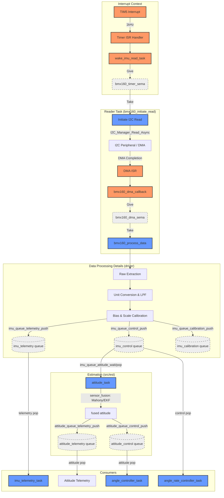

# Data Processing Pipeline Overview

This document outlines the high-frequency data processing pipeline for the VaiOS flight controller, starting from the hardware timer interrupt and ending with the consumption by flight control and telemetry tasks.

> **Updated for the post-refactor IMU path.** The single `_imu_fifo` SPSC ring
> (drained via `imu_buffer_peek*` by a monolithic `control_task`) is gone. The
> BMX160 reader now **fans out** each sample with
> `imu_queue_{telemetry,control,calibration}_push` (`src/sensor/imu_buffer.c`) to
> independent SPSC queues, and **sensor fusion moved out of the driver** into the
> dedicated `attitude_task` (`src/est/attitude_task.c`, `src/est/sensor_fusion.c`),
> which publishes attitude to its own `attitude_queue_{telemetry,control}` queues.
> See also `docs/analysis/firmware-control.md` for the control split.

## Pipeline Architecture

The pipeline is designed for high-frequency (1kHz) sensor acquisition with asynchronous I2C/DMA transfers to minimize CPU blocking.

## Synchronization Primitives

| Primitive               | Type             | From (Producer) | To (Consumer) | Purpose                                                               |
| :---------------------- | :--------------- | :-------------- | :------------ | :-------------------------------------------------------------------- |
| `bmx160_timer_sema`     | Binary Semaphore | Timer ISR       | Reader Task   | Triggers the 1kHz acquisition cycle.                                  |
| `bmx160_dma_sema`       | Binary Semaphore | DMA ISR         | Reader Task   | Signals that raw I2C data is ready in the buffer.                     |
| `imu_*` / `attitude_*` SPSC queues | SPSC FIFO | Reader Task / `attitude_task` | Consumers | Per-consumer lock-free fan-out (see below); `SPSC_POLICY_OVERWRITE`. |

> The old single `_imu_fifo` SPSC ring is replaced by a **fan-out** in
> `src/sensor/imu_buffer.c`: separate `_imu_{telemetry,control,calibration}_queue`
> rings for IMU samples and `_attitude_{telemetry,control}_queue` rings for fused
> attitude, each its own producer→consumer pair (`OVERWRITE` policy so a slow
> consumer never blocks the producer).

## Data Buffers

1.  **`_bmx_dma_rx_buffer` (30 bytes)**: Memory-aligned buffer used as the direct destination for DMA transfers from the BMX160 sensor.
2.  **`_bmx_data` (`bmx160_all_reading_t`)**: Internal task structure where raw data is parsed, converted to SI units, and filtered.
3.  **`_imu_{telemetry,control,calibration}_queue`** and **`_attitude_{telemetry,control}_queue`** (`src/sensor/imu_buffer.c`): the per-consumer SPSC ring backing arrays, each sized for its consumer's burst needs.

## Processing Flow

1.  **Extraction**: 30 bytes are parsed into Accel (X, Y, Z), Gyro (X, Y, Z), Mag (X, Y, Z), RHALL, and Temperature.
2.  **Unit Conversion**: Raw bits are converted to $m/s^2$ (Accel), $dps$ (Gyro), and $uT$ (Mag).
3.  **Filtering**:
    - Low Pass Filters (LPF) are applied to Accel and Gyro to remove high-frequency vibration noise.
    - Magnetometer data undergoes Hard-Iron bias removal and Soft-Iron scaling.
4.  **Fan-out**: the fully processed `bmx160_all_reading_t` is pushed (driver context) to the telemetry, control, and (when calibrating) calibration IMU queues via `imu_queue_{telemetry,control,calibration}_push`.
5.  **Sensor Fusion (moved to `src/est`)**: `attitude_task` (`src/est/attitude_task.c`) waits on the control IMU queue, runs fusion (`src/est/sensor_fusion.c`, Mahony / EKF), stamps the result, and pushes it to `attitude_queue_{telemetry,control}`.

## Consumers

### 1. Flight Control

- **Rate Loop** (`angle_rate_controller_task`): pops the latest gyro samples from the IMU **control** queue for the PID inner loop.
- **Angle Loop** (`angle_controller_task`): pops the fused orientation from the **attitude control** queue for the PID outer loop.

### 2. Telemetry (`imu_telemetry_task`)

- **High-Rate Data**: drains the IMU **telemetry** queue to transmit high-fidelity IMU data to the Ground Control Station (GCS).
- **Attitude**: transmits the fused Euler angles (Roll, Pitch, Yaw) from the **attitude telemetry** queue at a lower frequency (e.g., 10-50Hz).
