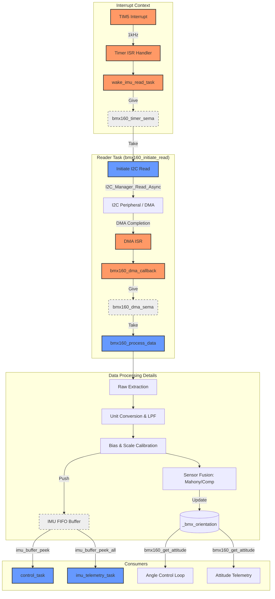

# Data Processing Pipeline Overview

This document outlines the high-frequency data processing pipeline for the VaiOS flight controller, starting from the hardware timer interrupt and ending with the consumption by flight control and telemetry tasks.

## Pipeline Architecture

The pipeline is designed for high-frequency (1kHz) sensor acquisition with asynchronous I2C/DMA transfers to minimize CPU blocking.

## Synchronization Primitives

| Primitive               | Type             | From (Producer) | To (Consumer) | Purpose                                                               |
| :---------------------- | :--------------- | :-------------- | :------------ | :-------------------------------------------------------------------- |
| `bmx160_timer_sema`     | Binary Semaphore | Timer ISR       | Reader Task   | Triggers the 1kHz acquisition cycle.                                  |
| `bmx160_dma_sema`       | Binary Semaphore | DMA ISR         | Reader Task   | Signals that raw I2C data is ready in the buffer.                     |
| `bmx160_attitude_mutex` | Mutex            | Reader Task     | Consumers     | Protects the `_bmx_orientation` quaternion during fusion update/read. |
| `_imu_fifo`             | SPSC FIFO        | Reader Task     | Consumers     | High-speed lock-free buffer for processed IMU samples.                |

## Data Buffers

1.  **`_bmx_dma_rx_buffer` (30 bytes)**: Memory-aligned buffer used as the direct destination for DMA transfers from the BMX160 sensor.
2.  **`_bmx_data` (`bmx160_all_reading_t`)**: Internal task structure where raw data is parsed, converted to SI units, and filtered.
3.  **`_imu_buffer_data`**: The backing array for the SPSC FIFO, sized to `IMU_BUFFER_SIZE` (typically 10-20 samples) to allow consumers to process bursts or averaged data.

## Processing Flow

1.  **Extraction**: 30 bytes are parsed into Accel (X, Y, Z), Gyro (X, Y, Z), Mag (X, Y, Z), RHALL, and Temperature.
2.  **Unit Conversion**: Raw bits are converted to $m/s^2$ (Accel), $dps$ (Gyro), and $uT$ (Mag).
3.  **Filtering**:
    - Low Pass Filters (LPF) are applied to Accel and Gyro to remove high-frequency vibration noise.
    - Magnetometer data undergoes Hard-Iron bias removal and Soft-Iron scaling.
4.  **Sensor Fusion**:
    - Processes Accel, Gyro, and Mag into a stable Attitude (Quaternion/Euler).
    - Supports both **Mahony** and **Complementary** filters.
5.  **Buffering**: The fully processed `bmx160_all_reading_t` is pushed to the global `imu_buffer`.

## Consumers

### 1. Flight Control (`control_task`)

- **Rate Loop**: Peeks the latest gyro samples from `imu_buffer` for the PID inner loop.
- **Angle Loop**: Calls `bmx160_get_attitude` to get the fused orientation for the PID outer loop.

### 2. Telemetry (`imu_telemetry_task`)

- **High-Rate Data**: Drains the `imu_buffer` using `imu_buffer_peek_all` to transmit high-fidelity IMU data to the Ground Control Station (GCS).
- **Attitude**: Transmits the current Euler angles (Roll, Pitch, Yaw) at a lower frequency (e.g., 10-50Hz).
