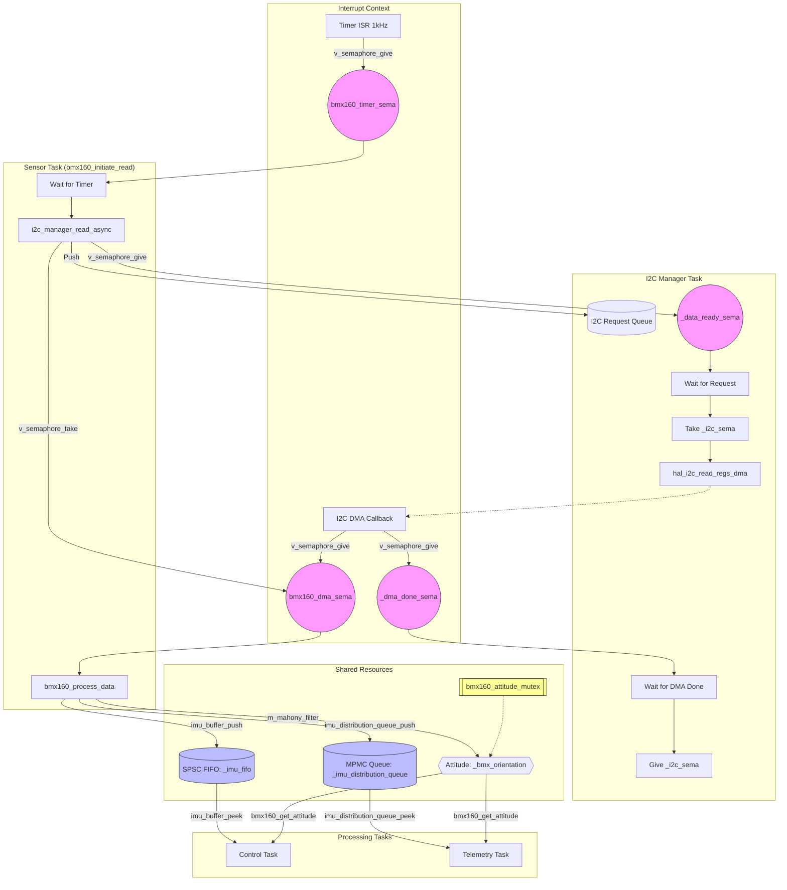
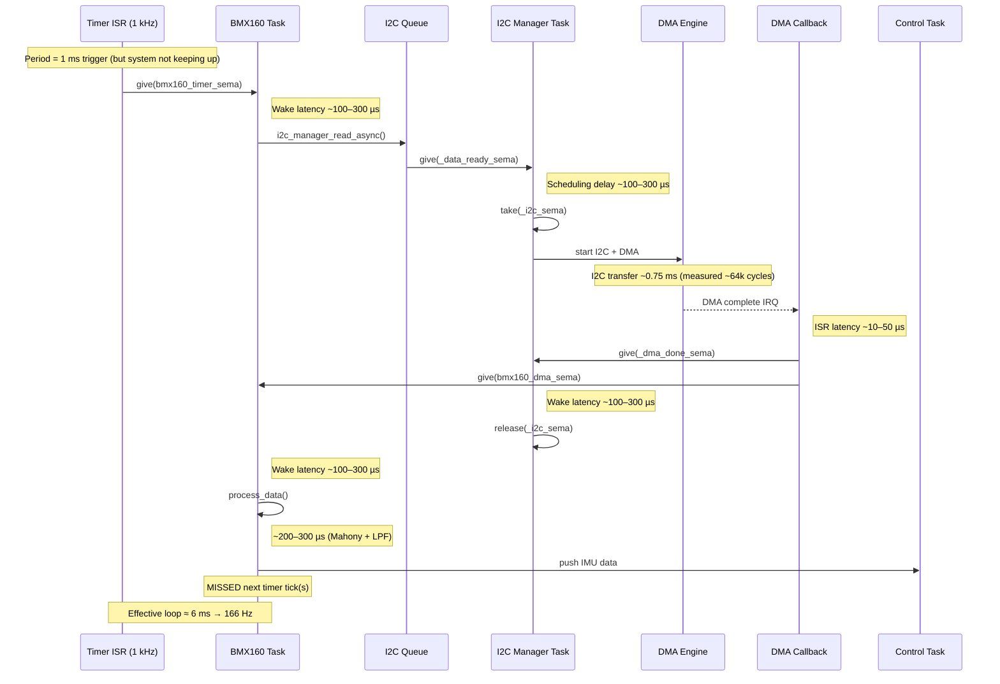

# Vayu Sensor Data Flow Map

This document maps the path of sensor data from the BMX160 hardware to the processing tasks (Control and Telemetry), highlighting shared buffers and synchronization primitives.

## Data Path Overview

## Shared Resources & Synchronization

| Resource | Implementation | Sync Primitive | Producer | Consumer(s) | Notes |
| :--- | :--- | :--- | :--- | :--- | :--- |
| **I2C Bus** | Physical Bus | `_i2c_sema` (Binary Semaphore) | I2C Manager Task | Any Task calling I2C | Ensures exclusive access during transactions. |
| **I2C Request Queue**| `i2c_queue_t` | `_queue_sema` + `_data_ready_sema` | BMX160 Task | I2C Manager Task | Queue for async I2C operations. |
| **I2C DMA Buffer** | `_rx_data` in [i2c_manager.c](file:///home/ragnar/Documents/Drone/vayu/src/drivers/i2c_manager.c) | `_dma_done_sema` (Binary Semaphore) | I2C DMA ISR | I2C Manager Task | Hardware buffer protected by task blocking. |
| **Sensor DMA Done** | `bmx160_dma_sema` | Binary Semaphore | I2C Manager Callback | BMX160 Task | Signals sensor task to start processing. |
| **IMU Buffer** | `_imu_fifo` (`spsc_fifo_t`) | Lock-free (Volatile head/tail) | BMX160 Task | Control Task | Overwrite policy; used for rate-loop PID feedback. |
| **IMU Dist. Queue** | `_imu_distribution_queue` (`mpmc_queue_t`) | Mutex + 2 Semaphores | BMX160 Task | Telemetry Task | Used for logging and remote monitoring. |
| **Attitude State** | `_bmx_orientation` (`attitude_t`) | `bmx160_attitude_mutex` (Mutex) | BMX160 Task | Control, Telemetry | Stores Euler angles/Quaternions from sensor fusion. |

## Detailed Sequence

1.  **Trigger**: Every 1ms, a high-frequency timer ISR signals `bmx160_timer_sema`.
2.  **Request**: The **BMX160 Task** wakes up and calls [i2c_manager_read_async()](file:///home/ragnar/Documents/Drone/vayu/src/drivers/i2c_manager.c#124-143), which pushes the request into `I2CQueue` and signals `_data_ready_sema`.
3.  **Acquisition**: The **I2C Manager Task** wakes up, takes `_i2c_sema` (bus mutex), initiates an asynchronous DMA read, and waits on `_dma_done_sema`.
4.  **Completion**: When the DMA transfer finishes, the **I2C DMA Callback** (ISR context):
    -   Copies data to the local sensor buffer.
    -   Signals `bmx160_dma_sema` to notify the sensor task.
    -   Signals `_dma_done_sema` to notify the manager task.
5.  **Task Resumption**:
    -   The **I2C Manager Task** unblocks and releases `_i2c_sema`.
    -   The **BMX160 Task** unblocks and calls [bmx160_process_data()](file:///home/ragnar/Documents/Drone/vayu/src/sensor/bmx160.c#860-1113).
6.  **Processing**: The **BMX160 Task** converts raw values, applies Low-Pass Filters (LPF) and calibration, and runs the **Mahony Filter** for attitude estimation.
7.  **Distribution**:
    -   Filtered IMU data is pushed to `_imu_fifo`.
    -   IMU data is pushed to `_imu_distribution_queue`.
    -   Fused attitude is updated in `_bmx_orientation` under `bmx160_attitude_mutex`.
8.  **Consumption**:
    -   **Control Task** peeks at `_imu_fifo` and `_bmx_orientation`.
    -   **Telemetry Task** pops from `_imu_distribution_queue` and peeks at `_bmx_orientation`.
