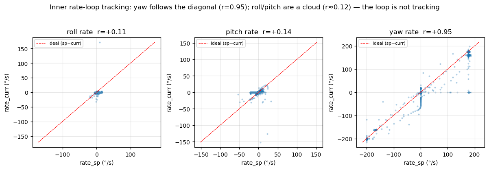
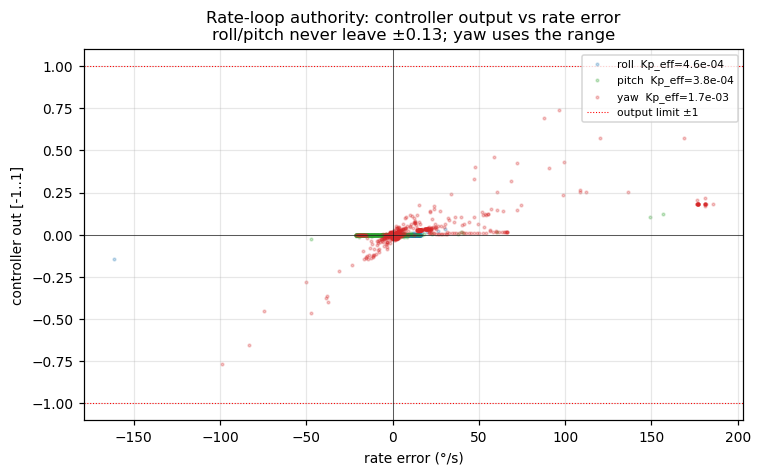
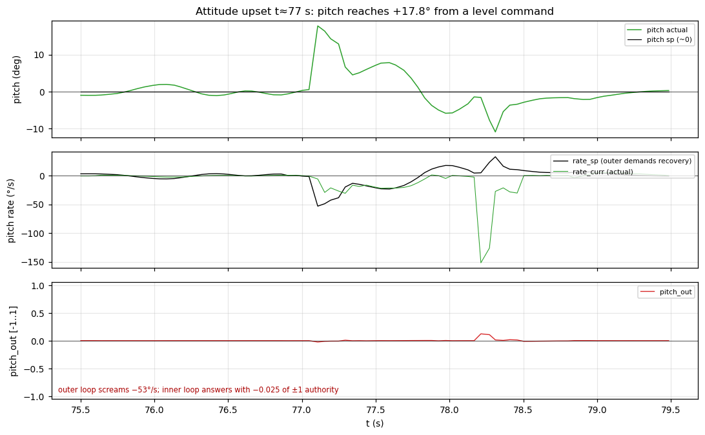

# Control-loop analysis — the stabilisation tracking failure

This is the headline of the session. The drone is asked to hold a level
attitude; the cascade controller's **outer (angle) loop does its job**, but the
**inner (rate) loop on roll and pitch fails to track**, because those axes are
grossly under-gained relative to yaw.

## The cascade, briefly

Real firmware, two nested loops (confirmed in `src/control/`):

```
RC stick ──► angle loop (250 Hz, 4 ms) ──► rate loop (1000 Hz, 1 ms) ──► mix ──► motors
            Kp_angle = 4.0                  Kp/Ki/Kd per axis
            out = rate setpoint (°/s)       out = motor torque [-1..1]
```

- **Outer loop** (`angle_controller.c`): P-only, `Kp = 4.0`. In ANGLE/stabilize
  mode it turns an *attitude* error into a *rate* command. Centred roll/pitch
  sticks ⇒ angle setpoint ≈ 0 ⇒ it commands whatever rate is needed to drive the
  measured angle back to level.
- **Inner loop** (`angle_rate_controller.c`): full PID per axis, output clamped
  to ±1, integrator clamped to `i_max = 0.2`. This is the loop that actually
  moves the motors.

`ControlTrace` (msgid 1030) logs both loops every cycle. All angles are in
**degrees**, rates in **deg/s**, `_out` normalised **[-1, 1]**, `thro_out`
**[0, 1]** (verified against the firmware that fills the struct).

## What the run commanded

`FlightMode` is **ANGLE (stabilize)** for essentially the whole 100.9 s, with a
handful of 0.3 s blips into ACRO at mode-switch boundaries. Roll and pitch
**angle setpoints are ≈ 0 the entire flight** (`std ≈ 0`) — the operator flew
throttle + yaw only and left roll/pitch centred. So roll/pitch is a clean
**level-hold** test: any non-zero roll/pitch angle is tracking error, full stop.

## Finding 1 — yaw tracks, roll/pitch don't

The inner loop's whole job is `rate_curr → rate_sp`. Correlation between the two
is the cleanest single number for "is this loop tracking":

| axis  | corr(rate_sp, rate_curr) | verdict                 |
|-------|--------------------------|-------------------------|
| roll  | **+0.12**                | not tracking            |
| pitch | **+0.14**                | not tracking            |
| yaw   | **+0.95**                | tracking well           |

yaw rides the `sp = curr` diagonal across the full ±200°/s range; roll and pitch
are a blob pinned at `rate_curr ≈ 0` regardless of what rate the outer loop asks
for. Same firmware, same loop structure, same timestep — the only difference
between the working axis and the broken ones is the gain.



## Finding 2 — the 36× gain asymmetry (root cause)

Firmware defaults, `include/variables.h`:

| axis (rate loop) | Kp         | Ki    | Kd    |
|------------------|------------|-------|-------|
| roll             | **0.0005** | 0.01  | **0** |
| pitch            | **0.0005** | 0.01  | **0** |
| yaw              | **0.018**  | 0.008 | 0     |

Yaw's proportional gain is **36×** roll/pitch. Recovering the *effective* gain
straight from the data (least-squares slope of `out` vs `rate_error`) reproduces
the firmware constants almost exactly — proof the trace is faithful and nothing
downstream is rescaling:

| axis  | measured Kp_eff | firmware Kp | output std |
|-------|-----------------|-------------|------------|
| roll  | 4.6e-4          | 5e-4        | 0.003      |
| pitch | 3.8e-4          | 5e-4        | 0.004      |
| yaw   | 1.7e-3 *        | 1.8e-2      | 0.058      |

\* yaw's single-slope fit is pulled down by its large `Ki` contribution and slew
saturation; the point stands — yaw output varies ~15× more than roll/pitch.

With `Kp = 0.0005`, a 50°/s rate error produces `0.0005 × 50 = 0.025` of
output — 2.5% of available authority. The proportional path is essentially
inert; roll/pitch lean entirely on the slow `Ki = 0.01` integral, which is
clamped at `i_max = 0.2` and lags any moving setpoint badly. With **`Kd = 0`**
there is no rate damping at all. That is exactly a loop that cannot track.

## Finding 3 — the loop never spends the authority it has

If roll/pitch were saturating we'd at least know the controller was trying. It
isn't:

- `roll_out` peaks at **0.142**, `pitch_out` at **0.123** — neither ever exceeds
  ~13% of the ±1 range, and neither saturates once in 100.9 s.
- `yaw_out` reaches **0.77**.

The figure below shows it directly: roll/pitch outputs hug zero across the full
span of rate error, while yaw fans out toward the ±1 rails. The weak axes have
enormous unused headroom; the gain simply never asks for it.



## Finding 4 — the cost: the t≈77 s attitude upset

The level-hold mostly *looks* fine (roll RMS 1.2°, pitch 1.9°) because SITL
applies little roll/pitch disturbance while the sticks are centred. The failure
shows its teeth the moment a disturbance arrives — around **t = 77 s**, during
the aggressive vertical maneuver (see vertical-analysis.md):

- pitch is knocked to **+17.8°** from a 0° command;
- the outer loop responds correctly, demanding **−53°/s** of recovery rate;
- the inner loop answers with `pitch_out = −0.025` — a rounding error of its
  available authority;
- recovery is slow and sloppy, overshooting to −10.9° before settling; roll is
  dragged to +6.7° in the same window.



On the 2026-06-17 bench rig the identical gains drove a sustained ~0.3 Hz limit
cycle under throttle. Here the milder SITL disturbance environment keeps it from
diverging into a limit cycle, but the mechanism is the same: a rate loop with no
proportional authority and no derivative damping cannot hold attitude against
any real disturbance.

## What is NOT wrong

- **Cascade architecture** — correct. The outer loop computes the right
  corrective rates; they're simply ignored downstream.
- **Yaw loop** — healthy (corr 0.95), proving the loop code and mixer are fine.
- **Timestep** — rock-steady `outer_dt = 4.000 ms`, `inner_dt = 1.000 ms`,
  zero jitter. Not a scheduling problem.
- **Mixer / motor saturation** — roll/pitch never saturate, so anti-windup and
  the mix aren't masking the fault. It's purely the gains.

## Conclusion

The stabilisation failure is a **roll/pitch rate-loop tuning defect**, not an
architecture, scheduling, sensor, or mixer problem. `Kp` is ~36× too small and
`Kd = 0` on both axes. Fix is in `include/variables.h` (and/or persisted PID
config). See [recommendations.md](recommendations.md).
