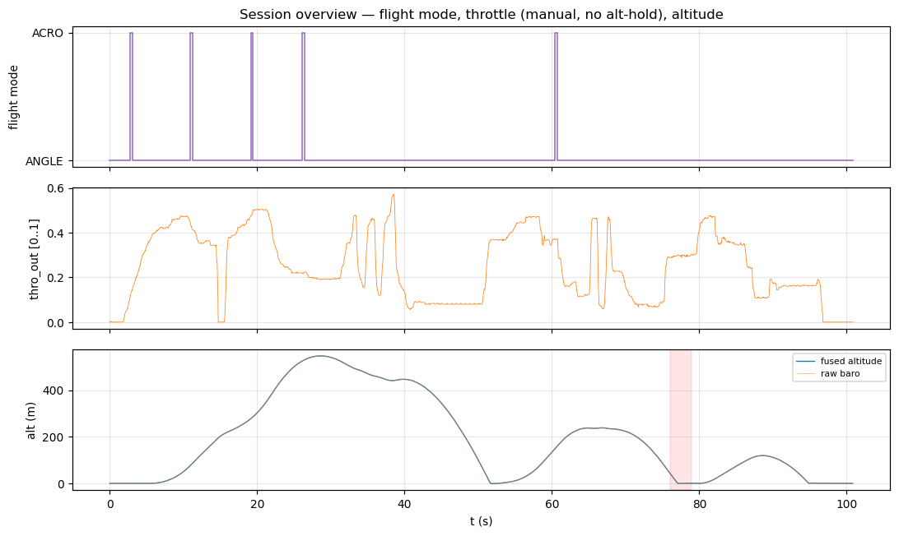
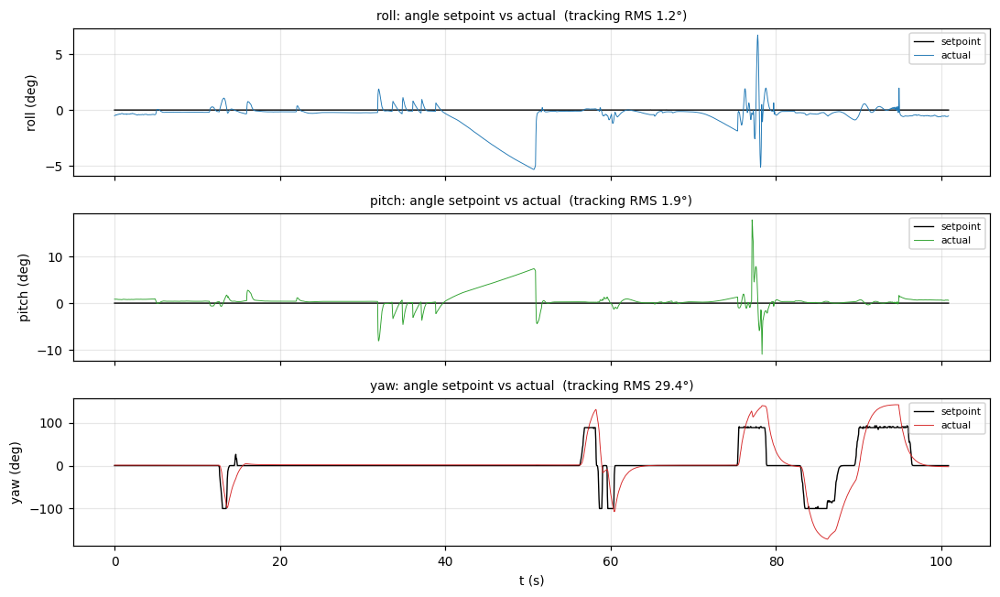

# Session analysis — 2026-06-20 SITL run

## What this is

A 100.9 s firmware-in-the-loop (SITL) capture: the **real FC control firmware**
running against simulated physics and sensors. Clean capture — 12,515 frames,
0 CRC errors, steady message rates. Because the control law is the production
firmware, control-tuning conclusions here are real firmware defects; sensor
conclusions are *not* transferable (the sim feeds idealised sensors).

## Timeline

| t (s)      | event                                                            |
|------------|------------------------------------------------------------------|
| 0          | armed, ANGLE (stabilize) mode, on the ground                     |
| 0 – 5      | throttle ramps up; lift-off, climb begins                        |
| ~2.7       | 0.3 s blip into ACRO then back (mode-switch transient)           |
| 5 – 28     | hard manual climb, up to **+47.5 m/s**                           |
| **28.6**   | **peak altitude 546.7 m**                                        |
| 28 – 51    | throttle cut, ballistic-ish descent to **−61.9 m/s**             |
| 51 – 95    | repeated manual climb/descent cycles (porpoising on throttle)    |
| **76 – 79**| **attitude upset: pitch +17.8°, roll +6.7°** (see control doc)   |
| ~95 – 101  | throttle to 0, settles back to ground; disarm                    |

Brief ACRO blips also at t ≈ 10.9, 19.1, 26.1, 60.4 s. The vehicle is in
**ANGLE/stabilize** mode for essentially the whole run.

## What the operator commanded

- **Roll / pitch:** centred — angle setpoint ≈ 0 throughout. This makes the run
  a clean **level-hold** test for roll/pitch.
- **Yaw:** actively flown — `yaw_rate_sp` swings ±200°/s, `yaw_angle_sp` ±100°.
- **Throttle:** aggressive manual, full range, no altitude hold (none exists in
  this build). This is what produced the 547 m / ±50 m/s vertical profile.

## The two stories in this log

1. **Roll/pitch stabilisation fails to track** — the headline. The inner rate
   loop on roll/pitch is grossly under-gained (Kp 36× below yaw, Kd = 0), so it
   cannot follow the corrective rates the outer loop commands. Full detail and
   evidence in [control-loop-analysis.md](control-loop-analysis.md).

2. **Vertical estimator is healthy** — across a brutal ±60 m/s, 547 m manual
   flight the baro+accel fusion stays within 0.25 m RMS of raw baro, `valid`
   100% of the time, and the flight-phase (IN_AIR) detector behaves. Detail in
   [vertical-analysis.md](vertical-analysis.md). Note there is **no alt-hold
   controller** here — the vertical subsystem is estimation + phase detection
   only — so the wild altitude trace is the manual throttle, not a fault.

## Figures

| file                            | shows                                              |
|---------------------------------|----------------------------------------------------|
| `01_session_overview.png`       | flight mode, throttle, altitude over the session   |
| `02_angle_tracking.png`         | angle sp vs actual, all 3 axes                     |
| `03_rate_tracking.png`          | rate sp-vs-curr scatter — yaw tracks, roll/pitch don't |
| `04_rate_authority.png`         | output vs rate error — the unused roll/pitch authority |
| `05_pitch_upset.png`            | the t≈77 s pitch upset, zoomed                      |
| `06_vertical_estimator.png`     | fused vs baro altitude + climb rate                |

## Relationship to the 2026-06-17 bench rig

Same root cause, different environment. The bench rig
([`../20260617-124210/`](../20260617-124210/)) showed the roll/pitch attitude
loop diverging into a ~0.3 Hz limit cycle under throttle, attributed to the
rate-loop tuning (Kd = 0, roll/pitch Kp ≪ yaw). This SITL run **reproduces the
same gain deficiency deterministically** and quantifies it cleanly (corr 0.12 vs
0.95) without the hardware's sensor noise confounders. The fix recommended on
the rig is unchanged and now has a second, cleaner piece of evidence behind it.
