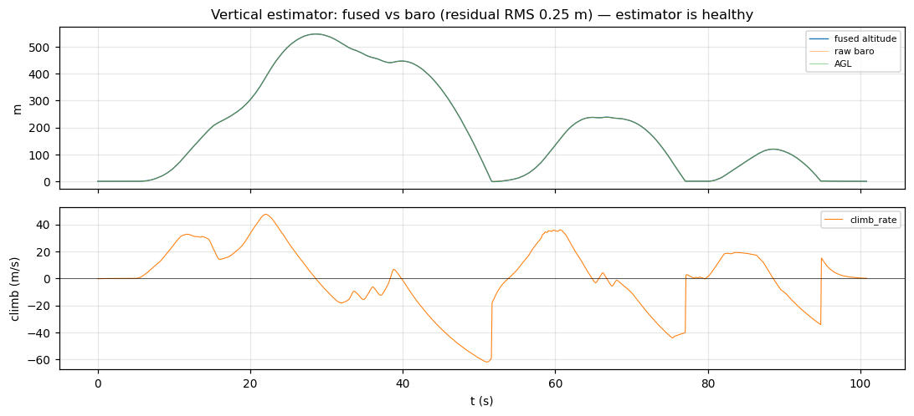

# Vertical-channel analysis — estimator & flight phase

This is the **secondary** story of the run and, unlike the control loop, it is
**good news**: the new vertical estimator and flight-phase detector behave well
across an extremely aggressive vertical profile. There is **no altitude-hold
controller** in this build — throttle is manual passthrough — so this section is
about *estimation* quality, not closed-loop altitude control.

## The vertical profile (manual)

The operator flew throttle hard with no alt-hold, producing a violent trajectory:

| quantity            | value     | time     |
|---------------------|-----------|----------|
| peak altitude       | 546.7 m   | t≈28.6 s |
| max climb rate      | +47.5 m/s | t≈22.1 s |
| max descent rate    | −61.9 m/s | t≈51.1 s |

This is far harsher than any real flight envelope — which makes it a good stress
test for the estimator.

## Finding — estimator is healthy

`VerticalState` (msgid 1040) carries fused `altitude`, `climb_rate`,
`vertical_accel`, raw `baro_altitude`, ground-referenced `agl`, and `valid`. The
estimator is a two-state baro+accel complementary/Kalman fuse (predict on IMU at
~1 kHz, correct on baro; `vertical_estimator.c`).

- **Fused vs raw baro residual:** mean −0.007 m, **RMS 0.25 m**, max 1.5 m. Even
  while climbing/dropping at ±50 m/s the fuse stays glued to baro and adds
  inertial smoothing rather than drifting off it (figure below).
- **`valid = 1` for 100%** of samples — the filter seeded on the first baro fix
  and never dropped out.
- **`agl` tracks `altitude`** with the expected near-constant offset (ground
  reference frozen at arm, `flight_phase.c`), so the AGL datum logic is working.

## Flight-phase / IN_AIR detector

`flight_phase.c` runs an ARMED ↔ IN_AIR state machine (takeoff needs AGL > 0.4 m
**and** climb > 0.3 m/s **and** throttle > 0.35 sustained 0.3 s; landing needs
AGL < 0.25 m **and** |climb| < 0.3 m/s **and** throttle < 0.30 sustained 0.7 s).
Given the unambiguous lift-off (climb to +47 m/s within seconds) and clean
return to ground, the detector had an easy time here — no chattering or false
transitions observed. A gentler hover would exercise the thresholds far harder;
that's a good target for a follow-up capture (see recommendations).

## Caveats / not-yet-tested

- **No alt-hold loop** exists, so this run says nothing about closed-loop
  altitude control — only that the *state* it would consume is trustworthy.
- The vertical profile is unrealistically aggressive; the estimator passing here
  is reassuring but the **slow-drift / near-hover** regime (where baro noise and
  accel bias matter most) was not exercised.
- `vertical_accel` and the climb-rate transients during the −62 m/s descent
  weren't independently cross-checked against sim ground truth in this pass —
  worth doing if the vertical channel becomes flight-critical (i.e. once an
  alt-hold loop is added on top).
