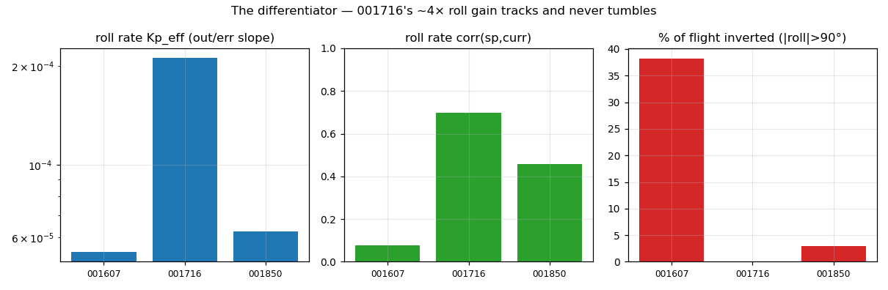
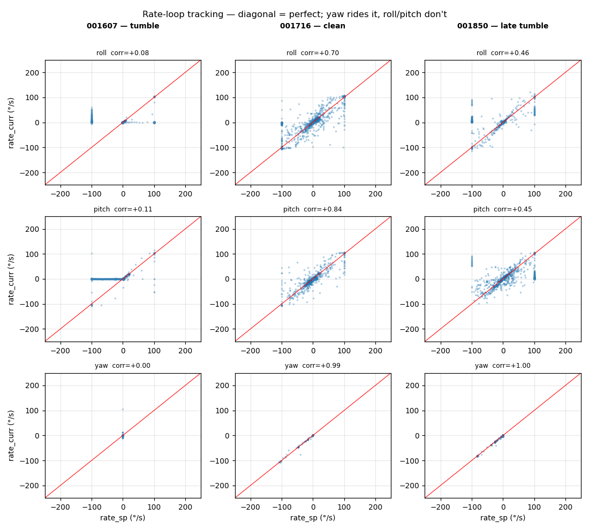
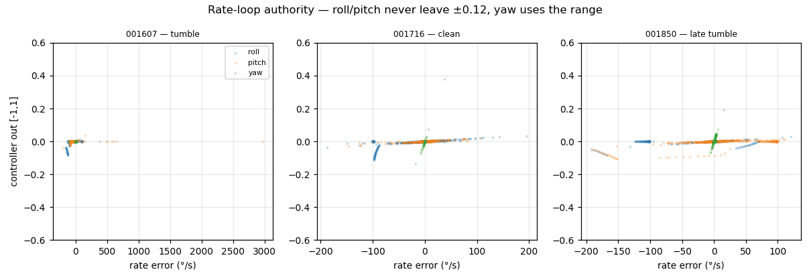
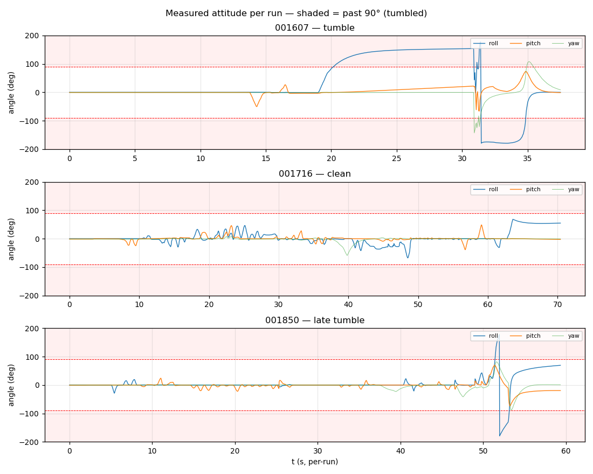

# Control-loop analysis — the roll/pitch rate gain decides tumble vs. clean

This is the headline of the triplet. Three aggressive manual ANGLE-mode flights,
same airframe and same firmware, differ in **one** thing — the roll/pitch rate
gain — and that difference is the whole story: two flights tumble inverted, one
flies clean. It is a controlled, three-point demonstration of the same
under-gained-inner-loop defect documented on the 2026-06-17 rig and the
2026-06-20 SITL level-hold.

## The cascade, briefly

Real firmware, two nested loops (`src/control/`):

```
RC stick ──► angle loop (250 Hz, 4 ms) ──► rate loop (1000 Hz, 1 ms) ──► mix ──► motors
            P-only, Kp_angle               Kp/Ki/Kd per axis
            out = rate setpoint (°/s)       out = motor torque [-1..1]
```

- **Outer (angle) loop** turns attitude error into a body-rate command. In ANGLE
  mode an aggressive roll stick asks for a large attitude, and the outer loop
  demands whatever rate drives the measured angle there (and back).
- **Inner (rate) loop** is the full per-axis PID that actually moves the motors,
  output clamped to ±1. **This is the loop under test.**

`ControlTrace` (msgid 1030) logs both loops every cycle. Angles in **degrees**,
rates in **deg/s**, `_out` normalised **[-1, 1]**, `thro_out` **[0, 1]**
(verified against the firmware that fills the struct). The PID *constants* are
**not** in the trace, so below we recover the **effective** gain from the data
(least-squares slope of `out` vs `rate_error`) — which is what the loop actually
delivered, regardless of what was nominally loaded.

> **Caveat.** These flights were captured during the autotune / System-ID work,
> so the loaded gains were being changed between runs by hand / by the tuner. We
> cannot read the exact PID constants from the log; we report the **measured
> effective gain** and the outcome it produced. The cross-run *comparison* is
> the robust result.

## Finding 1 — the differentiator is the roll/pitch rate gain

Line up the three runs by their measured roll rate gain and the outcome it
bought:

| run      | roll `Kp_eff` | roll corr(sp,curr) | mean \|roll err\| | % inverted | verdict       |
|----------|--------------:|-------------------:|------------------:|-----------:|---------------|
| `001607` | 5.4e-5        | +0.08              | 60.8°             | 38 %       | **tumble**    |
| `001716` | **2.1e-4**    | **+0.70**          | **10.3°**         | **0 %**    | **clean**     |
| `001850` | 6.3e-5        | +0.46              | 12.7°             | 3 %        | late tumble   |

The clean run has roughly **4× the roll rate gain** of the two that tumble — and
it was flown *harder* than 001607 (roll setpoint σ 17° vs 13°). More command,
more gain, far better result. Pitch tells the same story: `Kp_eff` 2.5e-6 →
1.5e-4 → 1.7e-4 with pitch corr 0.11 → 0.84 → 0.45.



## Finding 2 — yaw tracks everywhere; roll/pitch only when gained

The inner loop's whole job is `rate_curr → rate_sp`. The correlation between the
two is the cleanest "is this loop tracking" number. The scatter below puts all
three runs × three axes on one grid:

| run      | roll | pitch | yaw   |
|----------|------|-------|-------|
| `001607` | +0.08| +0.11 | n/c¹  |
| `001716` | +0.70| +0.84 | +0.99 |
| `001850` | +0.46| +0.45 | +0.996|

Yaw rides the `sp = curr` diagonal wherever it is commanded (001716/001850),
proving the loop code and mixer are fine. The roll/pitch blobs sit on the
`rate_curr ≈ anything` axis in 001607 (no tracking) and tighten toward the
diagonal in 001716 as the gain comes up.

¹ yaw stick untouched in 001607 (rate setpoint ≡ 0) → correlation undefined.



## Finding 3 — even the clean run barely spends its authority

The striking part: 001716 tracks well **without** using much actuator authority,
and the two tumbling runs leave almost all of theirs on the table.

- roll `_out` peaks: **0.085 / 0.112 / 0.085** across the runs — never above
  ~11 % of the ±1 range, and **never saturates**, in any of the three.
- pitch `_out` peaks: 0.040 / 0.029 / 0.107.
- yaw `_out` reaches **0.38** (001716).

So 001607 does not tumble because the controller tried its hardest and ran out
of motor — it tumbles because the gain **never asked** for the authority sitting
right there. This is exactly the "enormous unused headroom" signature from the
2026-06-20 analysis, here reproduced at three gain levels. It also means the
yaw-vs-roll/pitch asymmetry persists even in the best run: yaw `Kp_eff` ~9e-3 is
still **~45×** the roll/pitch gain in 001716.



## Finding 4 — what the tumbles look like

The attitude timelines show the failure directly. In **001607** roll tracks for
~20 s, then the under-gained loop loses it: roll crosses 90° at **t ≈ 20.2 s**
and the aircraft spends **38 %** of the rest of the flight inverted (|roll| to
179°). In **001850** the same weak-gain regime holds up longer but lets go at
**t ≈ 51.4 s** for a brief inversion (3 %). **001716** never crosses 90°.



A tumble past 90° is not just a tracking miss: once inverted, the thrust vector
points partly downward and the manual throttle drives the aircraft along that
vector — which is the origin of 001850's nonphysical 4.2 km / +202 m/s vertical
excursion (see [vertical-analysis.md](vertical-analysis.md)).

## What is NOT wrong

- **Cascade architecture** — correct. The outer loop computes sane corrective
  rates; the inner loop ignores them when under-gained.
- **Yaw loop** — healthy (corr 0.99), proving loop code + mixer are fine.
- **Timestep** — `outer_dt = 4.000 ms`, `inner_dt = 1.000 ms`, **0 µs jitter**
  in all three. Not a scheduling problem.
- **Mixer / saturation** — roll/pitch never saturate (`_out` ≤ 0.12), so
  anti-windup and the mix aren't masking the fault; motors peak ≤ 0.78 duty and
  stay balanced. It is purely the rate gain.
- **Decode / link** — 0 CRC errors across 21 k frames.

## Conclusion

The triplet is a clean three-point proof that the roll/pitch **rate-loop gain**
is the deciding variable: at `Kp_eff ≈ 5–6e-5` the loop cannot hold an
aggressive attitude and the aircraft tumbles (001607, 001850); a ~4× bump to
`≈ 2e-4` (001716) makes it track (corr 0.70/0.84) and eliminates the tumble —
while *still* sitting ~45× below yaw and using <12 % authority, i.e. with plenty
of margin to go stiffer. This is direct flight evidence for the autotune /
System-ID direction: raise roll/pitch rate `Kp` (and add `Kd`). See
[recommendations.md](recommendations.md).
