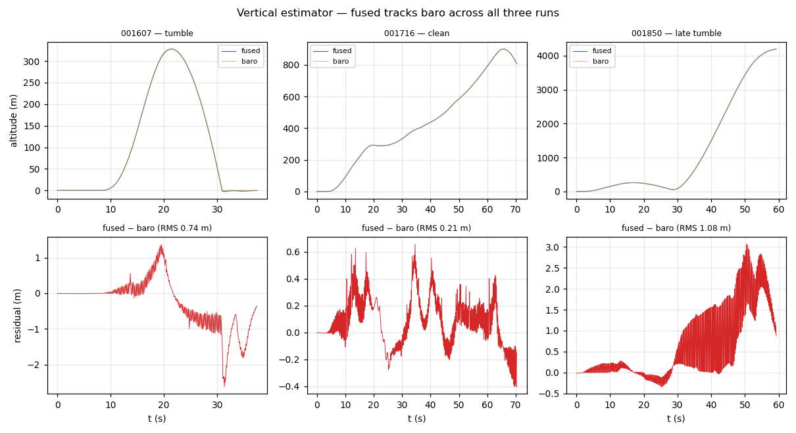

# Vertical analysis — estimator healthy; the 4.2 km excursion is a tumble artifact

There is **no altitude-hold loop** in this build — throttle is manual
passthrough (`thro_out` is the RC stick). So nothing here tests a vertical
*controller*; what it tests is the **vertical estimator** (fused altitude /
climb-rate vs. the raw baro), which feeds attitude-independent state. The
verdict: the estimator is trustworthy in all three runs.

## Estimator fidelity

`VerticalState` carries both the fused `altitude` and the raw `baro_altitude`;
their residual is the cleanest estimator-health number.

| run      | fused−baro mean | **RMS** | max \|resid\| | `valid` | peak alt | climb range      |
|----------|----------------:|--------:|--------------:|--------:|---------:|------------------|
| `001607` | —               | 0.74 m  | 2.62 m        | 100 %   | 328 m    | −66.9 .. +44.5 m/s |
| `001716` | —               | **0.21 m** | 0.66 m     | 100 %   | 900 m    | −38.2 .. +28.1 m/s |
| `001850` | —               | 1.08 m  | 3.06 m        | 100 %   | **4194 m** | −30.3 .. **+202.7** m/s |

`valid = 1` for **100 %** of samples in every run. The clean flight (001716)
has the tightest residual (0.21 m RMS) — comparable to the 0.25 m of the
2026-06-20 SITL run. The two tumbling flights have larger residuals (0.74,
1.08 m) and bigger peaks, which is expected: the estimator's accel-fusion term
is excited hard when the aircraft is being flung around at high attitude rates,
so a slightly larger fused−baro disagreement during a tumble is the estimator
working, not failing.

## The 001850 4.2 km / +202 m/s excursion is real data, not real flight

001850 logs a peak altitude of **4194 m** and a transient **+202.7 m/s** climb —
both nonphysical for this airframe under manual throttle. They are a
**consequence of the roll tumble**, not a vertical capability or an estimator
bug:

- The roll tumble begins at **t ≈ 51.4 s** (see
  [control-loop-analysis.md](control-loop-analysis.md)).
- Once the aircraft is past 90°, the thrust vector has a large horizontal /
  inverted component; with the operator still feeding throttle (`thro_out` up to
  0.76), the body is accelerated along that swinging vector.
- The vertical estimator faithfully reports the resulting world-frame motion —
  hence the spike. `valid` stays 1 and the fused−baro residual stays bounded
  (max 3.06 m) throughout, so the estimator is tracking the (violent) truth.

In other words: the headline control failure (the tumble) **produces** the
vertical anomaly. Fix the rate loop and this excursion disappears with it.

## What is NOT wrong

- **Vertical estimator** — healthy and trustworthy in all three runs
  (`valid = 100 %`, residual RMS ≤ 1.08 m).
- **Baro stream** — clean and continuous (11 Hz, simulated: temp 25 °C,
  humidity 50 % constant — the SITL baro model).
- There is **nothing to tune vertically** here — no alt-hold loop exists in this
  build, so the large altitude numbers are RC throttle + tumble dynamics, not a
  controller defect.
