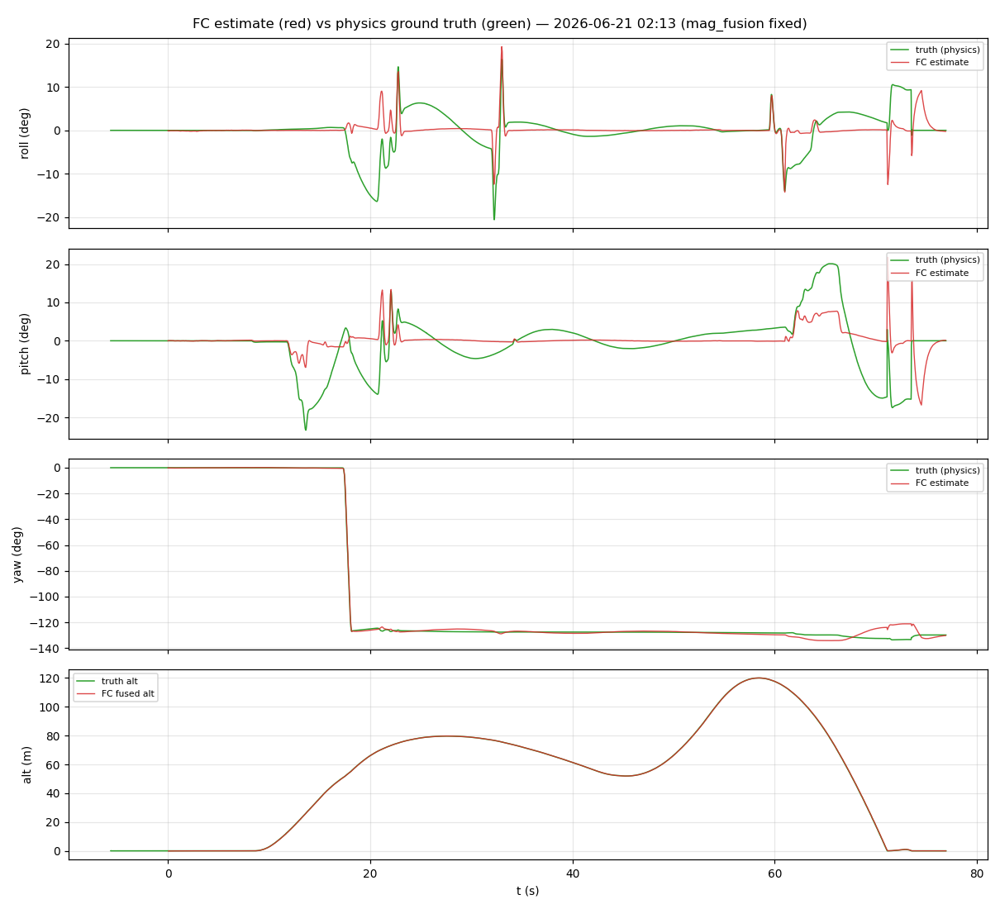
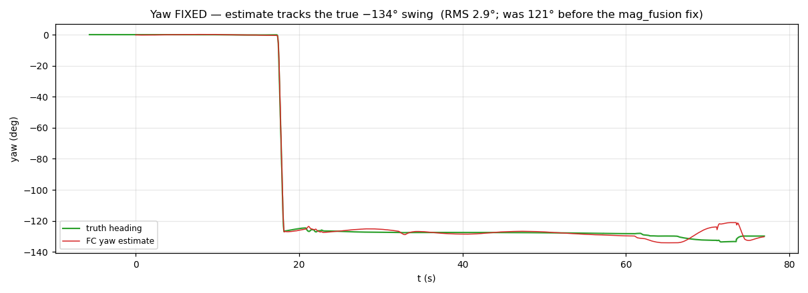
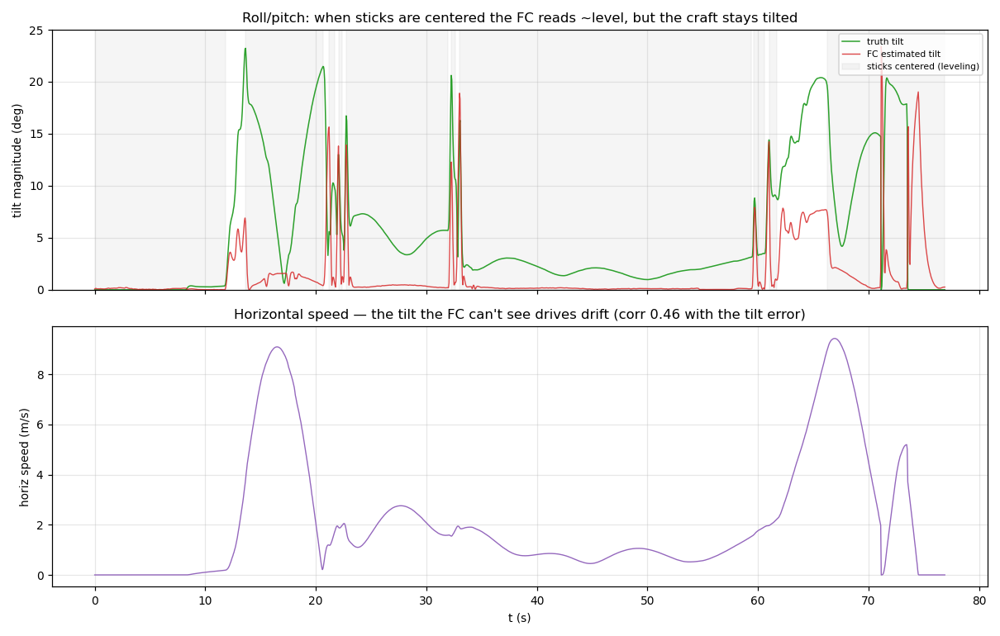

# Estimator analysis — estimate vs. ground truth

This is the headline of the first dual-log archive: the FC's attitude/altitude
estimate measured directly against the physics ground truth, on one aligned
clock. The verdict in one line: **yaw is fixed, altitude is excellent, and
roll/pitch is accurate except under sustained acceleration — where no
accelerometer-only filter can win.**

## The estimator under test

Real firmware (`src/est/`), active filter `SF_FILTER_USED = SF_EKF` — an
error-state EKF over attitude + gyro bias. Inputs: accelerometer (gravity
reference → roll/pitch), gyro (rate → propagation), magnetometer (absolute
heading → yaw, fused **yaw-only** about the world vertical so it can't tip
roll/pitch). Altitude comes from a separate baro/accel vertical estimator.

`ControlTrace.*_angle_curr` (deg) and `AttitudeEuler` (rad) are the same estimate
in different units; we compare both against the truth quaternion via a
convention-robust tilt angle where it matters.

## Finding 1 — yaw is FIXED

Before the producer fix, the firmware received `mag_fusion = {temp, 0, 0}` (a
constant body-frame vector) because the sim packed the obsolete 19-float IMU
layout — so the estimator had **no absolute heading reference** and yaw could not
be observed (run 01:12: RMS **121°**, estimate pinned near 0 while the craft
rotated). Commit `f14e53e` makes both producers pack the full 88-byte layout with
`mag_fusion` = unit-normalized field.

This run is the verification. The operator commanded a yaw rotation to **−134°**;
the estimate **tracks it**:

| | yaw error (est − truth, wrapped) |
|---|---|
| **this run (fixed)** | **RMS 2.86°**, median 0.74°, max 12.2° |
| 01:12 (broken) | RMS 121°, residual 127° |

The residual 2.9° is honest tracking error during the rotation (plus telemetry
skew), not a heading failure. **Resolved.**

## Finding 2 — altitude is excellent

Fused altitude vs truth: **RMS 0.12 m, max 0.45 m** across a 0 → 120 m, ±15 m/s
profile. The two traces are visually indistinguishable (bottom panel of
Fig 1). The vertical estimator is fully trustworthy, consistent with 2026-06-20.

## Finding 3 — roll/pitch under-reports tilt in accelerated flight (the open issue)

When calm, roll/pitch is sub-degree (verified on the rig: 0.13° median). But in
**free flight** the picture changes. The operator centered the roll/pitch sticks
for **89 %** of the flight (commanding "hold level"), and the controller drove
the *estimate* to level (estimated tilt median **0.18°**). Yet the **true** tilt
during those same centered-stick periods was:

| during stick-centered flight | tilt |
|---|---|
| FC **estimated** tilt | median 0.18°, p90 1.6° |
| **true** tilt | median **2.33°**, p90 **14.6°**, max **23.2°** |

So the FC genuinely believes it is level while the craft is tilted — and the
discrepancy **scales with horizontal speed**: `corr(truth_tilt − est_tilt,
horizontal_speed) = +0.46`.

### Why
The accelerometer measures *specific force* = gravity − linear acceleration; it
cannot distinguish a tilt from a sideways acceleration. When the craft drifts
(and it must, with no position reference), the accel vector tilts with the
motion, the EKF reads that as "down," and **under-reports the true tilt**. The
controller then holds the wrong attitude, so the craft keeps accelerating along
the tilt and drifts further — a self-sustaining loop. This is exactly the
*"levels on the HUD but the sim drone slides away"* behaviour.

### Why it can't be gated away
Accel **magnitude** carries no information here: `|‖a‖ − g|` is **0.54** during
the failure episodes and **0.56** during genuinely-level ones — identical. A
tighter gate rejects good and bad updates equally (e.g. at threshold 0.3 it
catches 84 % of bad but false-rejects 56 % of good), and since the accelerometer
is the *only* roll/pitch reference, gating harder degrades leveling. No
accel-only signal (magnitude, jerk, gyro-rate) separates *sustained coordinated*
acceleration from tilt. (The `EKF_Q_BG` gyro-bias gain was also tested and ruled
out — it changed nothing.)

### What would fix it
A velocity reference, to subtract kinematic/centripetal acceleration from the
accel before using it as gravity: **GPS** (velocity), **optical-flow +
rangefinder** (low-altitude), or VIO. A no-new-sensor partial mitigation is a
**drag-model velocity estimate** (multirotor horizontal drag ∝ velocity; as in
ArduPilot EKF3 drag fusion / Betaflight) — approximate but hardware-free. See
[recommendations.md](recommendations.md).

### Perspective
For **manual angle/stabilize flight this is normal** — every GPS-less quad
drifts and the pilot corrects; median 2.3° tilt is small. It only becomes a true
defect if the goal is hands-off self-leveling or position hold, which require the
velocity reference above regardless.

## What is NOT wrong

- **Mag fusion path / yaw** — fixed and verified (RMS 2.9°).
- **Vertical estimator** — RMS 0.12 m.
- **Roll/pitch in non-accelerated flight** — sub-degree.
- **Loop timing** — 4.000 / 1.000 ms, 0 µs jitter.
- **Data seam (post-fix)** — IMU + mag now packed correctly; alignment corr 1.000.

## Conclusion

The `mag_fusion` data fix closed the only *bug* in the estimator chain; against
ground truth the FC now matches truth on yaw (2.9°) and altitude (0.12 m). The
remaining roll/pitch tilt error in accelerated flight is a fundamental
accelerometer limitation, confirmed and quantified here, and is an
add-a-velocity-sensor decision rather than a code fix.
