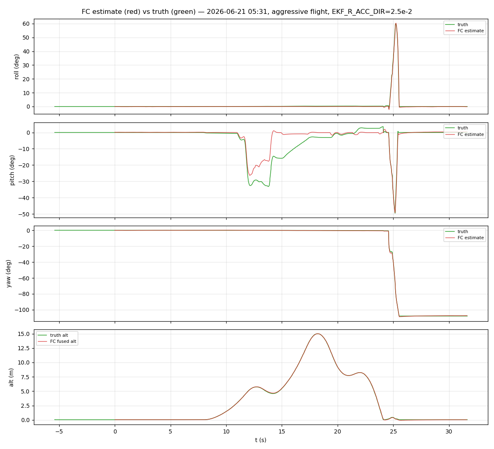
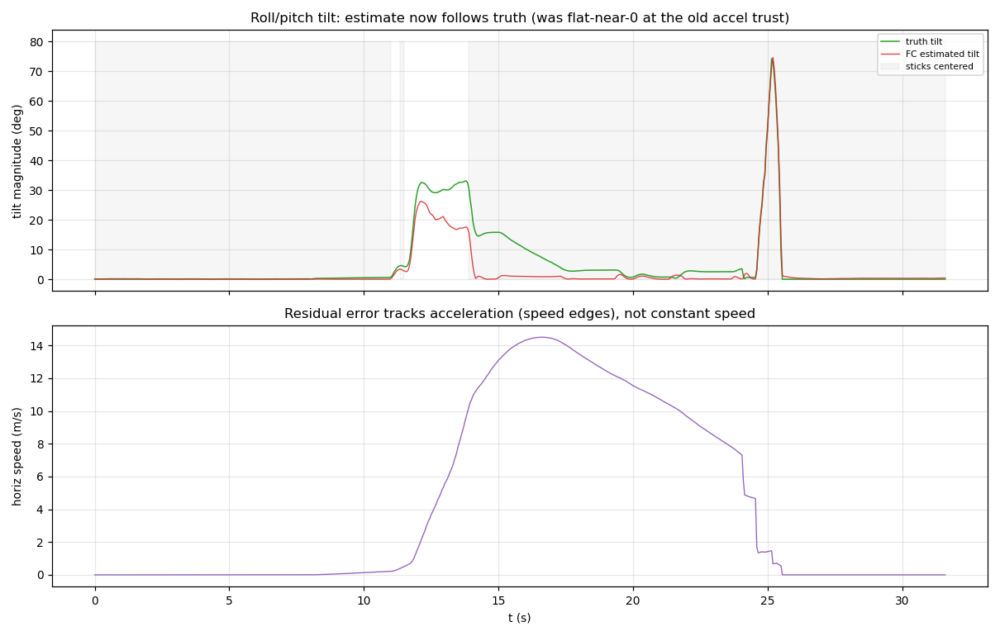
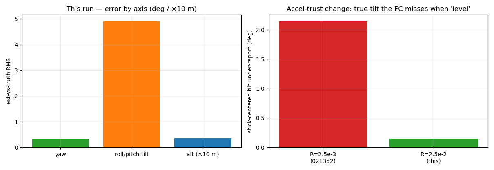

# Estimator analysis — the lowered accel trust, under aggressive flight

The headline: raising `EKF_R_ACC_DIR` 2.5e-3 → 2.5e-2 (trusting the
accelerometer less, letting the gyro carry attitude through accelerations)
**works as intended** — the roll/pitch tilt under-report that the FC used to
have when it believed it was level is essentially gone, while yaw and altitude
stay exact. The residual is now confined to *sustained* acceleration, the
irreducible IMU-only floor.

## Finding 1 — yaw and altitude: exact

- **Yaw** est-vs-truth **RMS 0.32°** (median 0.13°, max 2.5°), tracking the full
  true −108° heading swing. The `mag_fusion` fix continues to hold under
  aggressive flight.
- **Altitude** **RMS 0.04 m** — the fused and truth traces are indistinguishable.

## Finding 2 — roll/pitch: the under-report is gone

The defect this change targets is the FC reading ~level while the craft is
genuinely tilted (during free-flight acceleration). With sticks centered (92 %
of the flight):

| | estimated tilt | true tilt |
|---|---|---|
| **this run** (R=2.5e-2) | median 0.17° | median **0.32°** |
| baseline 021352 (R=2.5e-3) | median 0.18° | median **2.33°** |

The estimate-vs-truth gap when "level" fell from **2.15° → 0.15°**. And the
*true* tilt itself dropped from 2.33° to 0.32°, because an accurate estimate
lets the angle controller actually drive the craft level instead of holding a
hidden tilt — the drift-feedback loop is broken.

## Finding 3 — the residual is sustained acceleration only

The change makes the estimate gyro-led short-term, so **fast transients track
well** — the t≈25 s flick (truth roll +60° / pitch −50°) is followed closely.
What remains is *sustained* acceleration: the clearest case is **t≈12–15 s**,
where the craft holds a nose-down **−33°** pitch while accelerating forward and
the estimate reads **−25°** — an ~8° under-report that persists for the duration
of the maneuver and recovers when the acceleration stops.

This is expected and irreducible: over a multi-second coordinated acceleration
the accelerometer's specific force is genuinely tilted, and with no velocity
reference the filter cannot tell that from gravity. `corr(truth_tilt − est_tilt,
horizontal_speed) = +0.67` confirms the residual is acceleration-driven. The
overall tilt RMS (4.92°) and p90 (9.1°) are dominated by these sustained-accel
and hard-flick windows; the median is **0.52°**.

## Finding 4 — no drift penalty (validated separately)

The one cost of trusting the accel less is slower correction of gyro drift. A
dedicated **176 s** headless flight (low + high maneuver + edge cases) cleared
it: the low-speed tilt error was **0.48° at the start vs 0.49° at the end** — no
attitude creep over 2+ minutes. This 31.7 s run is too short to test drift and
is not relied on for that.

## What is NOT wrong

- **Yaw / mag** — exact (RMS 0.32°).
- **Altitude** — exact (0.04 m).
- **Roll/pitch in non-sustained-accel flight** — sub-degree; transients tracked.
- **Loop timing** — 4.000 / 1.000 ms, 0 µs jitter.
- **Decode / alignment** — 0 CRC; motor-xcorr corr 1.000.

## Conclusion

`EKF_R_ACC_DIR = 2.5e-2` delivers the intended improvement under aggressive
flight: the level-flight tilt under-report collapses (2.15° → 0.15°), the craft
genuinely flies more level, and yaw/altitude are unaffected. The remaining error
is the sustained-acceleration floor that only velocity aiding (GPS / optical-
flow) could remove — explicitly out of scope. The change is validated in SITL
(this run + the 176 s drift check) and is ready to commit pending a real-hardware
confirmation.
