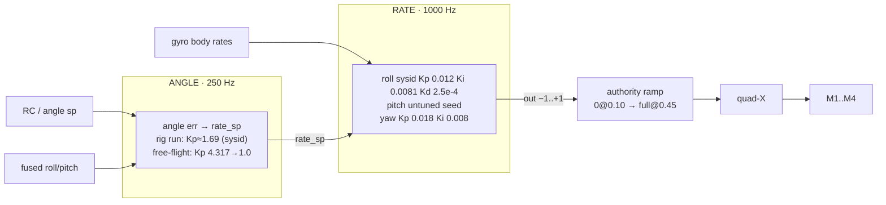
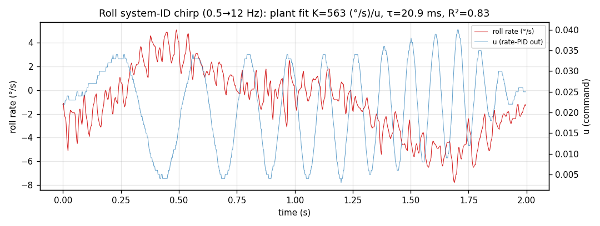
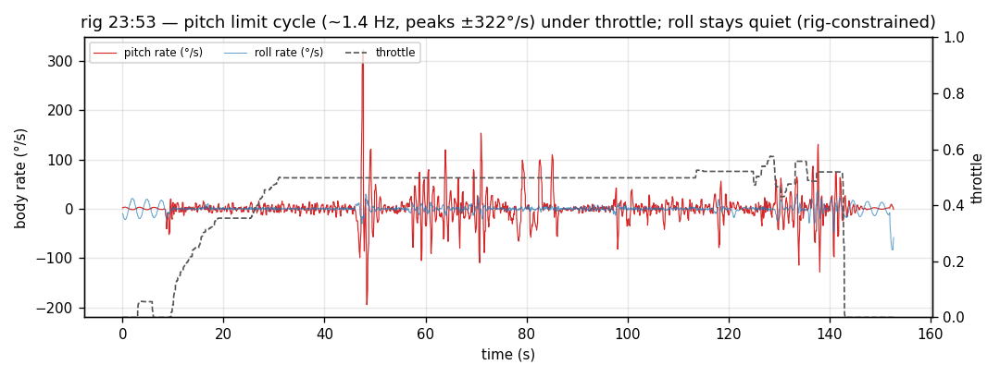

# Control-loop analysis — on-hardware tune (combined)

Cascade-controller behaviour across the two rig logs and the free-flight log,
cross-referenced with the roll system-ID (`data/sysid_roll_capture.csv`) and the
reconstructed free-flight monitor (`data/flight_traces.txt`). Companion to
[`session-analysis.md`](session-analysis.md) and
[`motor-analysis.md`](motor-analysis.md).

Units (firmware `control_telemetry_t`): **angles °, rates °/s, `*_out` ∈ [−1,+1]**
into the mixer. Loop timing from `ControlTrace.outer_dt`/`inner_dt`.

## Architecture & the gains we ran

Cascade, two rates (unchanged from firmware): outer **ANGLE** loop 250 Hz feeds a
rate setpoint to the inner **RATE** loop 1000 Hz; PID-authority ramps 0→full over
throttle 0.10→0.45 (`MIN_ARMED_THROTTLE`→`PID_FULL_AUTHORITY_THROTTLE`).

**Loop timing is perfect** in every log: `outer_dt` = 4.000 ms, `inner_dt` =
1.000 ms, zero jitter — same as 06-17. The instability below is **tuning/sign**,
never scheduling (corroborated by `EstPerf` 250 Hz, kernel doc).

## System-ID result (the basis for the gains)

From the armed roll chirp (`data/sysid_roll_capture.csv`, `u` = rate-PID output,
500 Hz), fitted to a rate-loop plant ω/u = K/(s(τs+1)):

| | K [(°/s)/u] | τ (ms) | actuator BW (Hz) | R² |
|---|---:|---:|---:|---:|
| roll | **563** | **20.9** | 7.6 | **0.83** |

Loop-shaped (`tools/sysid_fit.py`): rate_kp = ωc/K, kd = kp·τ, ki = 0.1·ωc·kp,
angle_kp = 0.25·ωc, ωc = 0.33/τ capped at rate_kp ≤ 0.012 → **rate kp 0.012,
ki 0.0081, kd 0.00025; angle_kp 1.69** (`data/tune_rig.json`). The integral knee
(0.68 rad/s) sits **well below** the 1.08 Hz crossover, so unlike the 06-17 default
(knee 20 rad/s, *above* crossover) this integral is safe. **Pitch and yaw were not
sysid'd** — pitch ran an untuned pure-P seed / stale default, yaw stayed default.
That asymmetry is the root of the pitch behaviour below.

## Sign-of-feedback audit (the headline diagnostic)

For each axis we computed three correlations over every `ControlTrace` frame
(`/tmp/analyze.py`):

- **corr(out, rate_err)** — is the *controller logic* correctly signed? (+ = `out`
  opposes rate error, as a positive-Kp PID should.)
- **corr(out, rate_curr)** — feedback polarity at the output. (− = negative feedback.)
- plus the **mixer** check (corr of `*_out` vs the realised motor differential) in
  [`motor-analysis.md`](motor-analysis.md).

| axis | metric | rig_235115 | rig_235304 | ff_001043 |
|---|---|---:|---:|---:|
| roll | corr(out, err) | +0.05 | +0.05 | +0.27 |
| roll | corr(out, rate) | −0.42 | −0.33 | −0.19 |
| pitch | corr(out, err) | **+0.60** | **+0.76** | +0.19 |
| pitch | corr(out, rate) | −0.75 | −0.51 | −0.46 |
| yaw | corr(out, err) | **+0.77** | **+0.84** | +0.60 |
| yaw | corr(out, rate) | −0.77 | −0.34 | −0.60 |

**Reading it:**
- **Controller logic is correctly signed on every engaged axis** — `out` opposes
  the rate error (positive corr) and is negative-feedback w.r.t. the rate (negative
  corr). No PID-polarity inversion in software.
- **Roll's correlation is weak (+0.05)** in both rig logs — but that's because the
  **rig constrained roll** (roll rate rms only 9–11 °/s vs pitch 28–41 °/s): the
  roll loop barely had to act, so there's little signal to correlate. This is the
  data signature of *"the rig masks roll"* — and the reason roll could not be
  validated on the rig.
- **In ff_001043 every `out` is tiny** (roll/pitch out ±0.01, slope ≈2e-6) because
  throttle ≤0.29 kept the authority ramp nearly closed — the loop was effectively
  disabled, which is why a 701 °/s yaw disturbance went uncorrected.

So: **no software sign bug in the rate PIDs.** The directional problems live at the
**mixer/actuator** (yaw sign, §motors) and in the **plant bias** (left-heavy, below).

## The pitch limit cycle (the dominant recorded instability)

In both rig runs, with throttle in the authority band, **pitch builds a sustained
~1.4 Hz oscillation**:

| | rig_235115 | rig_235304 |
|---|---|---|
| pitch rate peak | **378 °/s** | **322 °/s** |
| pitch rate rms | 41 °/s | 28 °/s |
| pitch osc freq (zero-cross) | ~1.6 Hz | ~1.4 Hz |
| roll rate rms (for contrast) | 11 °/s | 9 °/s |

This is a **cascade** limit cycle, not the 06-17 integral one:

- 06-17: rate loop soft (Kp 5e-4, Kd 0, Ki 0.01) against angle_kp 4.0 → **0.3 Hz**
  integral-driven divergence.
- Here: the **roll** rate loop was stiffened by sysid (Kp 0.012, Kd added), but
  **pitch was left on the untuned seed** while the **outer angle loop stayed fast**
  (angle_kp 1.69 on the rig; 4.317 in the first free-flight tune). A fast outer loop
  driving a soft/!matched inner pitch loop is the classic cascade oscillator — the
  inner loop can't keep up with the rate setpoints the outer loop demands, so the
  pair rings at ~1–1.5 Hz. The free-flight notes confirm the mechanism: **reducing
  rate kp made it worse** (FF-3 0.004→FF-4 0.0025: 731→760 °/s) — the signature of
  *outer-too-fast*, not *inner-too-low*. Softening angle_kp 4.317→1.0 (FF-5) calmed
  the roll-rate peak (760→344) but didn't cure it.

**Why pitch and not roll?** Roll got the sysid kd (damping); pitch didn't. On the
rig, roll is also mechanically constrained. So pitch is the only axis free *and*
undamped — it owns the oscillation. **Finishing pitch (and yaw) system-ID, and/or
slowing the angle loop below the inner-loop bandwidth, is the fix.**

## The left-bias the controller is fighting

Even though roll *looks* quiet on the rig, the **motor commands betray a constant
left-low tendency** the loop is correcting (see [`motor-analysis.md`](motor-analysis.md)
for the per-motor numbers): the left pair runs **+24–26 %** hotter than the right
across both rig runs, and pitch sits **nose-up +15–20°** at a 0° command (rear pair
hotter, F−R ≈ −0.06…−0.11). The roll loop output is small because the **integrator**
is carrying the trim — which is exactly why corr(out,err) is weak for roll. Remove
the rig and that standing left bias is no longer absorbed → the free-flight left
dive. The bias is real and quantified; its *cause* (CG, a weak right motor, or a
roll trim/mount offset) is not separable from these logs — props-off + per-motor
thrust check required.

## Yaw

Yaw `out` is correctly signed at the controller (corr(out,err) +0.77/+0.84) but the
**default mixer realised the opposite torque** on the rig (mix corr −0.76/−0.70) →
positive feedback → the monotonic spin we saw. The `spin=[-1,1,-1,1]` geometry fix
corrects it (001043 mix corr +0.75). With the fix and the integral restored
(kp 0.018, ki 0.008) yaw holds heading. Detail in [`motor-analysis.md`](motor-analysis.md).
The 701 °/s in 001043 is a *gated, near-idle* disturbance (throttle 0.29), not a
control failure — the authority ramp simply wasn't open.

## Takeaways

1. **Loop timing perfect** (4/1 ms, zero jitter) — instability is tuning/sign.
2. **No rate-PID sign bug** — controller `out` opposes error on every engaged axis.
3. **Dominant instability is a ~1.4 Hz PITCH cascade limit cycle** (peaks 322–378
   °/s) because **pitch was never sysid'd** while the outer loop stayed fast. Finish
   pitch/yaw sysid and/or slow `angle_kp` below inner-loop BW.
4. **Roll cannot be validated on the rig** (mechanically constrained; corr ≈ 0) — do
   not read rig roll-stability as flight-ready.
5. **A real +25 % left-thrust bias** is present on the rig and is the recorded cause
   of the free-flight left dive — chase it physically, not with gains.
6. **Yaw sign fixed and verified** from the mixer correlation flip (−0.7 → +0.75).
