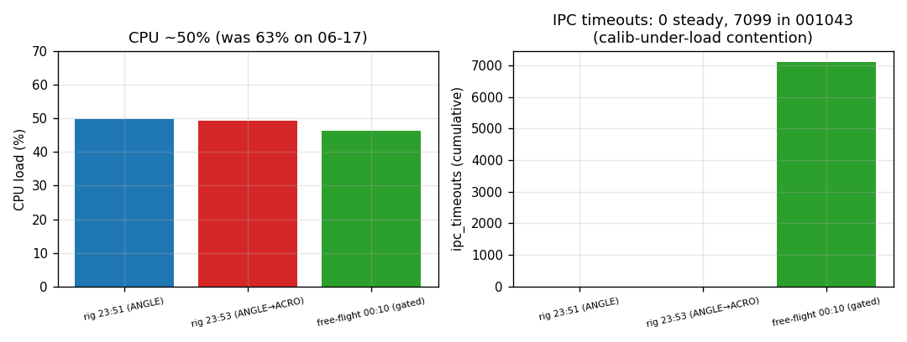

# Kernel / RTOS analysis — on-hardware tune (combined)

**vaios** RTOS health from `PerfGlobal` (1034), `PerfTask` (1035), `PerfFifo`
(1036), `EstPerf` (1033) across the three logs. Companion to
[`session-analysis.md`](session-analysis.md).

## Headline

The kernel is **healthy and not the bottleneck** in all three logs — CPU ~46–50 %,
EKF ≤26 % of budget, 0 heap OOM, all control-path FIFOs **0 drops**. Two things
changed vs 06-17, both worth tracking: **`task_id 4` stack crept 74 %→80 %**, and
**ff_001043 alone shows 7,099 IPC timeouts** with the **calibration FIFO saturating**
— a contention signal tied to a calibration running during that capture. And one
thing **improved**: **`tx_overflow` is 0** (was 612→2680) — the downlink saturation
is gone.

## CPU & scheduler

CPU load from `cpu_cycles_lo`/`idle_cycles_lo` deltas (single-sample is meaningless
— same u32-low-word caveat as 06-17):

| log | CPU load mean | range |
|---|---:|---|
| rig_235115 | **50 %** | 46–51 % |
| rig_235304 | 49 % | 47–51 % |
| ff_001043 | 46 % | 44–47 % |

Steady, ~50 % — *lower* than 06-17's 63 % (fewer/decimated telemetry streams this
session; consistent with `tx_overflow` going to 0). Comfortable headroom.

## Estimator timing (`EstPerf`)

Rock-steady **250 Hz**, IMU decimation 8, well inside the 4000 µs budget:

| log | mean | peak | % budget (peak) |
|---|---:|---:|---:|
| rig_235115 | 705 µs | 1001 µs | 25 % |
| rig_235304 | 656 µs | 1056 µs | 26 % |
| ff_001043 | 489 µs | 722 µs | 18 % |

Peaks a touch higher than 06-17 (891 µs) but never close to the budget. EKF is fine.

## Memory

- **Heap:** 0 OOM in all logs; peak 24,544–31,720 / 57,344 B (43–55 %). All-startup
  static allocation, no churn, no leak. (ff_001043's higher peak — 55 % — coincides
  with the calibration path being active; see FIFO below.)
- **Stacks** (worst high-water across the session, identical top-3 in all logs):

  | task_id | peak / size | % |
  |---:|---|---:|
  | **4** | **1644 / 2048** | **80 %** ← was 74 % on 06-17 |
  | 12 | 900 / 2048 | 44 % |
  | 15 | 860 / 2048 | 42 % |

  **`task_id 4` at 80 % is the one to watch** — it grew 6 points since 06-17 (1508→
  1644 B), now 20 % headroom. If its workload (or sysid/calib capture buffers) grows
  further it's the first stack at risk. (Task names still not captured — needs the
  `PerfTaskname` exchange the GCS never sent.)

## IPC — the ff_001043 anomaly

`ipc_timeouts` was **0** on 06-17 and **0 in both rig logs** — but **7,099 in
ff_001043**. That log is also the only one where the **IMU_CALIB FIFO (id 3)
saturates** (drops 65535) and heap peak is highest. Read together: a **calibration
routine was running during 001043** (consistent with its much tighter mag field,
sensor doc), and that path introduced IPC contention the steady-state runs don't
show. **It did not starve control** (control FIFOs still 0 drops, EKF still 250 Hz),
but 7 k timeouts is not nothing — worth tracing whether the calib task blocks on a
semaphore/FIFO it shouldn't while armed. New since 06-17; investigate before relying
on in-flight calibration.

`ipc_takes_blocked` stays high (~74 %) as before — expected (workers block on input
FIFOs); not a problem given the rig logs' zero timeouts.

## FIFOs — control clean, telemetry saturated, calib saturated in 001043

SPSC, OVERWRITE policy. Worst-case drops per fifo id:

| fifo id | role | rig_235115/304 | ff_001043 |
|---|---|---:|---:|
| 2 IMU_CONTROL | IMU → rate loop | **0** | **0** |
| 6 ATTITUDE_CONTROL | attitude → angle loop | **0** | **0** |
| 8 RC_CONTROL | RC → angle loop | **0** | **0** |
| 1 IMU_TELEMETRY | IMU → downlink | 65535 | 65535 |
| 5 ATTITUDE_TELEMETRY | attitude → downlink | 65535 | 65535 |
| 7 RC_TELEMETRY | RC → downlink | 65535 | 65535 |
| 9 TELEMETRY | control → downlink | 65535 | 65535 |
| 3 IMU_CALIB | calibration | **0** | **65535** ← calib active |
| 4 CALIB_TELEM | calibration | 0 | 0 |

**The split is unchanged and reassuring:** every **control-path** FIFO never dropped
a sample in any log — the flight loops are fed cleanly even during the oscillations
and the yaw spin. **Telemetry** FIFOs are pinned at the u16-saturated 65535 (true
counts unknowable — still should widen to u32 or report a rate). The new wrinkle is
**IMU_CALIB saturating in 001043**, the FIFO-level shadow of the IPC-timeout anomaly
above.

## Takeaways

1. Kernel healthy: ~50 % CPU, ≤26 % EKF budget, 0 OOM, control FIFOs 0 drops — **not
   limiting flight**.
2. **`tx_overflow` = 0** (was 2 k on 06-17) — downlink saturation resolved; good.
3. **Watch `task_id 4` stack (80 %, up from 74 %)** — least headroom, growing.
4. **Investigate the ff_001043 IPC contention** (7,099 timeouts + IMU_CALIB FIFO
   saturated): a calibration path appears to contend under load. New this session.
5. Reporting fixes still outstanding from 06-17: widen FIFO `drops` past u16, ship
   PerfGlobal cycle high-words (or computed load), support `PerfTaskname`.
