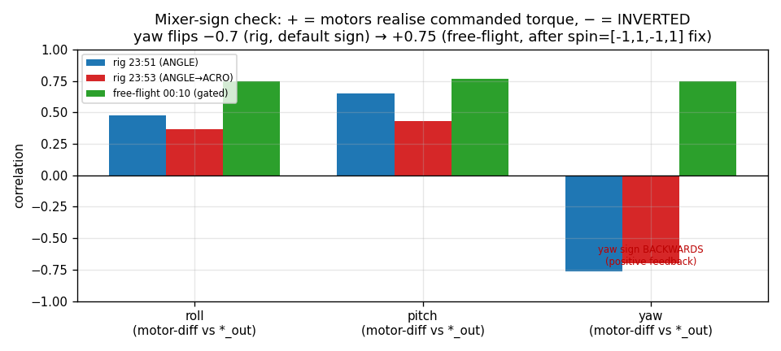
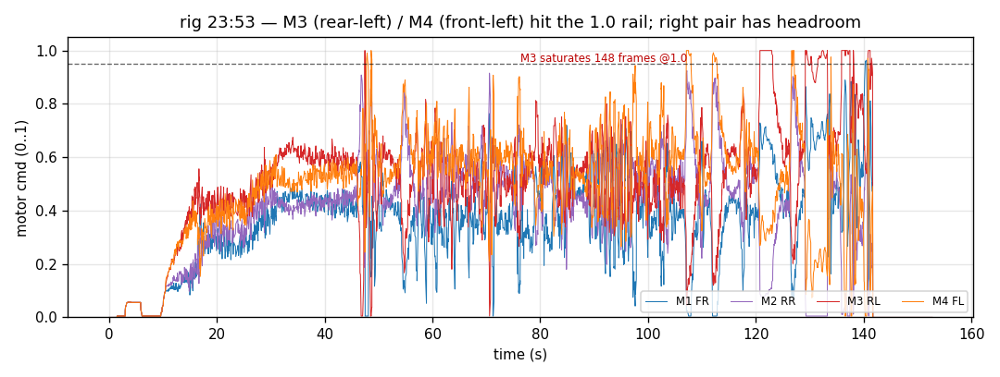
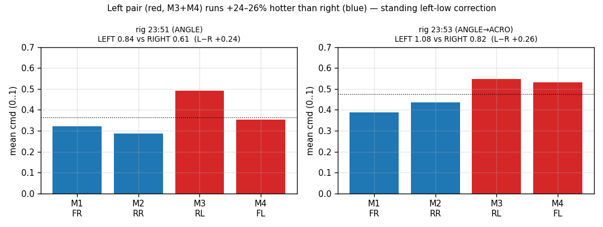

# Motor & mixer analysis — on-hardware tune (combined)

`MotorTelemetry` (msgid 1029) across the three logs, cross-referenced with
`ControlTrace.*_out` and the firmware quad-X mixer. This is where the **yaw
sign bug is confirmed from data** and the **left-thrust bias** is quantified.
Companion to [`control-loop-analysis.md`](control-loop-analysis.md).

## Mixer & geometry (from firmware)

```
out_i = throttle + roll·s_roll[i] + pitch·s_pitch[i] + yaw·s_yaw[i]   (clamped 0..1)
firmware default:  s_roll={-1,-1,+1,+1}  s_pitch={+1,-1,-1,+1}  s_yaw={+1,-1,+1,-1}
```

`cmd[0..3]` = M1..M4, 0..1 (idle floor 0.005); `cmd[4..7]` unused (quad).

| | **left** | **right** |
|---|---|---|
| **front** | M4 FL · CCW · (+,+,−) | M1 FR · CW · (−,+,+) |
| **rear**  | M3 RL · CW · (+,−,+)  | M2 RR · CCW · (−,−,−) |

This session **overrode `s_yaw`** at runtime via `CMD_SET_MOTOR_GEOMETRY
spin=[-1,1,-1,1]` (flips yaw only; roll/pitch mix unchanged). The rig logs were
recorded **before** that override took effect on their boot; ff_001043 **after**.

## Mixer-sign verification — the decisive test

For each axis we correlated the controller's `*_out` against the **realised motor
differential** built from the firmware default signs (e.g. roll-diff =
−M1−M2+M3+M4). **Positive** ⇒ motors produced the torque the controller asked for;
**negative** ⇒ motors produced the *opposite* torque (a sign inversion).

| axis (default-sign diff) | rig_235115 | rig_235304 | ff_001043 |
|---|---:|---:|---:|
| roll | +0.48 | +0.37 | +0.75 |
| pitch | +0.65 | +0.43 | +0.77 |
| **yaw** | **−0.76** | **−0.70** | **+0.75** |



**Findings:**
- **Yaw default sign was backwards.** Both rig logs: the yaw motor differential is
  *anti-correlated* with `yaw_out` → the mixer drove yaw the wrong way → positive
  feedback → the monotonic yaw spin-up we chased. This is independent, recorded
  confirmation of the bug we found live.
- **The geometry fix works.** ff_001043 (post `spin=[-1,1,-1,1]`) flips yaw to
  **+0.75** — the motors now realise the commanded yaw torque. Fix verified.
- **Roll/pitch signs are correct** (all positive, +0.37…+0.77). The rig data does
  **not** support a roll/pitch mixer inversion. (Roll's lower value tracks the rig
  constraining roll motion, not a sign problem — see control-loop §sign audit.)

## Output levels & saturation

Armed-ish frames (some motor > 0.1):

| | M1 FR | M2 RR | M3 RL | M4 FL | sat (>0.95) |
|---|---:|---:|---:|---:|---|
| rig_235115 | 0.320 | 0.286 | 0.492 | 0.353 | M3 ×2 |
| rig_235304 | 0.388 | 0.435 | **0.547** | 0.532 | **M3 ×148, M4 ×59** |
| ff_001043 | 0.174 | 0.227 | 0.179 | 0.232 | none |



The powered rig run (235304, throttle to 0.57) **saturated M3 (rear-left) in 148
frames and M4 (front-left) in 59** — the left side hit the 1.00 rail while the right
pair sat at 0.39–0.44. That is real headroom loss on one side under a hover-relevant
throttle, and a leading indicator that the frame can't hold attitude once the rig
isn't helping. ff_001043 never saturates because its throttle never opened the
authority ramp.

## The left-heavy thrust bias (quantified)

With roll/pitch commanded ≈0 and throttle up, a balanced frame runs four near-equal
motors. It doesn't:

| | LEFT (M3+M4) | RIGHT (M1+M2) | **L−R** | FRONT (M1+M4) | REAR (M2+M3) | F−R |
|---|---:|---:|---:|---:|---:|---:|
| rig_235115 | 0.845 | 0.606 | **+0.239** | 0.673 | 0.778 | −0.105 |
| rig_235304 | 1.079 | 0.823 | **+0.255** | 0.920 | 0.982 | −0.062 |
| ff_001043 | 0.411 | 0.401 | +0.010 | 0.406 | 0.406 | −0.000 |



- **Left pair runs +24–26 % hotter than the right** in both powered rig runs. The
  mixer only does that if the controller is commanding a **persistent right-roll
  correction** — i.e. it is fighting a standing **left-low** tendency. This is the
  recorded fingerprint of the free-flight left dive, present *on the rig* but
  absorbed by the gimbal.
- **Rear slightly hotter than front** (F−R −0.06…−0.11) → a nose-up correction,
  matching the +15–20° resting pitch (control-loop doc).
- **ff_001043 is balanced (L−R +0.01)** only because it never left idle (motors
  ≈0.17–0.23, authority gated) — it carries no correction, so it tells us nothing
  about balance. Do not read it as "the bias is gone."

**What this can and cannot prove.** It proves the controller is *commanding* a
left-up correction continuously — so something biases the frame left. It **cannot**
separate the cause: (a) CG offset to the right/left, (b) a genuinely weak right-side
motor/ESC, (c) a roll trim/IMU-mount offset, or (d) prop/thrust mismatch. The rig
absorbs the resulting motion, so the bias only became fatal in free flight. The
mixer signs being correct (above) **rules out a roll mix-sign flip** as the cause.

## Recommendations

1. **Props-off motor-command check** (the deferred test): arm props-off ~0.2
   throttle, tilt right-side-down by hand, confirm the **right** motors spin up to
   correct. The data says they should (roll mix corr +); verify on the bench, then
   trust roll.
2. **Per-motor thrust / current check** (thrust stand or props-off current draw) to
   find the left-heavy bias source — the logs can't separate actuator asymmetry from
   control action. Check M1/M2 (right) for a weak motor/ESC first.
3. **Re-check CG and IMU roll mount** — a few mm of CG offset or a fraction of a
   degree of IMU roll bias produces exactly this standing correction.
4. **Mixer signs:** yaw fix (`spin=[-1,1,-1,1]`) is correct and **must be persisted**
   (it's live-only today — a power cycle restores the broken default). Roll/pitch
   signs need no change.
5. **Watch M3 (rear-left) saturation** — once the left bias is removed it should
   stop railing; if it persists, M3/its ESC may be weak.
