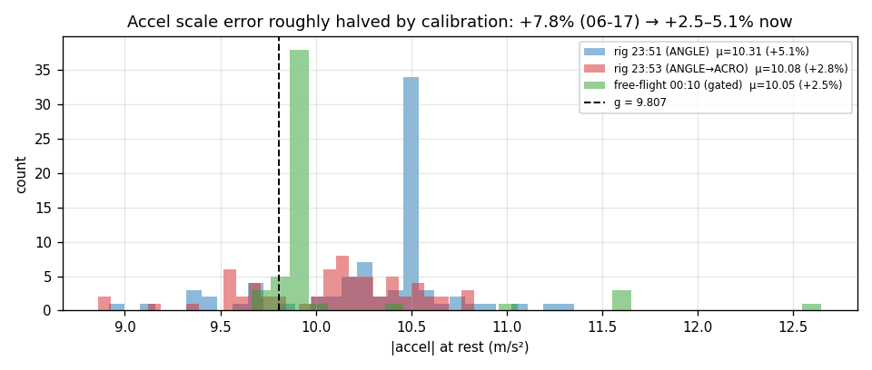
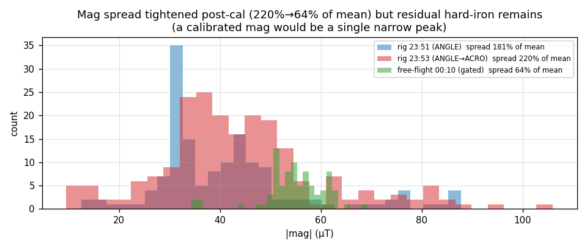

# Sensor & fusion analysis — on-hardware tune (combined)

Sensors and attitude fusion across the three logs, from `ImuRaw` (keyframe),
`ImuCompressed` (delta), and `AttitudeEuler` (fused). The point of interest vs
[`../20260617-124210/sensor-analysis.md`](../20260617-124210/sensor-analysis.md):
**did the calibration we ran this session move the numbers?** Companion to
[`session-analysis.md`](session-analysis.md).

## Verdict at a glance (vs 06-17)

| stage | 06-17 | this session | trend |
|---|---|---|---|
| Gyro | bias <0.1 °/s, σ 0.3–0.5 | clean stream; bias not re-measured (no clean static window) | ~ |
| Accel scale | **+7.8 %** | **+2.5 … +5.1 %** | **improved** (cal helped, not perfect) |
| Mag | spread ~140 %, hard-iron 25 µT | spread **64–220 %**, hard-iron ~25 µT | **partly improved** |
| Temp | 35.6–37.1 °C | 30.2–32.8 °C | OK (cooler ambient) |
| Fusion roll/pitch | matches gravity ±3.8° | tracks gravity (tilt real) | OK |
| Fusion yaw | mag-tainted | mag still offset → untrusted | unchanged |

## Accelerometer — scale error roughly halved

`|acc|` should read 9.807 m/s² at rest. Static-ish mean (low-gyro frames):

| log | mean `|acc|` | error vs g |
|---|---:|---:|
| rig_235115 | 10.311 | **+5.1 %** |
| rig_235304 | 10.082 | +2.8 % |
| ff_001043 | 10.054 | **+2.5 %** |

Down from **+7.8 %** on 06-17 — the accelerometer calibration we ran this session
**did** improve the scale, to +2.5–3 % in the later captures. 235115 (+5.1 %) is the
earliest and worst, consistent with cal being applied/improved as the night went on.
Still not at the ±1 % you'd want before fully trusting accel magnitude in the EKF
gravity gate — worth one more 6-side pass — but materially better.

## Magnetometer — better in the post-cal log, still hard-iron offset

A calibrated mag reads a near-constant `|mag|` in all orientations. `|mag|` spread
(% of mean) and the z hard-iron offset:

| log | `|mag|` range (µT) | spread | x/y/z hard-iron (µT) |
|---|---|---:|---|
| rig_235115 | 12.5 – 87.8 | 181 % | −2.6 / −22.5 / **+25.6** |
| rig_235304 | 9.5 – 105.9 | 220 % | −12.0 / −26.7 / +18.6 |
| ff_001043 | 34.3 – 69.2 | **64 %** | −9.1 / +3.4 / **+28.0** |

The post-cal log (001043) is **much tighter** (64 % vs ~200 %) — the mag calibration
reduced the spread. But two caveats keep it short of "trust heading":

1. **A residual z hard-iron offset of ~+25–28 µT persists in every log**, including
   post-cal — a calibrated mag should center near 0. Heading is still biased.
2. Part of the rig logs' larger spread is **motion extent** (the rig rotated through
   more orientations, sampling more of the distorted field) and **motor-current
   interference** (calibrate with the frame powered). 001043 rotated less, so its
   spread is partly optimistic.

Net: mag improved but is **not** heading-grade. This only matters for heading-hold /
nav; ANGLE/ACRO yaw is rate-controlled off the gyro and unaffected.

## Gyroscope — stream clean, bias not re-characterised

The gyro stream is clean (no clipping/stuck values; full-scale handling fine — peaks
355 °/s on the rig, 690 °/s in the 001043 yaw spin). **We did not get a clean static
window** in these logs to re-measure bias: the per-axis means are contaminated by
motion (e.g. ff_001043 "z bias" reads +17 °/s purely because the frame was spinning
at up to 701 °/s during the capture — it is not a bias). 06-17 measured a healthy
<0.1 °/s bias from a still window; nothing here contradicts that, but treat gyro bias
as **unverified this session**. The gyro calibration we ran over the harness targeted
exactly this; capture a 30 s still segment next time to confirm.

## Temperature — fine

IMU `temp` 30.2–32.8 °C across logs, smooth, sane — cooler than 06-17 (35–37 °C),
just a cooler start. No glitches.

## Fusion (attitude EKF)

Same error-state EKF (6-state: attitude error + gyro bias), 250 Hz, accel pins
roll/pitch (gated |‖a‖−g|>1.5), mag pins yaw (tilt-comp). `EstPerf` shows it healthy
all session (250 Hz, peak 0.72–1.06 ms of the 4 ms budget — see kernel doc).

- **Roll/pitch tilt is real**, not a fusion artifact: the resting +15–20° pitch and
  the left lean show up consistently in fused attitude *and* in the motor commands
  the controller derives from them (motor doc). The estimator tracks gravity.
- **Yaw/heading remains untrustworthy** while the mag carries a +25 µT hard-iron
  offset — do not use fused heading for nav until the mag is fully calibrated.
- The **improved accel scale** (+2.5 % vs +7.8 %) tightens the EKF gravity gate: at
  rest ‖a‖≈10.05 ⇒ |‖a‖−g|≈0.25, comfortably inside the 1.5 gate (06-17 was ≈0.8,
  over half the gate), so the estimator now accepts more static samples and leans
  less on gyro coasting. A real fusion-robustness gain from the cal.

## Reporting fidelity — the 06-17 bugs are all still open

Verified across all three logs:

1. **`AttitudeEuler.{rollspeed,pitchspeed,yawspeed}` = 0** for every frame (0/3440
   nonzero) — fused body rates still not populated.
2. **`ImuRaw.sample_time_us` = 0** for every frame — no per-sample hardware
   timestamp; IMU frames still only timeable by container `t_us`.
3. **`SystemHealth.cpu_load` = 0** for every frame — still unpopulated (real load
   only via `PerfGlobal` cycle deltas, kernel doc).

`ImuCompressed.ref_seq` (the 06-17 keyframe-linkage bug) is also still 0 in these
logs — the compressed stream remains non-reconstructable to absolute IMU.

## Recommendations

1. **One more accel 6-side cal** to get from +2.5 % to ≤1 %; then the gravity gate
   is solid.
2. **Finish the mag cal powered**, targeting the residual ~+25 µT z hard-iron;
   characterise throttle-dependent interference. Required before any heading/nav use.
3. **Capture a 30 s still window** next session to re-verify gyro bias and prove the
   gyro cal.
4. **Fix the three always-zero telemetry fields** (#1–3) — body rates (#1) most
   impactful for replay/analysis; right now we can only get body rates from
   `ControlTrace.*_rate_curr`/`ImuRaw.gyr`, not `AttitudeEuler`.
