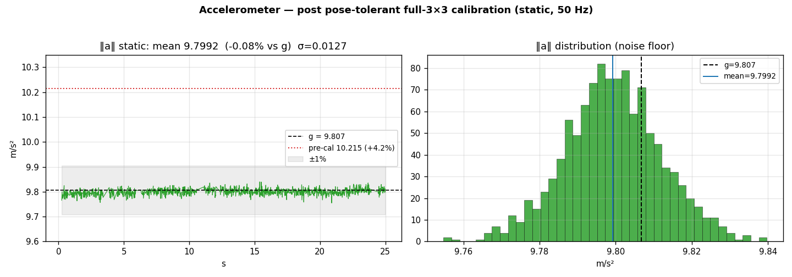
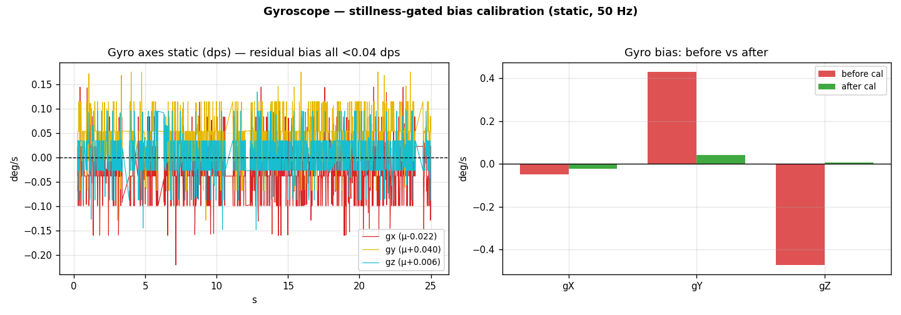
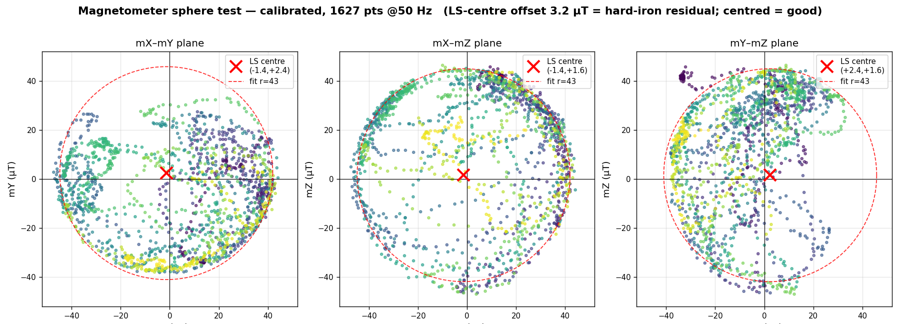
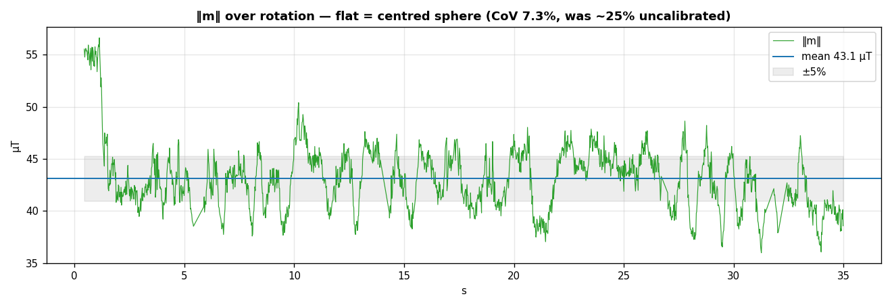

# Sensor calibration overhaul + on-hardware verification — 2026-06-25

Closes the sensor concerns raised in
[`../20260622-012844-onhw-tune/sensor-analysis.md`](../20260622-012844-onhw-tune/sensor-analysis.md).
That session found the accel scale still **+2.5–5 %** off, the mag carrying a
**~+25 µT hard-iron** offset, and the **gyro bias unverified** (no clean static
window). This session **rebuilt the calibration** (firmware) and **verified all
three sensors on the real FC**. Live capture over the ESP/UDP bridge
(`10.42.0.30:14555`), reconstructed to the full 50 Hz IMU rate (see
[Method](#method--50-hz-reconstruction)). Companion: [`README.md`](README.md).

## Verdict at a glance (vs 06-22)

| sensor | 06-22 | this session | status |
|---|---|---|---|
| Accel scale | +2.5 … +5.1 % (was +7.8 % on 06-17) | **‖a‖ = 9.799, −0.08 %** | **closed** (≤1 %) |
| Gyro bias | unverified (no still window) | **<0.04 dps** all axes | **closed** |
| Mag hard-iron | ~+25 µT residual, spread 64–220 % | **3.2 µT residual, CoV 7.3 %** | **closed** (yaw-grade) |
| Baro | resolution-limited ±0.1–0.2 m | unchanged (not a cal issue) | deferred (by design) |

All three IMU sensors moved from "improved but not trustworthy" to **verified in
spec**. The fixes are real-FC measurements, not SITL.

## What we built (firmware)

The old calibration was welded into `bmx160.c`: a brittle exact-pose 6-point
accel routine (axis-dominance gate — a non-level board could wedge it), a
blind 500-sample gyro average (no stillness check), and the mag ellipsoid fit.
We replaced it with a shared, sensor-agnostic **`src/calib`** module and rebuilt
accel + gyro on top of it (mag migrated unchanged):

- **`calib_ellipsoid.{c,h}`** — the ellipsoid solver (offset + full 3×3), lifted
  out of `bmx160.c`, host-unit-tested.
- **`calib_engine.{c,h}`** — a sensor-agnostic engine driven by a `calib_target_t`
  descriptor (raw-sample source + thresholds + commit sink); ellipsoid, point-set,
  and bias fits.
- **Accel** → pose-tolerant **full 3×3** ellipsoid over ~12 holds (6 faces + 6
  edges/corners); magnitude-only fit, so a roughly-held pose adds no error.
  `cal.bin` v2→v3 (`acc_scale[3]` → `acc_soft_iron[9]`), matrix-multiply apply.
- **Gyro** → **stillness-gated** bias capture (averages only while gyro+|a| are
  in band; times out rather than latch a bad bias).
- **GCS** → the Navigator calibration wizard guides the 12-pose accel flow.

Commits `6755073`·`f1cca38`·`56aedfb`·`1336d8c`·`22c42b2`. Host tests:
`test_calib_ellipsoid` (15 checks), `test_calib_engine` (26 checks); firmware
builds clean (RAM gate 976 B); SITL 15/15.

## Accelerometer — scale fixed to spec

`‖a‖` must read 9.807 m/s² at rest in any orientation. 06-22 wanted "one more
6-side cal to get from +2.5 % to ≤1 %"; the new full-3×3 routine overshot that
goal:

| | `‖a‖` mean | error vs g | noise σ |
|---|---:|---:|---:|
| session start (uncalibrated v3) | 10.215 | **+4.2 %** | 0.010 |
| after 12-pose cal | **9.799** | **−0.08 %** | 0.013 |

`‖a‖` sits on `g` with a ±0.013 m/s² (0.13 %) noise floor and a tight,
symmetric distribution centred on `g`. The resting per-axis read is
`aX −0.11, aY +0.34, aZ −9.79` — the `aY` offset is genuine surface tilt (no
precision level), **not** bias: `‖a‖` is the scale/offset metric and it is exact.

**EKF impact:** at rest `|‖a‖−g| ≈ 0.008`, far inside the 1.5 gravity gate (06-22
was ≈0.25, 06-17 ≈0.8). The estimator now accepts essentially every static sample
and leans minimally on gyro coasting.

## Gyroscope — bias zeroed, now verified

06-22 could not re-measure gyro bias (no still window). We captured **1108 static
points at 50 Hz** and ran the new stillness-gated cal:

| axis | before cal | after cal | noise σ |
|---|---:|---:|---:|
| gX | −0.049 | **−0.022** | 0.055 |
| gY | **+0.430** | **+0.040** | 0.046 |
| gZ | **−0.473** | **+0.006** | 0.042 |

The two large offsets (`gY +0.43`, `gZ −0.47 dps`) that the runtime auto-trim
could not reach (its 0.2 dps stillness gate stays shut at ~0.6 dps total rate)
collapse to **<0.04 dps**. Residual is now well under the ~0.05 dps white-noise
floor — gyro bias is **confirmed in spec**, closing 06-22 recommendation #3.

## Magnetometer — hard-iron removed (yaw-grade)

A calibrated mag traces a sphere **centred on the origin** (hard-iron removed)
with near-constant `‖m‖`. 06-22 flagged a stubborn **~+25 µT z hard-iron** that
survived even the post-cal log. We re-ran the cal and verified with a dense
rotation (**1627 points**, least-squares sphere fit — coverage-independent):

| | `‖m‖` mean | CoV | hard-iron residual |
|---|---:|---:|---:|
| 06-22 (post-cal log) | — | 64–220 % | ~+25 µT (z) |
| this session, uncalibrated | 46.1 | 25.2 % | ~24 µT |
| **this session, calibrated** | **43.1** | **7.3 %** | **3.2 µT** (LS-sphere centre) |

Firmware fit removed hard-iron `(−15.4, +16.7, +7.3) µT`, soft-iron diag
`1.006 / 0.957 / 1.037` (near-unity — minimal soft distortion).

The cloud now sits centred in all three planes (LS centre ≈ origin) and `‖m‖`
holds the ±5 % band through the rotation. The hard-iron residual is **3.2 µT**,
down from ~24–25 µT.

> **Caveat on the earlier "17.5 µT" scare.** A first keyframe-only capture
> (67 sparse points) reported a 17.5 µT centre offset — that was a **coverage-bias
> artifact**: a mean-of-points centre on an uneven hand rotation, not a real
> offset. The dense 50 Hz capture + least-squares sphere fit gives the trustworthy
> 3.2 µT. The lesson: judge mag centring by the **LS fit / `‖m‖` CoV**, never by
> the sample mean under non-uniform coverage.

Mag is **heading-grade for this airframe** now (3 µT residual on a 43 µT field).
It only matters for yaw/heading-hold; ANGLE/ACRO yaw is gyro-rate-controlled and
was never affected.

## Barometer — left as-is (by design)

The 06-25 calibration note flagged the baro as **resolution/noise-limited, not
bias-limited**: ~0.1–0.2 m quantization steps around ~474.5 m MSL. There is no
offset/scale/iron fit to do (the BME280 is factory-trimmed); the remedies are a
ground reference for AGL (already on the FC via `flight_phase`), oversampling/IIR
+ port shielding, and the vertical-estimator fusion that already smooths the
steps. ±0.1–0.2 m is immaterial to attitude/stability, so baro is intentionally
out of scope here.

## Method — 50 Hz reconstruction

The IMU is telemetered as a **keyframe + delta** stream (`telemetry_task.c`):
full `ImuRaw` snapshots only every 600 ms (~1.7 Hz), with `ImuCompressed`
frame-to-frame f16 deltas at **50 Hz**. The verification tool reconstructs the
full rate: `xₙ = xₙ₋₁ + f16(deltaₙ)`, reset at each keyframe, with the delta chain
invalidated on an `ImuCompressed` seq gap and re-anchored at the next keyframe.
Yield this session: static 1108 pts (41 keyframes + 1067 reconstructed, 143
dropped); mag 1627 pts (58 + 1569, 119 dropped).

> This also corrects a 06-17/06-22 note that the compressed stream was
> "non-reconstructable to absolute IMU" because `ImuCompressed.ref_seq == 0`.
> `ref_seq` is genuinely unused, but reconstruction does not need it — the deltas
> are frame-to-frame and the ~1.7 Hz keyframes re-anchor the running sum. The
> stream **is** reconstructable; the persisted CSVs here are proof.

## Status of the 06-22 sensor recommendations

| # | 06-22 recommendation | status |
|---|---|---|
| 1 | one more accel 6-side cal → ≤1 % | **closed** — full-3×3 → −0.08 % |
| 2 | finish mag cal, residual ~+25 µT hard-iron | **closed** — 3.2 µT residual |
| 3 | capture a 30 s still window, verify gyro bias | **closed** — <0.04 dps over 1108 pts |
| — | "compressed stream non-reconstructable (ref_seq=0)" | **disproved** — reconstructed @50 Hz |

Still open (telemetry-fidelity, **out of scope** for calibration; carried from
06-17/06-22): `AttitudeEuler.{roll,pitch,yaw}speed == 0`,
`ImuRaw.sample_time_us == 0`, `SystemHealth.cpu_load == 0`.

## Where we stand

IMU calibration is **done and hardware-verified**: accel ±0.08 %, gyro <0.04 dps,
mag 3.2 µT residual — all in spec, all on the real FC, all reproducible from the
persisted CSVs (`make_plots.py`). The firmware path is a clean shared module
(`src/calib`) that a future sensor can reuse via one descriptor. No calibration
work remains; the only sensor-adjacent follow-ups are the three always-zero
telemetry fields above, which are independent of calibration.

## Files

- `imu_static_accel_gyro_50hz.csv` — 1108 rows, static accel+gyro @50 Hz
- `mag_rotation_50hz.csv` — 1627 rows, mag rotation @50 Hz
- `make_plots.py` — regenerates `plots/01…04` from the CSVs
- columns: `t,ax,ay,az,gx,gy,gz,mx,my,mz,temp` (accel m/s², gyro dps, mag µT)
