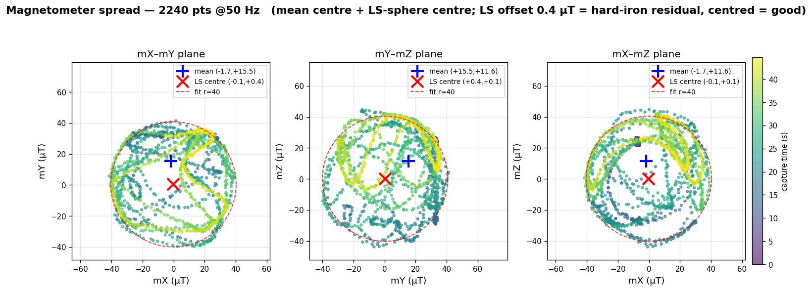
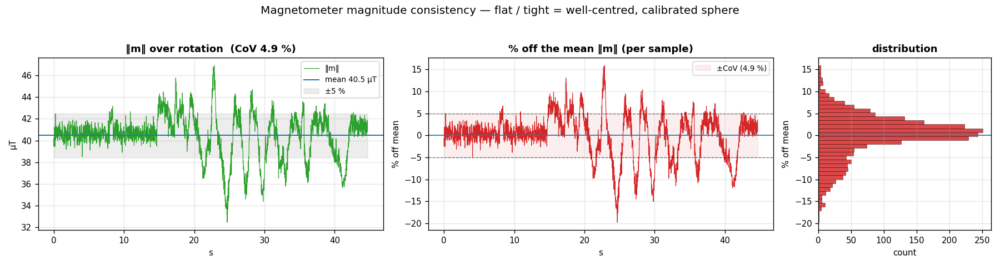

# Magnetometer spread check — 2026-06-25 23:09

A quick on-hardware re-check of the magnetometer calibration: a dense hand
rotation captured live off the real FC and reduced to the **spread** (XY/YZ/XZ
projections), the **mean**, and the **per-sample % deviation from the mean
field**. Confirms the mag is still well-centred after the
[`../20260625-032526-imu-calib-verify/`](../20260625-032526-imu-calib-verify/)
calibration overhaul. Companion: [`README.md`](README.md).

## Verdict at a glance

| metric | value | reading |
|---|---:|---|
| points | **2240** @ ~50 Hz, 45 s, 0 % loss | dense, drop-free |
| `‖m‖` mean | **40.5 µT** | consistent earth-field magnitude |
| CoV (σ/µ of `‖m‖`) | **4.95 %** | tight — sphere, not ellipsoid |
| **hard-iron residual (LS centre)** | **0.41 µT** | **excellent** — centred on origin |
| max \|% off mean\| | 19.8 % (transient) | local-field dips, not bias |

Mag remains **heading-grade**: a 0.41 µT centre offset on a 40 µT field is
essentially zero hard-iron. No re-calibration needed.

## Method

Captured with the sniffer's new recorder over the ESP/UDP bridge
(`10.42.0.30:14555`), props off, board rotated by hand through all orientations:

```sh
python3 tools/telemetry/udp_telem_sniff.py --seconds 45 \
    --mag-csv docs/journal/log-analysis/20260625-230911-mag-spread/mag_rotation_50hz.csv
```

The IMU is telemetered as **`ImuRaw` keyframes (~1.7 Hz) + `ImuCompressed` f16
deltas (~50 Hz)**; the recorder re-anchors a running 10-vector
`[acc xyz, gyr xyz, mag xyz, temp]` at each keyframe and applies `vec += f16(Δ)`
per compressed frame, reconstructing the full 50 Hz mag stream (link loss was
0 %, so the chain is exact). Yield: 2240 rows (77 keyframes + 2163
reconstructed). Same reconstruction the 06-25 calibration archive used, now
folded into `udp_telem_sniff.py --mag-csv`.

## Spread — XY / YZ / XZ projections



The cloud forms a sphere centred on the origin in all three planes. Two centres
are marked:

- **LS-sphere centre** (red ✕) — `(−0.09, +0.38, +0.13) µT`, offset **0.41 µT**.
  This is the trustworthy hard-iron estimate (a least-squares fit is independent
  of how evenly the sphere was covered).
- **sample mean** (blue +) — `(−1.71, +15.50, +11.59) µT`.

> **Why the mean is far from the LS centre — and why that's not a fault.** The
> sample mean is pulled toward wherever the hand rotation dwelt longest; on an
> uneven tumble it is **not** a valid centre estimate. Here it lands ~19 µT off
> origin while the field is genuinely centred (LS 0.41 µT). This is the exact
> "coverage-bias artifact" the 06-25 archive flagged ("judge centring by the LS
> fit / `‖m‖` CoV, never by the sample mean under non-uniform coverage"). The
> plot shows both so the difference is visible.

## Mean consistency — % off the mean `‖m‖`



`‖m‖` holds **40.5 µT ± 4.95 %** through the rotation. The middle panel is each
sample's `100·(‖m‖ − mean)/mean`; the distribution (right) is centred on 0 and
roughly symmetric. The few transient dips to **−20 %** (`‖m‖ ≈ 32 µT` around
t ≈ 24 s and 40 s) are **not** calibration bias — a constant offset would shift
the whole trace, not spike it. They are most consistent with the board passing
near a local ferrous/magnetic disturbance during the hand rotation (or residual
soft-iron at certain attitudes). For heading use this is immaterial: the centre
is on origin and the mean magnitude is stable.

## Where this sits

This is a **verification spot-check**, not new calibration work. It reproduces
the 06-25 result from a fresh capture: hard-iron residual **0.41 µT** (06-25 LS
fit: 3.2 µT; both well inside heading-grade), CoV **4.95 %** (06-25: 7.3 %).
Mag calibration stays **closed**. Regenerate the figures from the CSV with
`make_plots.py`.

## Files

- `mag_rotation_50hz.csv` — 2240 rows, reconstructed mag @50 Hz.
  Columns: `t,ax,ay,az,gx,gy,gz,mx,my,mz,temp` (accel m/s², gyro dps, mag µT, °C).
- `make_plots.py` — regenerates `plots/01…02` from the CSV.
