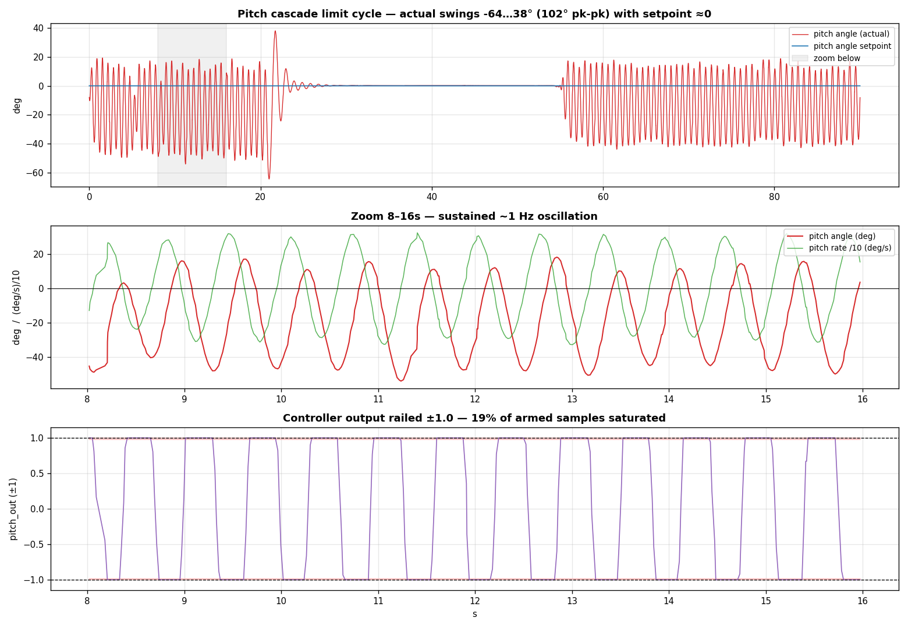
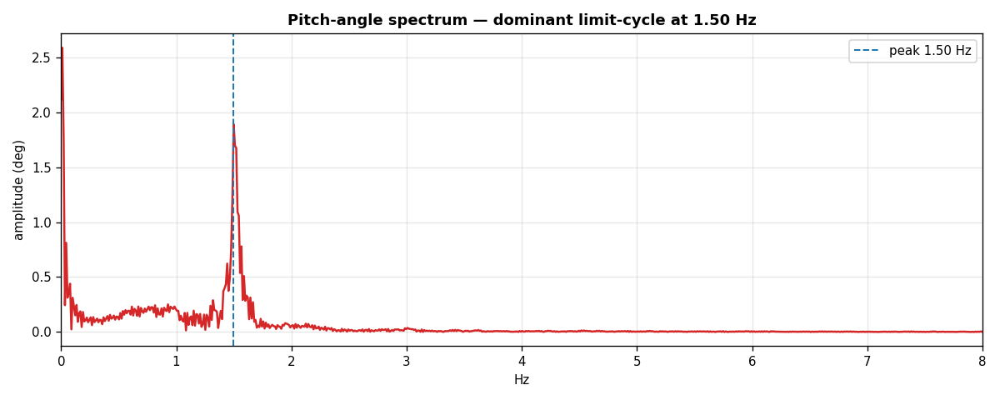

# Pitch cascade oscillation after sysid apply — 2026-06-25 23:17

A live capture of the **violent pitch oscillation** that appeared immediately
after pushing the sysid-designed pitch gains (rate + **angle_kp 4.14**) from the
0.25-throttle chirp run earlier this session. Recorded raw off the real FC; the
whole NavLink stream replays/decodes like a Navigator export. Companion:
[`README.md`](README.md).

## Verdict

**The new `angle_kp = 4.14` is too fast for the inner rate loop → a 1.5 Hz
cascade limit cycle.** With the pitch stick centred (`pitch_angle_sp ≈ 0`) the
craft oscillates **±~50° (102° peak-to-peak)** and the controller output rails
at **±1.0 for 19 % of the time**. The **rate** gains are fine; the **outer angle
gain must come down** (the loop is unstable, not mistuned-soft).

This is the *same* mode `freeflight_tune.json` already documents and fixed:

> "OUTER loop SOFTENED to 1.0 (was 4.317) — the autotune angle_kp was faster
> than the soft inner loop → ~1 Hz cascade oscillation. **Outer must be slower
> than inner.**"

The sysid `design_gains()` set `angle_kp = 0.25·wc = 0.25·16.57 = 4.14` — almost
exactly the 4.317 that caused the cascade before. We re-introduced a known fault.

## Evidence (armed window, 4534 ControlTrace samples @50 Hz)

| signal | value | note |
|---|---:|---|
| `pitch_angle_sp` | **0.0°** (flat) | stick centred — nothing commanded |
| `pitch_angle_curr` | **−64 … +38°**, 102° pk-pk | should be ≈0 |
| `pitch_rate_curr` | **±327 °/s**, σ 152 | violent |
| `pitch_out` | railed **±1.0, 19 %** of samples | bang-bang saturation |
| limit-cycle freq | **1.50 Hz** (FFT, single sharp peak) | the cascade mode |

The oscillation comes in bursts (≈0–22 s, then ≈40–90 s) separated by a brief
quiet stretch — a limit cycle that re-excites whenever the craft is perturbed.
In the zoom, pitch **angle** and pitch **rate** run ~90° out of phase (a clean
oscillator), and `pitch_out` switches between the rails — the controller is
saturating every half-cycle, which both sustains the limit cycle and is what
**overheats / burns a motor**.

One dominant mode at 1.50 Hz, no broadband content — consistent with a
loop-shaping (gain) problem, not sensor noise or a mechanical fault.

## Why it happened — and the fix

The inner rate loop was freshly stiffened by sysid (`rate_kp 0.012`, the same as
the tuned roll axis — good). But `design_gains()` then placed the **outer** angle
crossover at `0.25·wc`, which for this airframe lands the angle loop *faster*
than the inner loop can follow. In a cascade, the outer loop must be the slower
of the two; when it isn't, the two loops fight and limit-cycle.

**Fix: keep the sysid rate gains, drop `angle_kp` to the proven range.**

| gain | applied (caused this) | recommended |
|---|---:|---:|
| rate_kp | 0.01200 | 0.01200 (keep) |
| rate_ki | 0.01988 | 0.01988 (keep) |
| rate_kd | 0.00023 | 0.00023 (keep) |
| **angle_kp** | **4.1424** | **~1.0–2.0** (freeflight used 1.0) |

A follow-up is to cap `angle_kp` in `sysid_fit.py:design_gains()` (e.g. a
`bw_frac`-style ceiling or an explicit outer-slower-than-inner constraint) so the
analytic design can't hand back an angle gain that out-runs the rate loop.

## Hardware caveat

A motor was already burned out earlier this session; this run railed the output
19 % of the time, which is exactly the duty that cooks a motor/ESC. **Inspect the
motors before any further armed test**, and apply the softened `angle_kp` while
disarmed first.

## Files

- `pitch-osc.bin` — raw VREC capture, 90 s, 11409 datagrams (~23 k frames, 0 %
  loss). Decodes via the generated NavLink codec (see `make_plots.py`).
- `make_plots.py` — regenerates `plots/01…02` from the `.bin`.
