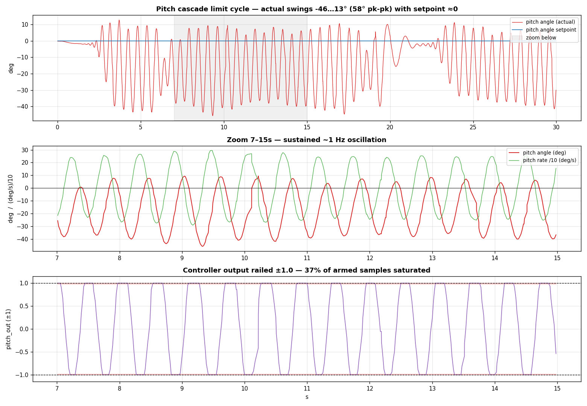
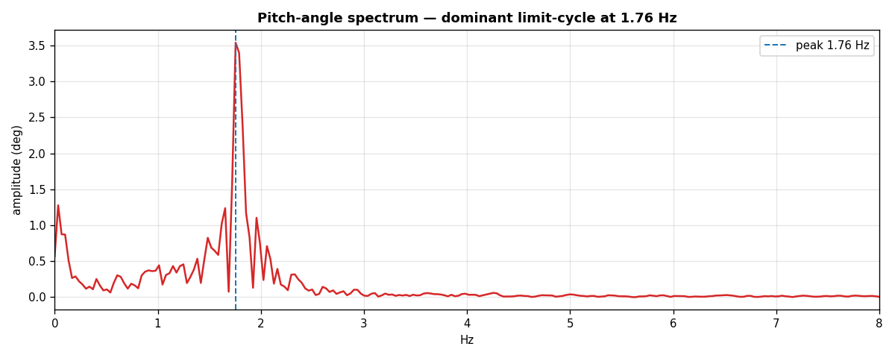

# Pitch tune v3 verification — 2026-06-25 23:38

Verification hover after applying the wc-capped pitch tune v3 (`rate_kp 0.00507`,
`angle_kp 1.75` — pitch inner loop matched to the stable roll axis). Raw capture
off the real FC.

## Verdict: NOT fixed — and it is not a tuning problem

The pitch oscillation persists. Across **three** gain sets spanning a 2.4× range
of `rate_kp` and a 2.4× range of `angle_kp`, pitch limit-cycles at ~1.5–2.6 Hz
while **roll stays rock-stable** — that rules out gain tuning as the lever.

| run | rate_kp | angle_kp | osc freq | pitch_out saturated |
|---|---:|---:|---:|---:|
| v1 (sysid raw) | 0.012 | 4.14 | 1.5 Hz | 19 % |
| v2 (angle cap) | 0.012 | 2.0 | 2.6 Hz | 19 % |
| **v3 (wc cap)** | 0.00507 | 1.75 | **1.76 Hz** | **37 %** |

Softening the inner loop **lowered** the frequency but **did not** stop the
limit cycle, and the output saturates *more* (37 %). A limit cycle that is
roughly gain-invariant and runs the actuator into the rails is **saturation /
authority-limited**, not a linear-gain issue.

## The physical tell — front/back thrust asymmetry

Motor means this run (X-quad; pitch = front M0,M3 vs back M1,M2):

| group | mean cmd |
|---|---:|
| front (M0,M3) | **0.341** |
| back (M1,M2) | **0.285** |
| left (M2,M3) | 0.323 |
| right (M0,M1) | 0.303 |

The **front pair runs ~20 % harder than the back** (left/right balanced) — a
pitch-axis imbalance: the craft trims nose-up (pitch mean −13°) and the loop
holds extra front thrust. Combined with the heavy saturation, the pitch loop is
running out of authority on one side and bang-bangs → a limit cycle no gain
damps.

## Most likely causes (pitch axis, in order)

1. **CG too far forward** — front motors carry the imbalance and saturate first
   on pitch corrections. *Balance the craft front-to-back.*
2. **Degraded back motor/ESC** — a session motor already burned out; a weak
   M1/M2 (or its ESC) loses pitch authority on that side.
3. **Mechanical** — bent/imbalanced prop, loose arm, or pitch-axis play feeding
   the ~1.5 Hz resonance.

The sysid plant itself is suspect: pitch `K = 1381` is **2.45× roll's 563** on a
symmetric X-quad — a red flag that the pitch axis was already asymmetric when it
was identified, so its designed gains were never going to fly.

## Recommendation

**Stop tuning gains; fix the hardware.** Check CG balance, inspect all four
motors/ESCs (especially the burned one) and props, then re-run sysid on a
verified-healthy airframe. Safe parking config meanwhile: revert pitch to the
firmware-default soft pure-P seed (`rate_kp 0.0005, ki 0`) — sluggish but does
not limit-cycle.

## Files

- `pitch-verify.bin` — raw VREC, 30 s, ~3812 datagrams, 0.1 % loss.
- `make_plots.py` — regenerates the figures from the `.bin`.
