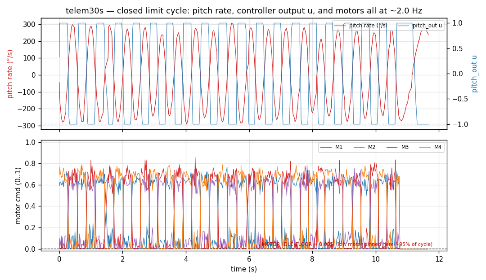
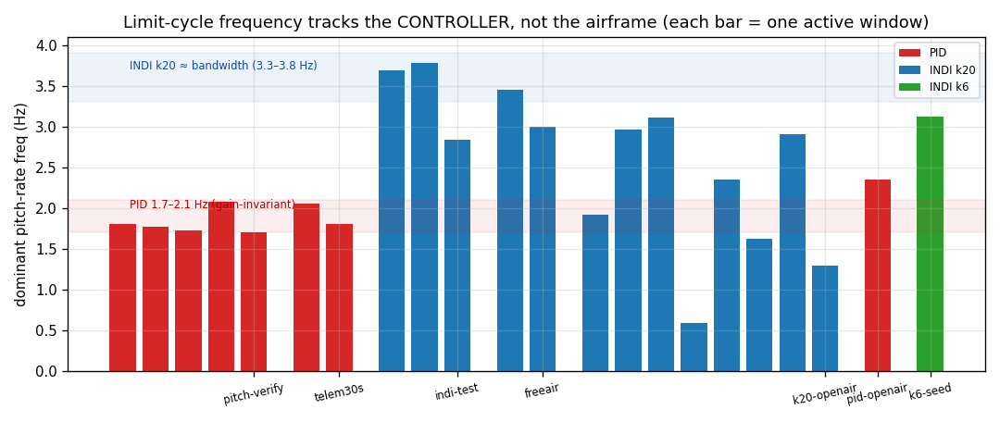

# Control-loop analysis

The cascade is angle (outer) → rate (inner; PID *or* INDI) → mixer. This doc
covers what the **control loop** does in the brief active windows; the actuator
stage that actually limits it is in [motor-analysis.md](motor-analysis.md).

## Loop timing — clean

`inner_dt` is **1.00 ms (1 kHz) with zero jitter** in every capture (loop column
of `analyze_campaign.py`). The rate loop is never starved, late, or aliasing on
its own clock. This rules out an entire class of "the loop is too slow / jittery"
explanations before we start.

## The rate estimate it controls on — clean

`AttitudeEuler.{rollspeed,pitchspeed}` are unpopulated (0): the rate loop reads
the **gyro directly**, so there is no estimator lag in the rate path. The gyro
itself is quiet at idle and shows only genuine motion when active
([sensor-analysis.md](sensor-analysis.md)).

## It is a closed limit cycle

`pitch_out` (controller effort, clamped to `[-1, 1]`) saturates `|u| ≥ 0.99` for
**26–83 %** of active samples. On the clean telem30s bench window the three loop
signals move as one — **pitch rate, controller output `u`, and the motor
pitch-differential all oscillate at ≈2.0 Hz**:

The lower panel is the tell: the low motor is **pinned at the idle floor
(0.005) for ~95 % of the cycle** while `u` rails. That is a closed actuator
relay loop, not airframe shake. The pilot is not involved — during this cycle
the pitch/roll sticks are still (`std ≈ 0`); the oscillation energy is in **no
RC channel**.

The attitude (outer) loop never holds: pitch-angle tracking error
(`setpoint − estimate`) runs **7–20° RMS** in every active window. But that is
*downstream* of the actuator saturation, not a cause — the inner loop cannot
deliver the rate the outer loop asks for.

## The frequency is owned by the controller

- **PID** (pitch-verify / telem30s / pid-openair): **1.7–2.1 Hz**, and
  *gain-invariant* — the v1→v2→v3 sweep spanning 2.4× in both `rate_kp` and
  `angle_kp` only shifted the frequency, never removed the cycle
  (`pitch-verify/README`). A cycle that ignores the gains is set by a
  *nonlinearity* (the mixer clip), not the linear gains.
- **INDI k20**: **3.3–3.8 Hz ≈ its own bandwidth `k`** (≈3.18 Hz) — it hunts at
  crossover where there is no phase margin.
- **INDI k6**: lowering the bandwidth collapses the sharp peak (rel-power 0.11);
  it is calm but soft.

(The wider spread in the k20-openair bars is an artefact of its ≤3 s windows
and 26 Hz lossy rate — the frequency resolution there is coarse and the gross
hop maneuver dominates the short transforms; the clean bench windows are the
trustworthy ones.)

## Why PID *and* INDI both fail

Both controllers are correct; both hit the same actuator wall.

- **PID** over-commands the differential chasing the rate error → low motor
  floors → anti-sat clips it → relay limit cycle. Softening gains only changes
  the frequency because the nonlinearity is the *clip*.
- **INDI** is saturation-aware — it feeds back the *realised* differential after
  clipping (`angle_rate_controller.c:505–523`), which is why k6 can be calmed.
  But it still cannot synthesise authority the motors physically cannot deliver;
  at k=20 it hunts at its bandwidth, and k6 "works" only by going so soft it
  droops to −82° and sits on the skids.

Algorithm-invariant failure ⇒ the cause is **upstream of the controller choice**
— the plant's actuator authority at its operating throttle. See
[motor-analysis.md](motor-analysis.md).
