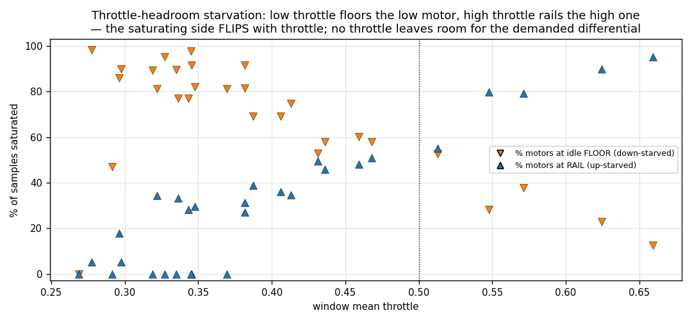
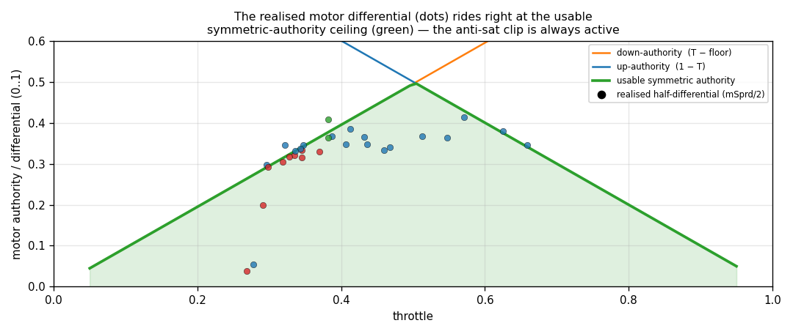

# Motor / mixer analysis — the actuator bottleneck

This is where flight is lost. The mixer takes the controller's per-axis
differentials and the collective throttle and produces four motor commands in
`[0, 1]`. Two firmware facts set the trap:

1. **`MOTOR_IDLE_FLOOR = 0.005`** (`variables.h:122`) — effectively *no* idle
   floor. A motor can be driven to ~0 thrust, where it has **zero further
   downward authority**.
2. **Anti-saturation by differential-scaling** (`angle_rate_controller.c:435–466`).
   When the demanded mix would push any motor outside `[0, 1]`, the firmware
   scales the *whole* PID differential down so the worst motor sits exactly at a
   limit, *keeping the pilot's throttle intact*. Its own comment:
   *"Authority over attitude is reduced when limits bite."*

In active windows the controller asks for a differential `mSprd` ≈ 0.6–0.8 of
full range while throttle is only ~0.3–0.5 — so a limit always bites and the
scaler is always cutting authority.

## The saturating side flips with throttle

At throttle `T` a motor can move `+(1 − T)` up but only `−(T − 0.005)` down. The
controller demands a roughly symmetric differential; whichever side has less
headroom saturates first. **The data shows the saturating side flip with
throttle exactly as that model predicts:**

| window group | throttle | motors at **floor** | motors at **rail** | starved side |
|---|---:|---:|---:|---|
| telem30s | 0.30–0.35 | **95–98 %** | 0 % | down |
| pid-openair | 0.30 | **90 %** | 5 % | down |
| pitch-verify | 0.33–0.37 | **81–91 %** | 0 % | down |
| k20-openair (air) | 0.39–0.55 | 28–81 % | 33–80 % | both |
| indi-test (bench) | 0.57–0.67 | 13–38 % | **79–95 %** | up |

Low throttle → floor-starved; high throttle → rail-starved. **There is no
throttle at which both sides have enough headroom** for the differential the
loop demands, because the demand (`mSprd` ≈ 0.7) is comparable to the throttle
itself.

## The realised differential rides the authority ceiling

Plotting the usable *symmetric* authority `min(T − floor, 1 − T)` (green) against
the realised half-differential per window (dots): the dots sit **right on the
green ceiling** at every flown throttle. Because `mSprd` is measured *after* the
anti-sat clip, riding the ceiling is direct proof the **clip is active in every
window** — the loop is continuously authority-limited, and the *pre-clip* demand
(visible as `pitch_out` railing, [control-loop](control-loop-analysis.md)) is
higher still.

## Lock-step with the cycle, and mostly symmetric

The motor pitch-differential oscillates at the **same frequency** as pitch rate
and `pitch_out` (telem30s: 2.02 / 2.05 / 2.05 Hz) — the actuator is *in* the
limit-cycle loop. Front-vs-back asymmetry is small in steady windows (±0–10 %);
the large `fb` excursions (freeair +155 %, k6 −45 %, k20 +44 %) coincide with
upsets/tumbles, not steady trim. So the earlier "front pair 20 % hotter" bench
observation is a minor trim bias — **the dominant motor problem is gross
bidirectional saturation, not a steady asymmetry.**

## Why the craft can't climb out of the trap

The escape from a low-throttle floor-starve would be *more* throttle (toward the
0.5 crossover where headroom is most symmetric). But max sustained throttle never
exceeds ~0.5 and altitude barely rises — the craft is **underpowered /
overweight / down a motor** (consistent with the previously burned arm and the
pitch-axis `K` being 2.45× roll's, documented in `pitch-verify/README` and the
`onhw-*` notes). Low thrust margin ⇒ low control-authority margin ⇒ guaranteed
saturation limit cycle. Fixes in [recommendations.md](recommendations.md).
