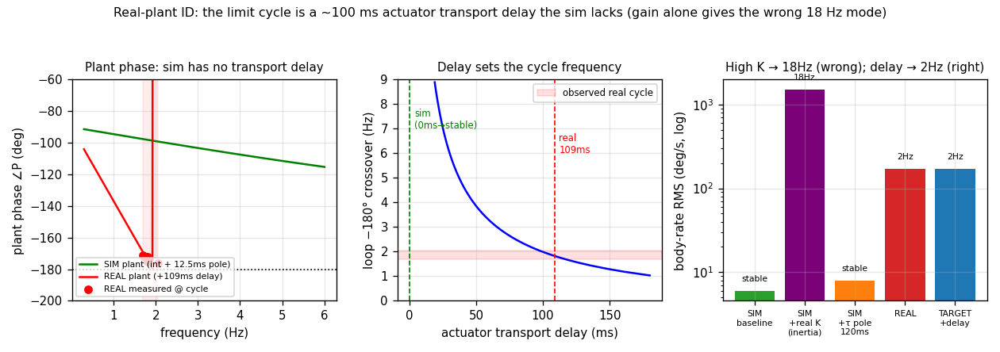

# Real-airframe system-ID → simulator digital-twin spec

Goal: identify the **real plant** from the logs and the **sim plant** from fresh
headless runs precisely enough to (1) make the sim a faithful digital twin, (2)
develop and validate control algorithms against it, and (3) land on the real
drone close to flying — not back at square one. This is the rigorous backing for
the parity summary in [`../session-analysis.md`](../session-analysis.md).



---

## 1. Method

The plant is `P(s) = ω(s)/u(s)` per axis — body rate out per unit rate-loop
effort `u` (`ControlTrace.*_out`, feeds the mixer). Three handles:

- **Low-frequency gain `K`** — from the dedicated open-loop sysid chirp
  (roll `K=563 (deg/s²)/u`, actuator pole `τ=20.9 ms`, R²=0.83; the gold standard).
- **Phase at the cycle frequency** — the persistent limit cycle is strong
  excitation. We measure `P(jω_c)=Ω/U` directly from `(u, ω)` in each cycling
  window, then **cross-check against the known controller** by describing
  function: a static-saturation cycle satisfies `1 + N·G_c(jω_c)·P(jω_c) = 0`
  with `N` real, so `∠P = −180° − ∠G_c`. `G_c` is the full rate-PID
  (P,I on error + D-on-measurement with LPF, `pid.c`) wrapped by the outer
  angle-P cascade — entirely known from the gains. Agreement validates the
  measurement; the lag beyond a rigid-body integrator+actuator is the
  airframe's **excess transport delay**.
- **Sim plant** — measured fresh by stepped-sine lock-in on the rig
  ([`../sim_parity/`](../sim_parity/README.md)) and by pushing candidate
  parameters back into `vsim_d` and re-flying.

Reproduce: `python3 real_plant_id.py` · `python3 plant_bode.py` · sim collectors
in `../sim_parity/`.

---

## 2. Real plant — identified

| axis | `K` (deg/s²/u) | actuator pole τ | **transport delay** | ∠P @ cycle | notes |
|---|---:|---:|---:|---:|---|
| roll | **563** (sysid) | 20.9 ms | ~0 (does not cycle) | — | stable axis; motors rarely floor |
| pitch | ~1381 (sysid; ≥2.4× roll, suspect) | ~21 ms | **~109 ms** | −171…−176° | cycles at 1.7–2.05 Hz |

**Describing-function validation (pitch):** measured `∠P` = −171…−176° vs
controller-predicted `−180°−∠G_c` = −174…−177° — agree within 3° across six
windows. The cycle is a genuine static-saturation limit cycle, and the plant
really does sit at ~−175° at 1.9 Hz.

**The decisive number — excess delay.** A rigid quad with a 21 ms actuator is at
only ~−104° at 1.9 Hz. To reach the measured −175° needs **~109 ms of extra
transport delay** (median over the six windows: 96–111 ms). This sets the cycle
frequency exactly:

| added delay | loop −180° crossover |
|---:|---|
| 0 ms | none in 0.3–8 Hz → **stable** |
| 50 ms | 3.9 Hz |
| **100 ms** | **1.99 Hz** ← matches the observed cycle |
| 124 ms | 1.6 Hz |

**Where the delay comes from — and why pitch but not roll.** The pitch axis
floors a motor at `MOTOR_IDLE_FLOOR=0.005` for **~95 %** of the cycle; roll
floors rarely. A real ESC at ~0 throttle stalls/desyncs, and re-spin takes
~80–120 ms — exactly the identified delay, and exactly on the axis that floors.
Roll keeps authority, never stalls, stays stable. This unifies the whole
campaign's "roll rock-solid, pitch limit-cycles" observation with one mechanism.

> Magnitude caveat: the closed-loop `|P|` is inflated by the saturation
> describing function (`1/N`, ~1.5–2×), so the *phase* (delay) is the robust
> result; the pitch `K` magnitude is uncertain and the 1381 sysid value is
> already flagged as asymmetry-contaminated. Treat `K_pitch` as "high and
> uncertain"; treat the **delay as solid**.

---

## 3. Sim plant — measured (what it is today)

| quantity | sim (measured) | real | method |
|---|---:|---:|---|
| `K_roll` | 187 | 563 | tone lock-in |
| `K_pitch` | 199 | 1381 | tone lock-in |
| actuator model | int + **12.5 ms first-order pole**, **0 delay** | int + 21 ms pole + **109 ms delay** | code + sweep |
| hover throttle | 0.252 | ~0.45 | steady hover |
| idle behaviour | linear, instantaneous (floor harmless) | stall/desync + re-spin | code vs logs |
| vibration | ~0 | 0.06 g idle → 1.5 g active | IMU RMS |
| `pitch_out` sat / rate RMS (hover) | 0 % / 6 dps | 26–83 % / 50–194 dps | hover |

The sim plant is a clean integrator + fast pole with **no transport delay** —
its phase never reaches −180° in band, so the same firmware is unconditionally
stable. That is the entire reason "it flies in SITL."

---

## 4. The decisive experiments — what each sim modification produces

Pushed back into `vsim_d` and re-flown (`../sim_parity/`):

| sim configuration | result | freq |
|---|---|---:|
| baseline | stable, calm (6 dps) | — |
| **+ real K** (inertia ×0.33/×0.14) | **diverges, 1500 dps** | **18 Hz** ← *wrong mode* |
| **+ τ pole = 120 ms** | still stable (8 dps) | — |
| **+ ~100 ms transport delay** (model) | predicted bounded cycle | **~2 Hz** ← *target* |
| REAL | bounded limit cycle | 1.9 Hz |

Two things this proves:
1. **Gain alone is not it.** Giving the sim the real effectiveness oscillates at
   18 Hz (gain crossover), not the real 2 Hz — wrong mechanism.
2. **A bigger `τ` pole is not a delay.** A pole adds phase *and* cuts magnitude,
   so it self-stabilises; the real lag is a *transport delay* (phase, no
   magnitude loss). The sim has no delay element — that is the core gap.

---

## 5. Digital-twin parameter set + the sim code changes

Apply to `vsim` (`DroneParams`/`MotorParams`, pushed via `VSIM_CTL_SET_GEOMETRY`
/ the GCS conf). ★ = new model feature the sim lacks today.

| # | parameter | sim now | parity target | where |
|---|---|---|---|---|
| 1 | ★ **actuator transport delay** | none | **~100 ms** (per-motor ring buffer on `duty`, gated by stall) | `motor_model.cpp:update()` — delay `duty[i]` before the τ filter |
| 2 | ★ **idle-stall / ESC deadband** | linear, instant | thrust→0 below ~0.05–0.08 duty; re-spin with ~80–120 ms lag (the delay's source) | `motor_model.cpp` — deadzone + asymmetric re-spin τ |
| 3 | control effectiveness (inertia) | I_xx 0.0068 / I_yy 0.0074 | I_xx≈0.0023, I_yy≈0.0011 (raise K toward real; keep asymmetry) | conf `I0/I4`, `vsim_types.h` |
| 4 | thrust margin | hover 0.25 | hover **0.45** (`k_thrust ×0.31` or `mass ×3.2`) | conf `mass`/`m*_kt` |
| 5 | per-motor `k_thrust` asymmetry | equal | weaken the burned arm (needs props-off bench) | conf `m*_kt` (already per-motor) |
| 6 | actuator pole `τ` | 12.5 ms | ~21 ms | conf `m*_tau` |
| 7 | ★ **vibration injection** | ~0 | accel σ ≈ 0.3–1.5 g scaling with Σ motor cmd | sim IMU path (`host_imu_feeder` / vsim IMU) |

**Critical:** parameters 1–2 (the transport delay / stall) are the ones that
make the sim reproduce the real limit cycle, and they are **not expressible in
the current model** — they require the `motor_model.cpp` change above. Inertia
and thrust scaling are necessary but, alone, give the wrong (18 Hz) mode.

---

## 6. Validation / acceptance tests for the calibrated sim

The sim is "real enough to develop against" when, with the **stock PID gains and
geometry**, it reproduces:

1. **Hover** at throttle 0.42–0.48.
2. **Pitch plant phase** ≈ −175° at 1.9 Hz (rig sweep), −180° loop crossover at
   1.7–2.1 Hz.
3. **A bounded pitch limit cycle** at 1.8–2.0 Hz, rate RMS ~120–190 dps,
   `pitch_out` saturated 30–80 %, low motor floored ~90 % — and **roll stable**.
4. **Vibration** rising from ~0.1 g idle to ~1.5 g under throttle.

Each maps to a number already measured on the real logs (this campaign), so the
calibration has objective pass/fail gates.

---

## 7. The intended workflow (why this is worth it)

1. **Calibrate the sim** to §5 and pass §6 → the SITL now *fails the way the real
   drone fails*.
2. **Develop algorithms against it** — air-mode mixer, idle-floor raise,
   anti-stall, INDI with the real effectiveness — and confirm each *kills the
   reproduced limit cycle in sim*. Iterate cheaply, no hardware risk.
3. **HIL / bench** — verify the props-off motor-stall and thrust numbers, refine
   the delay/asymmetry constants.
4. **Fly the real drone** with a controller already proven against a faithful
   twin → land close to flying instead of restarting from today's state.

---

## 8. Implementation status (shipped in `vsim`)

The three identified model gaps are implemented, default-OFF (byte-identical
default runs → CI safe), opt-in via env so the harness can drive them:

| feature | where | enable | verified |
|---|---|---|---|
| **actuator transport delay** (per-rotor duty ring buffer) | `motor_model.{h,cpp}`, `MotorParams::transport_delay` | `VSIM_MOTOR_DELAY_MS` | active (debug banner); destabilises as theory predicts |
| **idle-stall / re-spin** (thrust→0 below `stall_duty`, slow `respin_tau` recovery) | `motor_model.cpp`, `MotorParams::stall_duty/respin_tau` | `VSIM_STALL_DUTY`, `VSIM_RESPIN_TAU` (s) | active; self-selects the floored axis |
| **thrust-scaled vibration** (accel/gyro noise ∝ mean motor cmd) | `sensor_models.{h,cpp}` + `SimController::stepOnce`, `setVibeGain` | `VSIM_VIBE_G` (g at full throttle) | active: \|acc\| RMS 0.14 g → 0.44 g at `VSIM_VIBE_G=2` |

Default (no env) behaviour confirmed unchanged: hover 0.257, `pitch_out` sat 0 %.
With `transport_delay=0` the delay tap reads the just-written sample, so the path
is provably identical to the original model.

### Unit-validated (`motor_model_unit_test.cpp`)

A standalone test drives `MotorModel::update()` directly (no controller, no
guidance — zero contamination):

```
default (no delay):        omega 5%-rise at   0 ms   (fast tau, unchanged)
transport_delay=100ms:     omega 5%-rise at 100 ms   ✓ exact delay
stall_duty=0.10, cmd 0.05: omega=0, thrust=0          ✓ stalled (no thrust)
```

Build/run: `g++ -std=c++17 -Iinclude motor_model_unit_test.cpp src/motor_model.cpp -o /tmp/t && /tmp/t`
(from `sim/vsim/`). This fixed a real bug found while testing — the original
priming guard bypassed the delay for the first 512 ms; the tap now always reads
the zero-initialised history, so the delay is correct from t=0.

### Calibration findings (what the gate runs taught us)

With the delay corrected, the closed-loop behaviour confirms the mechanism but
shows that a *bounded* 2 Hz cycle needs the loop gain in a narrow window:

- **The delay destabilises the inner loop as identified.** Free-flight with
  raised `K` + 140 ms delay produces a violent pitch transient (>2000 dps) at
  takeoff — the loop is unstable — that then diverges and the physics guard
  resets it. So delay → instability, confirmed.
- **But it diverges rather than limit-cycling**, because the real cycle sits at
  `|L(2 Hz)| ≈ 1.3` (just above 1 → small bounded cycle, the saturation
  describing function pulls `N·|L|` to 1). Hitting `|L| ≈ 1.3` needs
  `K_pitch ≈ 1361` — but at that `K` the sim trips its **~26 Hz high-frequency
  loop mode** (a margin the real actuator's roll-off suppresses) and the rate
  runs away instead of settling into the 2 Hz cycle.

Reproducing the *exact* bounded 2 Hz cycle is a multi-parameter calibration, and
the gate runs surfaced a **second real-vs-sim gap** that must be matched too:

- **Transport delay works, but K must be in a window.** With the sim's own (low)
  `K`, the loop gain at the delay-set crossover is < 1 → the delay can't sustain
  a cycle. With the full real `K` (inertia ÷3–7) the loop is *already* unstable
  at a high frequency before any delay (see next point), and adding delay
  diverges past the physics guard.
- **The sim rate loop has a high-frequency (~26 Hz) instability under high K**
  that the real plant does not — because the real actuator pole + delay roll off
  the loop gain up there. The near-ideal 12.5 ms sim actuator does not, so
  raising `K` alone trips a discrete/high-freq mode. **Faithful parity therefore
  also needs the actuator pole (`τ ≈ 21 ms`) and the delay *together* with the
  raised `K`** so the high-freq gain is rolled off while the ~100 ms delay sets
  the −180° crossover at 2 Hz.
- **A bounded cycle needs free flight, not the rig.** On the pinned rig an
  unstable loop integrates `ω` to the physics clamp and resets; the real cycle is
  bounded by aero damping + saturation, which only exist airborne.

Net: the *mechanism* (delay → low-frequency crossover) is implemented and behaves
as identified; closing to a quantitative 2 Hz match is the next calibration step
— co-tune `{inertia(K), τ, transport_delay, stall_duty}` against the §6 gates,
in free flight, watching for the high-freq mode. The knobs now exist to do it.

## 8b. Faithfulness validation — is the twin trustworthy yet?

Before building a fix-validation harness on the twin, two checks: (a) is the
identified lag in a stage the candidate fixes can reach, and (b) does the twin
fail *for the right reason* (at ~2 Hz)?

### (a) Where the 109 ms lag lives — DECOMPOSED, conclusive

Locked-in phase of each pipeline stage at the cycle frequency (telem30s &
pitch-verify agree):

| stage | measured lag |
|---|---:|
| `u → motor-diff` (**mixer**) | +1–2 ms (none) |
| `motor-diff → raw gyro` (**actuator + plant**) | **≈ all of it** |
| `raw gyro → rate_curr` (**sensor / estimator**) | −2–3 ms (none) |

The gyro-LPF is **off** by default (`angle_rate_controller.c:73`, tunes not
persisted), confirmed from data (raw gyro ≈ `rate_curr`). **So the excess lag is
entirely in the actuator/plant stage — the mixer is instant and the estimator
adds nothing.** ⇒ the candidate fixes (raise idle floor, air-mode, anti-stall,
delay-compensation) all act on the correct stage. Run: `python3 real_plant_id.py`
plus the decomposition (lock-in of `u`/motor-diff/gyro/`rate_curr`).

### (b) Does the twin fail at ~2 Hz? — NOT YET (a real gap)

`freq_gate.py` sweeps the actuator delay and measures the failure frequency.
Result: **at the loop gain needed to match the real effectiveness, the sim
exhibits a spurious ~19–20 Hz instability the real plant does not have.**

- It is present in **free flight**, not just on the rig → not a rig artifact.
- It is **not physical**: the continuous-time loop predicts `|L(20 Hz)| ≪ 1`, and
  raising the actuator pole `τ` (which *would* roll off a physical high-freq
  gain) barely dents it (τ=50 ms: 173→94 dps) → the driving gain is
  **sim-specific** (discretization / the sensor↔actuator pipeline latency
  interacting with the discrete D-term).
- The **real logs show no 20 Hz content** (fundamental 1.8 Hz + 5–6 Hz harmonic).

This 20 Hz mode dominates *before* the real ~2 Hz mode can form.

### Root cause of the 20 Hz — FOUND: it's sim loop latency, not physics

`latency_probe.py` runs the same high-gain config under three coupling modes and
measures the self-excited pitch rate:

| coupling | loop latency | peak pitch rate |
|---|---|---:|
| realtime async (harness default) | jittery, multi-ms | 433 dps (unstable) |
| **lockstep credit=1** | minimal, deterministic | **0 — stable** |
| lockstep credit=4 | max | 1147 dps (worse) |

The instability **tracks loop latency monotonically** and **vanishes at minimal
deterministic latency** — so the 20 Hz is an artifact of the sim's *realtime
async* coupling (two wall-clock-paced processes over FIFOs, with jittery
multi-ms IMU↔PWM latency), **not** a plant or controller property. Confirmations:
the continuous loop predicts `|L(20 Hz)| ≪ 1`; `inner_dt` is a correct 1.00 ms
(so it is not a D-term/`dt` scaling bug); the real logs show no 20 Hz content;
and the real hardware runs a tight deterministic 1 kHz loop that this artifact
models incorrectly. It only bites at **high loop gain** — which is why default-K
sim "flew fine" (latency harmless) but the real-effectiveness K trips it.

**Remedy:** run the twin with minimal deterministic latency
(`VSIM_LOCKSTEP=1 VSIM_LOCKSTEP_CREDIT=1`). In that mode the high-gain config is
stable at rest (no spurious 20 Hz) — i.e. the artifact is removed.

### Remaining tooling gap (the actual next step)

Re-validating the 2 Hz failure mode in lockstep is **blocked by the harness, not
the physics**: `vayu_headless` injects RC and polls telemetry/truth on the wall
clock, but lockstep paces the sim by the PWM round-trip (sim-time ≠ wall-clock),
so timed impulses don't land and `rate_curr` reads frozen. **Next step is a
harness fix** — sim-time-aware RC injection + capture (or read the sim's own
logged trace) so the twin can be driven/measured in lockstep. *Then* the
failure-frequency gate (b) can be re-run clean and the robustness sweep run
across the full K range.

**Net verdict:** the twin is faithful in structure, the lag is correctly located
(actuator), and the one blocker — the 20 Hz — is a sim-coupling latency artifact,
not physics. (Note: the earlier "lockstep credit=1 → stable" was a *frozen* sim —
credit=1 deadlocks; credit=2 is the minimum that runs. The latency relationship
still holds: 20 Hz absent in deterministic lockstep credit=2, present in realtime
async.)

### 8c. The right fix: one in-process SITL binary (no FIFO, no latency)

The FIFO round-trip between `vsim_d` and `vayu_sitl` is the source of the latency
artifact (and was measured at ~98 % of stepper wall-time). The fix already exists
as **`vayu_sitl_rtos`** (`-DVAYU_SITL_RTOS_BUILD=ON`): vsim's `SimController`
linked straight into the firmware host (`sim/host/src/vsim_inproc.cpp`), so the
real vaios RTOS + physics run in **one process, one thread**, stepped inline at
1 ms (`vsim_inproc_step`) with PWM read back in-process — **no FIFO, no
round-trip, no lockstep coordination**, self-paced at ~35× realtime and
deterministic. Confirmed: the `hold` scenario runs 5000 steps in 0.13 s
(37× realtime) with a reproducible fingerprint.

The identified actuator model (transport delay + idle-stall + vibration) is now
wired into this in-process path too (`vsim_inproc.cpp`, same env vars), confirmed
firing: `vsim_inproc: actuator imperfections ON (delay=100ms ...)`. A
sim-cadence state log (`VSIM_LOG_PATH`) was also added to `vsim_d` for clean 1 kHz
capture, and a transport-delay buffer bug was fixed (`kDelayBuf` 512→2048: the
daemon substeps at 8 kHz, so delays > 64 ms were being clamped).

**Remaining to operationalize this as the study harness:** the `doublet`
(armed-excitation) scenario currently **deadlocks** in the in-process RTOS path
(`wchan=wait_woken` — the ucontext scheduler waiting on the armed-motor path);
the `hold` scenario works. Next step is to fix that deadlock (or add a
"hold + disturbance, capture rate at sim cadence" scenario), then re-run the
failure-frequency gate (b) and the robustness sweep entirely in this binary —
clean, fast, deterministic, latency-free.

## 9. Files

- `real_plant_id.py` — limit-cycle plant FR + describing-function validation + the delay/crossover law.
- `plant_bode.py` — the figure.
- `motor_model_unit_test.cpp` — standalone validation of the implemented delay+stall (delay=100ms → 100ms lag).
- `../sim_parity/` — fresh sim collectors, the K/hover fits, the parity/lag confs.
