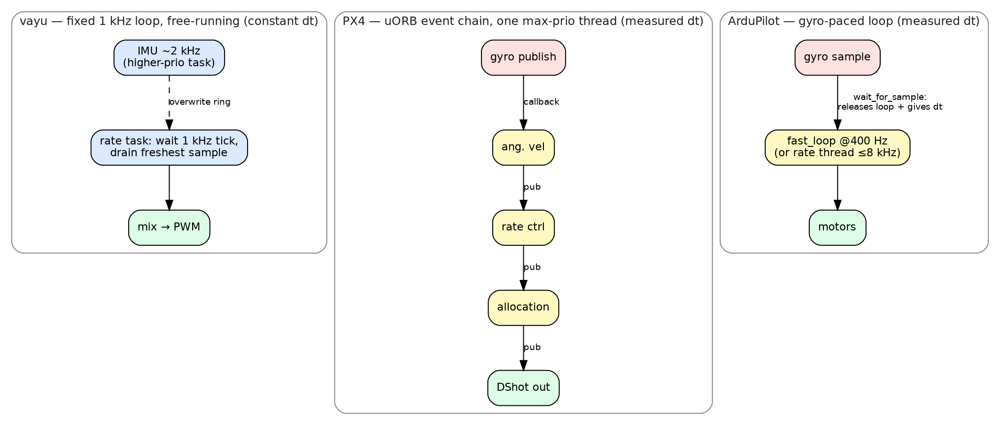
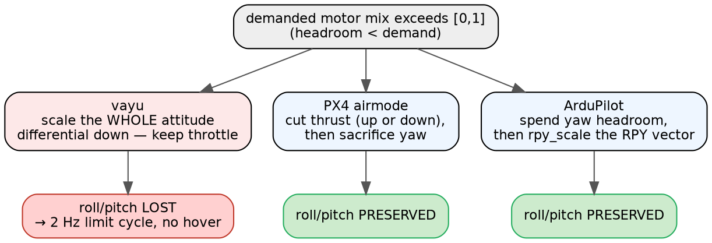
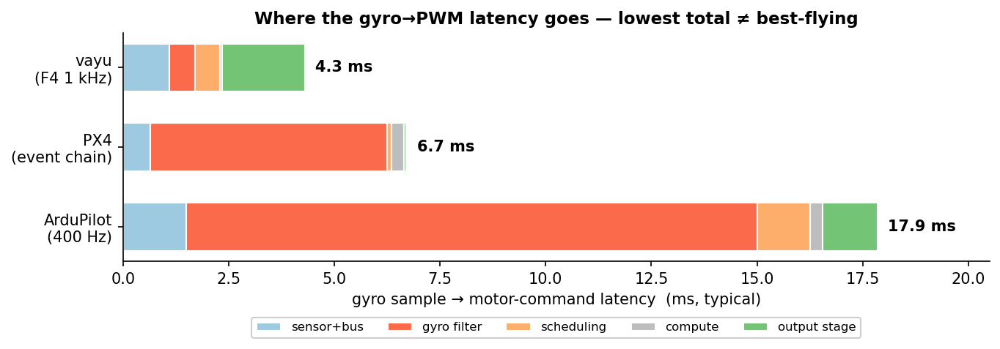
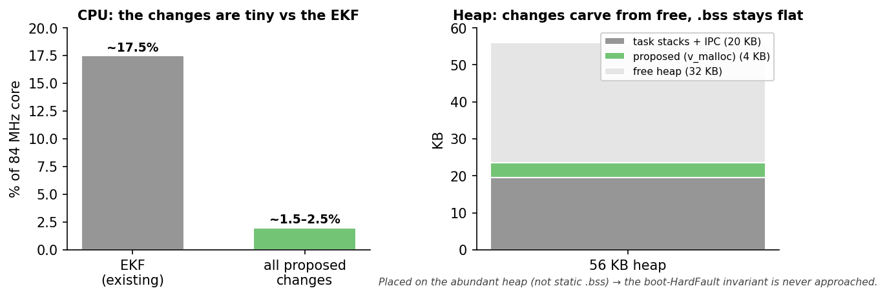

# Control loop, sensor→PWM: vayu vs PX4 vs ArduPilot — a timing-first comparison

Date: 2026-06-27. Three independent source traces of the inner stabilization
pipeline (gyro sample in → motor PWM out), aligned stage-for-stage with a focus
on **timing, cadence, and where latency/phase-lag is born**. Reference trees:
`stack/vayu/firmware` (vaios RTOS, Cortex-M4 @ 84 MHz), `stack/resources/PX4-Autopilot`
(v1.16-dev), `stack/resources/ardupilot` (ArduCopter, ChibiOS).

> Why this matters: the [pitch-INDI campaign](README.md)
> proved vayu's no-hover failure is an **actuator-authority** problem (naive
> anti-sat mixer + ~0 idle floor → ESC stall transport delay → 2 Hz limit cycle),
> not a loop-timing one. PX4 and ArduPilot are the reference implementations for
> the two fixes that matter (graceful saturation / airmode, real idle). This doc
> locates exactly where each does it differently.

---

## 0. TL;DR matrix

| Axis | **vayu** | **PX4** | **ArduPilot** |
|---|---|---|---|
| Time base | Fixed 1 kHz RTOS task, **free-running**, drains freshest IMU sample | **Event-driven** uORB callback chain (no loop) | **Gyro-paced** main loop (`wait_for_sample`) |
| Inner rate-loop rate | **1 kHz** (constant) | ~400 Hz (`IMU_GYRO_RATEMAX`, gyro-driven) | 400 Hz main, **or gyro-rate (≤8 kHz)** in fast-rate thread |
| `dt` used by controller | **Constant 1 ms** (nominal) | **Measured** inter-sample Δt | **Measured** inter-sample Δt |
| Sensor→loop coupling | Decoupled via SPSC overwrite rings | uORB publish callback (synchronous) | `wait_for_sample` blocks loop on gyro |
| Gyro filtering | 1st-order EMA (α≈0.51) + deadband; **no notch** | 2 dyn-notch (ESC/FFT) + 2 static notch + 40 Hz LPF | up to 3 harmonic notch + 20 Hz 2-pole LPF |
| Estimator in rate path? | **No** — raw filtered gyro | **No** — `vehicle_angular_velocity` | **No** — `get_gyro_latest()` |
| Inner control law | **INDI** (selected; PID compiled) | Rate **PID** (D-on-measurement) | Rate **PID** (D-on-measurement) |
| Mixer / allocation | Scalar **anti-sat scaler** (uniform shrink, keeps throttle) | **Pseudo-inverse + sequential desaturation** (airmode) | **rpy_scale vector shrink** + yaw headroom + thrust-boost |
| Saturation philosophy | Sacrifice **attitude** to keep throttle | Sacrifice **thrust then yaw** to keep roll/pitch | Sacrifice **yaw** (then scale RPY) to keep roll/pitch |
| Idle floor | `MOTOR_IDLE_FLOOR = 0.005` (≈ none) | spin_min via airmode/spool | `MOT_SPIN_MIN`=0.15 + airmode |
| Output protocol | **Analog PWM 400 Hz**, polled @ ~500 Hz | DShot/PWM, same-thread, event-driven | DShot/PWM, dedicated rcout thread |
| Gyro→PWM latency (typical) | **~4.3 ms** (worst ~7.9) | **~6–7 ms** (filter-dominated) | **~15–30 ms** (filter-dominated) |
| Dominant latency source | **Output stage** (poll + 400 Hz latch) | **40 Hz gyro LPF** (~5.6 ms) | **20 Hz LPF + notch** (~11–16 ms) |

The counter-intuitive headline: **vayu has the *lowest* nominal gyro→PWM latency
of the three** — because it barely filters and runs the rate loop at 1 kHz. Its
worst chunk is the crude *output* stage, not the controller. So the no-hover
failure is **not** loop latency. The two stacks that fly do so by being smarter
exactly where vayu is naive: **filtering, the mixer under saturation, and the
idle floor** — none of which are about raw loop speed.

---

## 1. Time base & scheduling — three different philosophies



*vayu free-runs and grabs the newest sample (constant dt); PX4 is publish-triggered
(no loop, one context switch, measured dt); ArduPilot lets the gyro clock the loop
and supply dt. vayu is the only one not sensor-triggered and the only one on a
nominal constant dt.*

**vayu — fixed-rate, free-running, sample-draining.**
The rate loop is a vaios task (`angle_rate_controller.c:244`) that does
`task_delay_until(1 tick)` on the 1 kHz SysTick, then *drains* the freshest gyro
from a lock-free overwrite ring (`imu_buffer.c`). It is **not** woken by a
sensor-ready event — the `_imu_control_sema` exists but the loop deliberately no
longer waits on it (CTRL-RATE-101 comment, `angle_rate_controller.c:561`). The
IMU producer runs at ~2 kHz on a higher-priority task (`imu_read`, prio 2),
asynchronous to the 1 kHz consumer. Consequence: **the phase between the 2 kHz
producer and 1 kHz consumer is uncontrolled** (beat/aliasing possible), and the
controller is handed whatever sample is newest at its tick.

**PX4 — there is no loop.** The rate path is a chain of uORB-publish-triggered
work items, all on one work queue `wq:rate_ctrl` at `SCHED_FIFO` **max priority**
(`WorkQueueManager` table). A gyro publish synchronously schedules
`VehicleAngularVelocity`, whose publish schedules `MulticopterRateControl`, whose
publish schedules `ControlAllocator`, whose publish schedules the DShot output —
**all inside one `WorkQueue::Run()` drain pass, one thread, exactly one context
switch (bus→rate_ctrl) in the entire path.** The gyro sample is the trigger; the
"rate" is just how often the gyro publishes (`IMU_GYRO_RATEMAX`, default 400 Hz).

**ArduPilot — the gyro clocks a fixed-rate loop.** `AP_Scheduler::loop()` blocks
on `AP::ins().wait_for_sample()` (`AP_Scheduler.cpp:353`); the gyro sample both
*releases* the loop and *supplies its dt* (`_last_loop_time_s`). A task table of
`FAST_TASK`s runs every loop in order (INS update → rate controller → motor
output → EKF → …, `Copter.cpp:115-149`), sub-rate tasks run on tick intervals.
Default 400 Hz. **Optionally**, a dedicated high-priority *fast-rate thread*
(`rate_thread.cpp`) runs the rate controller + motor output at the **gyro sample
rate** (self-throttling 1–8 kHz), bypassing the 400 Hz main loop.

**The fault line:** vayu is the only one of the three that is **(a) free-running
rather than sensor-triggered**, and **(b) feeds the controller a constant nominal
`dt` instead of the measured inter-sample interval.** Both PX4 and ArduPilot
treat "dt = actual time between this gyro sample and the last" as load-bearing —
ArduPilot's `rate_thread.cpp:44-66` explicitly warns that using a processing-cycle
Δt instead of the IMU-measurement Δt corrupts the PID. **For an INDI inner loop
(vayu's selected law), this is sharper**: INDI inverts `(ω̇_des − ω̇_filtered)/b`,
and both the angular-acceleration estimate and the increment scale with dt — a
nominal-vs-actual dt mismatch directly mis-scales the command.

---

## 2. Sensor acquisition

| | vayu | PX4 | ArduPilot |
|---|---|---|---|
| Sensor (representative) | BMX160 | ICM-42688P | ICM-42688 |
| Bus | I2C1 @ 400 kHz, DMA, single-owner chain | SPI, DMA, FIFO | SPI, DMA, FIFO |
| Sensor ODR | 1600 Hz (OSR4) | 8 kHz | 1 kHz (8/4/2 kHz fast-sample) |
| FW consume rate | ~2 kHz paced (HIGH_FREQ_TIMER) | 800 Hz FIFO drain | backend rate (1–8 kHz) |
| Hardware FIFO | **No** (direct register burst) | Yes | Yes |
| Buffering | SW SPSC overwrite rings | uORB topic | FastRateBuffer + publish |
| Timestamping | DWT cycle-stamp per sample | per-sample, FIFO-aware | per-sample |

Notable: vayu **polls accel/gyro at ~2 kHz over a 1600 Hz ODR sensor**, so some
reads return not-yet-updated (duplicate) data — mild aliasing + wasted bus. Both
PX4 and ArduPilot read a hardware FIFO so no sample is missed or duplicated, and
both integrate/accumulate the FIFO so the estimator's time base stays exact. Vayu
relies on overwrite-rings + the DWT stamp instead, which is clean for *time* but
drops intermediate samples on the rate path (no averaging).

---

## 3. Filtering chain & group delay

**vayu:** first-order gyro EMA (`LPF_GYR_ALPHA=0.51`, `variables.h:74`,
≈0.5 ms group delay) in the driver, plus an optional per-axis rate-loop LPF
(default off), plus a ±0.1 dps deadband. **No notch filter of any kind.** Accel
gets a 3×3 calibration + EMA. Lowest filter latency of the three — but also the
least vibration rejection, and the campaign already measured 0.2–1.5 g of
thrust-correlated vibration entering the estimate.

**PX4:** per-axis, applied over the whole FIFO batch (`VehicleAngularVelocity.cpp:743`):
ESC-RPM dynamic notch → FFT dynamic notch → static notch 0 → static notch 1 →
40 Hz 2-pole LPF (`IMU_GYRO_CUTOFF`). D-term source differentiated then LPF'd at
`IMU_DGYRO_CUTOFF`=20 Hz. **The 40 Hz LPF (~5.6 ms group delay) is PX4's single
largest gyro→PWM latency** — a deliberate noise/latency knob, not architecture.

**ArduPilot:** notch(es) first, then `INS_GYRO_FILTER` 2-pole LPF **last** (so the
LPF cleans up notch ringing), all at backend rate. Default 20 Hz LPF ⇒
**~11–16 ms group delay** — the dominant latency in AP's whole path, and the
reason high-vibe builds raise the LPF cutoff and lean on the harmonic notch
instead. Up to 3 harmonic-notch instances, each composite, tracked by
throttle/RPM/ESC-telemetry/FFT, center freq updated at 200 Hz (or per-loop, or
per-rate-iteration in the fast thread).

**Takeaway for vayu:** it sits at the opposite extreme — almost no filtering, so
almost no filter delay, but **no structural rejection of prop/ESC vibration**.
Both mature stacks treat a **tracked harmonic notch** as essential. Given the
campaign's vibration finding, the *absence of a notch* is a real gap — but note
adding one *adds* latency, so it must be paired with the higher gyro rate vayu
already has (1–2 kHz) to keep group delay bounded.

---

## 4. The estimator is out of the rate loop — in all three

A strong commonality worth stating plainly: **none of the three feed EKF/fused
state into the inner rate loop.** The rate controller everywhere consumes the
*directly filtered gyro* (plus, in PX4/AP, the EKF's slowly-varying gyro-bias):

- **vayu:** `current_rates` ← `imu_control_queue` (driver-filtered gyro),
  bypassing the EKF; the EKF (decimated to 250 Hz) only feeds the *outer* angle
  loop (`attitude_task.c`, `angle_rate_controller.c:287`).
- **PX4:** `mc_rate_control` subscribes to `vehicle_angular_velocity`, never an
  EKF topic; EKF2 (INS0 queue, 100–200 Hz) feeds only `vehicle_attitude` → the
  outer attitude loop.
- **ArduPilot:** rate PID uses `_ahrs.get_gyro_latest()` = `ins.get_gyro() +
  drift` (`AP_AHRS_Backend.cpp:31`); EKF3 (~83 Hz internal) feeds attitude only.

So vayu already gets the most important latency decision right: **the
stabilizing loop is not gated by estimator dynamics.** This is not where it
differs from the reference stacks.

---

## 5. Control cascade & law

All three are the classic **outer angle/attitude P → inner rate PID** cascade,
with the inner loop faster than the outer. Where they diverge:

| | vayu | PX4 | ArduPilot |
|---|---|---|---|
| Outer (angle→rate) | P-only, 250 Hz, dt=4 ms const | P-on-quaternion-error, ~200 Hz | sqrt/input-shaped P, 400 Hz |
| Inner law | **INDI** (`rate_indi.c`), PID also compiled | Rate PID | Rate PID (`AC_PID`) |
| Derivative | INDI uses filtered ω̇; PID path is D-on-measurement, LPF (def 0.004 s) | **D-on-measured angular accel** (no setpoint kick), D-LPF 20 Hz | **D-on-measurement**, D-LPF 20 Hz |
| Anti-windup | conditional integration (P+I unsaturated); INDI fed realized differential | **back-calculation from allocator saturation flags** | saturation flags → integrator limit |
| dt | **constant nominal** | measured | measured |

Two things stand out for vayu:

1. **vayu is the only one running INDI as the shipped inner law.** PX4 and
   ArduPilot both ship rate PID. INDI is in principle the better law (the
   campaign agrees), but it is *also the most sensitive to the two things vayu
   gets non-standard*: an accurate `b` (effectiveness — currently an unfit bench
   placeholder) and an accurate `dt` (currently constant). PX4/AP's PID is more
   forgiving of both. INDI on a mis-identified plant with nominal dt is a fragile
   combination.
2. **Saturation→anti-windup coupling.** PX4 explicitly feeds the *allocator's
   per-axis saturation flags* back into the rate PID's integral (back-calculation).
   ArduPilot feeds mixer saturation into the PID limit. vayu's PID path has
   conditional integration, and the INDI path is fed the post-clip realized
   differential (`rate_indi_set_applied`, `angle_rate_controller.c:511`) — so vayu
   *does* close this loop for INDI, which is good. The gap is upstream: the mixer
   it feeds back from is the naive one (§7).

---

## 6. Mixer / allocation / saturation — **the crux**

This is the stage the log analysis fingered, and it is exactly where vayu is
furthest from both reference stacks. All three must turn (roll, pitch, yaw,
throttle) demands into 4 motor commands in [0,1]; the difference is **what they
sacrifice when the demand doesn't fit.**



*The one decision that decides hover: under saturation PX4 and ArduPilot give up
thrust/yaw to keep roll/pitch; vayu gives up roll/pitch to keep throttle.*

**vayu — uniform shrink, throttle-preserving (`angle_rate_controller.c:440-466`).**
When any motor would leave [0,1], a single scalar shrinks the **entire attitude
differential** so the worst motor sits exactly at a rail, while **pilot throttle
is held intact**. Its own comment: *"Authority over attitude is reduced when
limits bite."* That is precisely backwards for a craft starved of headroom: it
**throws attitude authority away to protect throttle**, which is what closes the
2 Hz limit-cycle loop. Idle floor `0.005` ⇒ the low side clips against ≈0, where
a real ESC stalls (the ~109 ms transport delay the campaign identified).

**PX4 — pseudo-inverse allocation + sequential desaturation / airmode
(`ControlAllocationSequentialDesaturation.cpp`).** Allocation is a cached
Moore-Penrose pseudo-inverse of the effectiveness matrix. Under saturation it
does *not* scale all axes uniformly; it **sequentially sacrifices the least
important axis to preserve roll/pitch torque**:
- airmode off: reduce **thrust** to unsaturate → only then reduce roll/pitch →
  add **yaw last** against a margin.
- airmode RPY: roll/pitch fully preserved; **thrust is allowed to move *up* as
  well as down** to make room for attitude even near min/max throttle; yaw
  desaturated next.

**ArduPilot — RPY-vector shrink + yaw headroom + thrust boost
(`AP_MotorsMatrix.cpp:213-404`).** Roll+pitch claim the motor range first; yaw
gets the *remainder* down to a reserved `MOT_YAW_HEADROOM` (default 20%) and is
**sacrificed before roll/pitch**. If roll+pitch+yaw still overflow, a single
`rpy_scale` shrinks the **RPY vector as a unit** (preserving the moment-axis
direction, unlike per-motor clipping). Airmode raises the throttle floor so
motors keep spinning to hold attitude at zero stick; `thrust_boost` lifts the
ceiling and re-weights to keep authority after a motor failure. `MOT_SPIN_MIN`
≈ 0.15 is a *real* idle.

**The one-sentence difference:** under saturation, **PX4 and ArduPilot give up
thrust and/or yaw to keep roll/pitch; vayu gives up roll/pitch to keep thrust.**
On an authority-starved airframe, vayu's choice is the one that cannot hover.
This is the concrete target for the campaign's P1 fix — and both stacks provide a
ready reference: PX4's `mixAirmodeRPY`/`mixAirmodeDisabled`, ArduPilot's
`output_armed_stabilizing` + yaw-headroom.

---

## 7. Output stage & latency

| | vayu | PX4 | ArduPilot |
|---|---|---|---|
| Protocol | **Analog PWM, 400 Hz, 1–2 ms pulse** (TIM1) | DShot/PWM | DShot/PWM |
| Dispatch | `motor_task` **polls @ ~500 Hz** (`v_delay(2)`) | Same `rate_ctrl` thread, event-driven | Dedicated rcout thread (prio 181), `EVT_PWM_SEND` |
| Staging | duty latches next 400 Hz update (≤2.5 ms) | ~27 µs DShot600 frame | corked→push (≤1 loop, 2.5 ms) + DShot |
| Output latency | **up to ~4.5 ms** (poll + latch) | **~27 µs** | thread switch + ~32 µs frame |

vayu's output path is the crudest and, given its otherwise-tight loop, its single
largest *controllable* latency: a 500 Hz software poll feeding a 400 Hz analog
PWM contributes up to ~4.5 ms — more than the rest of vayu's pipeline combined.
PX4 clocks the DShot frame out on the same thread that ran the controller (no
extra wait); ArduPilot offloads to a dedicated rcout thread but stages output for
up to one loop period via cork/push. **The vayu ESCs do not support DShot**, so
the win here is *not* the protocol but the dispatch: **event-drive the motor task
off the rate loop instead of the 500 Hz poll, and raise the analog PWM rate to the
ESC's max** (~490 Hz for standard PWM ESCs; OneShot125 only if the ESCs support it).
That removes the ~2 ms poll latency and most of the latch latency — roughly halving
the output stage — with no protocol change. Again, not what's blocking hover.

---

## 8. End-to-end latency budget, side by side (gyro edge → motor command edge)



| Latency source | vayu | PX4 | ArduPilot |
|---|---:|---:|---:|
| Sensor internal filter / FIFO | ~0.5–1.0 ms | ~0.6 ms (FIFO drain) | ~0.5–2.5 ms (AAF) |
| Acquisition pacing | ~0.25–0.5 ms | — (event) | up to one sample |
| Bus transfer | ~0.3–0.4 ms (I2C DMA) | one ctx switch (<0.1 ms) | included |
| Gyro digital filter group delay | **~0.5–1.0 ms** (EMA) | **~5.6 ms** (40 Hz LPF) | **~11–16 ms** (20 Hz LPF + notch) |
| Loop / scheduling | ~0.5–1.0 ms (1 kHz wait) | <0.1 ms (chain) | 0–2.5 ms (loop period) |
| Control + mixer compute | ~0 ms | <0.5 ms | <0.5 ms |
| Output staging | **~1.0–4.5 ms** (poll + 400 Hz latch) | ~27 µs (DShot) | 0–2.5 ms + ~32 µs |
| **Total (typical)** | **~4.3 ms** | **~6–7 ms** | **~15–30 ms** |
| **Dominant term** | **output stage** | **gyro LPF** | **gyro LPF + notch** |

Read this carefully: **lower total latency does not mean a better-flying craft.**
vayu wins the raw-latency number precisely because it filters almost nothing and
outputs at a fixed fast rate — but it pays for that with no vibration rejection
and a crude actuator interface, and *none of this* is the reason it can't hover.
ArduPilot accepts 3–6× more latency in exchange for heavy, tracked noise
filtering and a saturation-robust mixer, and it flies. The lesson is that the
gyro→PWM latency budget is a *secondary* knob; the *primary* determinants of
hover are the §3 filtering robustness, the §6 saturation behavior, and the
physical idle/actuator handling.

---

## 9. How PX4 and ArduPilot solve each problem

**Net first:** vayu's loop *architecture* is sound and even low-latency — its
estimator placement, 1 kHz rate, and overwrite-ring decoupling are all reasonable.
The places it is genuinely behind the reference stacks are exactly the ones the
flight logs implicated: **(1) the mixer's saturation behavior (it discards attitude
where PX4/AP preserve it), (2) the absent idle floor / vibration filtering, and
(3) the constant-dt + unfit-`b` INDI combination.** Loop timing is not the problem;
authority handling is.

This section takes each problem the analysis surfaced and shows the **concrete
mechanism** PX4 and ArduPilot use against it, with `file:line`, and names the
structural gap for vayu. It is the bridge from the campaign's findings to the
[recommendations](recommendations.md) that follow. Problem evidence:
[`motor-analysis.md`](motor-analysis.md), [`session-analysis.md`](session-analysis.md),
[`control-loop-analysis.md`](control-loop-analysis.md), [`plant_id/README.md`](plant_id/README.md).

The problems, in the order treated below: (1) mixer discards attitude under
saturation, (2) no real idle floor → ESC stall delay, (3) no vibration/notch
filtering, (4) constant `dt` mis-scales INDI, (5) INDI `b` unfit, (6) crude output
stage, (7) power/weight + burned motor.

### 9.1 — Mixer discards attitude authority under saturation (the hover-blocker)

**Our problem.** When the demanded mix pushes a motor outside `[0,1]`, vayu's
scaler (`firmware/src/control/angle_rate_controller.c:440-466`) shrinks the
**entire attitude differential** so the worst motor sits at a rail, while keeping
pilot throttle intact. On an authority-starved craft (≈0.7 diff at ≈0.35 throttle)
a limit always bites, so the loop continuously trades away roll/pitch torque → the
relay/limit cycle. **vayu sacrifices attitude to keep throttle — backwards for hover.**

**PX4 — sequential desaturation / airmode**
(`src/lib/control_allocation/control_allocation/ControlAllocationSequentialDesaturation.cpp`):
`allocate()` (`:44-228`) branches on `MC_AIRMODE`. `mixAirmodeRPY()` (`:146-171`)
keeps **roll/pitch fully preserved** and lets thrust move *up as well as down*
(`:166`) to make room; `mixAirmodeDisabled()` (`:176-204`) reduces **thrust first**
(`:196`) then adds **yaw last** via `mixYaw()` (`:206-228`). `computeDesaturationGain()`
(`:88-118`) ignores actuators with effectiveness <0.2. Saturation flags feed the
rate-PID anti-windup (`src/lib/rate_control/rate_control.cpp:50-99`).

**ArduPilot — RPY-vector shrink + yaw headroom + thrust boost**
(`libraries/AP_Motors/AP_MotorsMatrix.cpp:213-404`): roll+pitch claim the range
first; **yaw gets only the remainder** down to `MOT_YAW_HEADROOM` (default 20%) and
is **sacrificed before roll/pitch** (`:274-331`); if RPY still overflows, a single
`rpy_scale = 1/(rpy_high − rpy_low)` shrinks the **RPY vector as a unit** (`:359-371`,
applied `:394`). Airmode = throttle floor `−rpy_low` (`:371`); `thrust_boost`
(`:206-209,234`) lifts the ceiling and re-weights after a motor loss (relevant to #7);
saturation → PID anti-windup via `limit.set_rpy(true)` (`:375`).

**The gap.** Both references preserve roll/pitch torque under saturation by giving
up thrust and/or yaw; vayu's scaler does the opposite. The fix direction is an
airmode policy at `angle_rate_controller.c:440-466` (raise collective and/or
sacrifice yaw first) — the single highest-leverage change, detailed in the
[recommendations](recommendations.md).

### 9.2 — No real idle floor → ESC stall transport delay

**Our problem.** `MOTOR_IDLE_FLOOR = 0.005` (`firmware/include/variables.h:122`) is
effectively no idle. The low mixer side clips against ≈0, where a real ESC
stalls/desyncs and takes ~80–120 ms to re-spin — the **~109 ms transport delay**
pinned as the root of the 2 Hz cycle (hits pitch, which floors ~95% of the cycle,
not roll). [`plant_id/README.md`](plant_id/README.md) §2.

**ArduPilot:** `MOT_SPIN_MIN` ≈ 0.15 (`AP_Motors_Thrust_Linearization.cpp`) is a
genuine idle; `thrust_to_actuator()` maps thrust into `[spin_min, spin_max]` so a
motor never drops below a synced spin; airmode keeps motors lit while armed.
**PX4:** output interpolation to a min code (`src/lib/mixer_module/mixer_module.cpp:560`,
DShot `DSHOT_MIN_THROTTLE`) + airmode/spool min spin.

**The gap.** vayu's `MOTOR_IDLE_FLOOR = 0.005` is no idle at all; both references
keep a real min-spin so a motor never desyncs. Raising it is the cheapest way to
remove the transport-delay *source* — see the [recommendations](recommendations.md).

### 9.3 — No vibration / notch filtering

**Our problem.** vayu's only gyro filtering is a 1st-order EMA + deadband — **no
notch** (§3). The campaign measured 0.2–1.5 g thrust-correlated vibration entering
the estimate ([`sensor-analysis.md`](sensor-analysis.md)).

**PX4:** `src/modules/sensors/vehicle_angular_velocity/VehicleAngularVelocity.cpp:743-764`
— ESC-RPM notch → FFT notch → 2 static notches → 40 Hz LPF over the FIFO batch.
**ArduPilot:** `libraries/Filter/HarmonicNotchFilter.cpp` + `AP_InertialSensor_Backend.cpp:226-251`
— up to 3 harmonic notches (throttle/RPM/ESC/FFT-tracked) then `INS_GYRO_FILTER` LPF.

**The gap.** vayu has no notch at all. A tracked harmonic notch needs to know where
the prop peak is — and this craft has **no RPM telemetry** (analog ESCs, no
DShot/bidir), so RPM-tracking is unavailable and throttle-estimation is a crude
proxy. **An FFT of the gyro is the only *true* in-flight source**, and it is feasible
on the F401 in a minimal config — feasibility and the self-contained FFT design are
in §10.5–§10.6; the recommendation in [recommendations.md](recommendations.md).

### 9.4 — Constant nominal `dt` mis-scales INDI (surfaced by this comparison)

**Our problem.** The inner loop feeds a **constant `INNER_LOOP_DT` = 1 ms**
(`variables.h`), not the measured interval; only the EKF uses DWT-stamp dt. INDI
inverts `(ω̇_des − ω̇_filtered)/b` and both the accel estimate and the increment
scale with dt, so nominal-vs-actual mismatch (overrun, producer/consumer beat)
mis-scales the command.

**PX4/AP:** both feed the **measured** Δt to the rate controller; AP paces on the
gyro (`AP_Scheduler.cpp:353`) using `_last_loop_time_s`, and `rate_thread.cpp:44-66`
explicitly warns a processing-cycle dt corrupts the PID.

**The gap.** vayu feeds a nominal constant where both references feed measured Δt —
and it matters more here because vayu runs INDI, which is dt-sensitive. The
DWT-measured Δt is already stamped in `bmx160.c`; wiring it into the rate update is
the cheapest correctness fix (see [recommendations.md](recommendations.md)).

### 9.5 — INDI effectiveness `b` unfit / law fragility

**Our problem.** vayu ships **INDI** (`RATE_CTRL_ALGO_USED = RATE_CTRL_INDI`) —
unique vs PX4/AP (both ship rate PID). INDI is the better law but most sensitive to
an accurate `b` (bench placeholder today) and accurate dt (#4). The k6/lpf=0.010
seed is calm enough for a clean b-fit only because it went limp.

**The gap.** This is a contrast, not a port: PX4/AP ship rate PID, which tolerates a
mis-identified plant far better than INDI. The implication — whether to finish the
INDI b-fit once the craft can hold altitude, or fall back to the compiled PID path
for the authority work — is weighed in the [recommendations](recommendations.md).

### 9.6 — Crude output stage (analog PWM 400 Hz, polled) — secondary

**Our problem.** `motor_task` polls ~500 Hz (`firmware/src/actuator/motor.c`,
`v_delay(2)`) feeding **analog PWM at 400 Hz** (`firmware/src/actuator/esc.c`) — up
to ~4.5 ms, vayu's largest *controllable* latency (not the hover-blocker).

**PX4:** ~27 µs DShot frame on the **same `wq:rate_ctrl` thread**
(`src/drivers/dshot/DShot.cpp:125-159`). **ArduPilot:** dedicated rcout thread
(prio 181) + DMA DShot (`libraries/AP_HAL_ChibiOS/RCOutput.cpp`). Both also support
plain PWM/OneShot for ESCs without DShot.

**The gap.** DShot is **off the table — these ESCs don't support it.** So the
reference lesson here is only the *dispatch* model (event-driven output, no poll),
not the protocol. Keeping analog PWM but event-driving it and raising the rate is
the available win — secondary to the authority fixes; see [recommendations.md](recommendations.md).

### 9.7 — Power/weight margin + burned motor (hardware)

**Our problem.** Underpowered/overweight, suspect burned arm, pitch `K` 2.45× roll;
no throttle gives both mixer sides enough headroom ([`motor-analysis.md`](motor-analysis.md)).

**The gap.** This is the root, and it is **hardware** — code can't add thrust. The
only software mitigation the references offer is ArduPilot's **`thrust_boost`**
(motor-failure compensation, §9.1), which re-weights the healthy motors on a degraded
airframe; that is a robustness layer, not a substitute for fixing the power margin.
The hardware action is in the [recommendations](recommendations.md).

---

## 10. Resource analysis — CPU & memory impact of the proposed changes

The §9 fixes land on an **STM32F401RD: Cortex-M4F @ 84 MHz with a hardware
single-precision FPU** (`-mfpu=fpv4-sp-d16 -mfloat-abi=hard -fsingle-precision-constant`,
`__FPU_PRESENT=1`, `firmware/CMakeLists.txt:218`), **96 KB SRAM**, **512 KB flash**
(`firmware/linker.ld`). This part is RAM-constrained — memory is the binding
resource, not flash or CPU.

### 10.0 — The budget we're spending against

**CPU.** 84 MHz core. At the 1 kHz rate loop, **1% CPU ≈ 840 cycles/iteration**.
FPU costs: add/sub/mul = 1 cyc, div/sqrt ≈ 14 cyc, `sinf`/`cosf` ≈ 50–150 cyc
(soft-float libm — *not* hardware). Reference existing load: the EKF alone is
~0.7 ms × 250 Hz ≈ **17.5% CPU** ([`session-analysis`](session-analysis.md) timing,
`attitude_task.c`); the 2 kHz IMU read + filters and telemetry add more. So the
control loop already shares the core with a heavy estimator — **every §9 change
below is small next to the EKF**, but the 2 kHz IMU path (where the notch would
sit) is the most rate-sensitive place to add work.

**Memory — and the key POV: spend the abundant heap, protect the scarce BSS.**
96 KB SRAM is carved as: **56 KB VAIOS heap** (`HEAP_SIZE = 0xE000`, holds the
~19.5 KB of task stacks + IPC, **~36.5 KB FREE**) + **10 KB main stack** + the
**`.data`/`.bss`** region (a **~30 KB static budget *before* the heap**). The two
regions have very different risk:
- The **heap is the abundant resource** — ~36.5 KB free, instrumented (watermarks),
  and **fragmentation-safe for init-time allocations** (the §3 leak analysis in
  `memory_report.md` shows `v_malloc` at startup is "permanent", no fragmentation).
  Growing it is cheap and safe.
- The **pre-heap `.bss` is the scarce, dangerous one**: new *static* arrays push
  `_heap_start` up, and if `_heap_start + 0xE000 > 0x20018000` the kernel's
  `HEAP_SIZE` memset overruns SRAM → **silent boot HardFault** (the F401 SRAM note;
  the same failure that forced `HEAP_SIZE` 0x16000→0xE000).

**So the design rule for every new buffer/state below: `v_malloc` it once at init
(heap) rather than declaring a static/global array (BSS).** Runtime cost is
identical — same SRAM, same access speed — but heap allocation keeps `.bss` flat,
leaves the boot invariant untouched, and draws from the ~36.5 KB we have spare
instead of the ~30 KB we must guard. New task stacks likewise come from the heap.
Code → flash (512 KB, unconstrained).

### 10.1 — Per-change resource delta

RAM Δ is split **heap** (safe, abundant) vs **BSS** (scarce, guard the boot
invariant) — see §10.0. Default everything to heap.

| # | Change | CPU Δ (per 1 kHz loop) | CPU % | RAM Δ | Flash Δ | Where it lands |
|---|---|---|---|---|---|---|
| 1 | Airmode mixer (replace scaler) | +~50–150 cyc (extra min/max + yaw-desat / raise-collective pass over 4 motors, ~1–2 extra divides) | **~0.06–0.18%** | ~tens of B stack | ~0.2–0.5 KB | §9.1 mixer, compute-only |
| 2 | Raise idle floor | **0** (constant change) | **0%** | **0** | ~0 | §9.2; cost is motor *current/heat*, not compute |
| 3 | **Harmonic notch on gyro** | biquad ≈ 9 FPU ops ≈ ~12–15 cyc/axis/section; 3 axes × 3 harmonics ≈ ~120 cyc/**2 kHz** sample = ~240 cyc-equiv/ms; **+ gated coeff update** | **~0.4–0.6%** (throttle-tracked) | **~0.3–0.5 KB HEAP** (`v_malloc` the 9 biquad sections at init — keep out of BSS) | ~0.5–2 KB | §9.3; **highest-rate path** (2 kHz driver) |
| 4 | Measured `dt` | +~10–15 cyc (DWT-stamp Δ + one mul; `vayu_dt_from_cycles` exists) | **~0.02%** | **0** | ~0 | §9.4 rate/INDI update |
| 5 | INDI `b`-fit | **0 runtime** (offline re-fit; INDI already runs) | **0%** | 0 | 0 | §9.5; ground-side tuning |
| 6 | **Output fix — event-drive + raise PWM rate** (NOT DShot; ESCs unsupported) | wake motor task on the rate-loop publish instead of polling; ~0 extra compute, **removes** the 500 Hz poll | **~0% (slightly less)** | **0** (reuses the existing queue; no DMA bit-buffers) | ~0.2 KB | §9.6 actuator; no new buffers, no NavHAL DShot driver |
| 7 | `thrust_boost` (motor-loss) | +~tens of cyc when active, ~0 idle | **~0.02%** | ~tens of B | ~0.3 KB | §9.7 mixer |

### 10.2 — Aggregate



If **all** code changes ship (throttle-tracked notch; event-driven analog-PWM
output — no DShot):

- **CPU:** ≈ **+0.5–0.9%** of the 84 MHz core, essentially all of it #3 (the
  notch). Trivially absorbed — <1/20th of the EKF's existing ~17.5%. The 2 kHz IMU
  task gains the most, so watch *that* task's headroom specifically, not the
  aggregate. #6 now slightly *reduces* CPU (kills the poll).
- **Heap (the abundant region):** ≈ **+0.3–0.5 KB** if the notch state is
  `v_malloc`'d at init (recommended), well within the ~36.5 KB free. A dedicated
  task, if ever added, is another ~1–2 KB stack from the same pool — but prefer
  running the notch **inline** in the existing IMU/rate task (zero new stack).
- **Static RAM (`.bss`, the scarce region):** ≈ **+0 KB** by design — keep the
  notch state and any output state on the heap (§10.0). Only a few tens of bytes
  of mixer constants (#1/#7) realistically touch BSS. With DShot dropped, the
  ~1 KB of DMA bit-buffers is **gone entirely**, and the boot invariant
  `_heap_start + 0xE000 ≤ 0x20018000` stays untouched — no re-check needed unless
  someone declares a static array against the §10.0 rule.
- **Flash:** ≈ **+1–4 KB** (no DShot driver). Irrelevant on 512 KB.

**Bottom line:** with DShot off the table and new state placed on the heap, the
**only measurable resource cost is #3 (the notch — ~0.5–0.9% CPU on the 2 kHz path,
~0.5 KB heap)**, plus, **if the notch is FFT-driven (recommended — §10.5), another
~0.5–1.5% CPU and ~2–4 KB heap for the FFT analysis** (in a background task, off the
rate-loop critical path). #6 is now free-to-negative (event-drive, no buffers).
#1/#2/#4/#7 are effectively free; #5 has zero runtime cost. **No change needs to grow
`.bss`**, so the boot-HardFault risk is engineered out rather than monitored. Even
fully loaded (airmode + FFT-driven notch) the total is **~1.5–2.5% CPU and ~3–5 KB
heap** — trivial against the EKF's ~17.5% and the 36.5 KB free heap.

### 10.3 — The three resource traps to avoid

1. **Gate the notch coefficient recompute** (the one real CPU trap). A biquad
   *evaluation* is cheap (~12 cyc); recomputing its coefficients needs `sinf`/`cosf`
   (~50–150 cyc each, soft-float). PX4/AP recompute at **~200 Hz**, not per sample
   — doing it naively at 2 kHz × 3 axes would cost **several %** instead of ~0.1%.
   Recompute on a 200 Hz tick (or on a frequency-change threshold), not per gyro
   sample. **For the frequency *source*, FFT is feasible and is the right choice
   here (no RPM telemetry) — see §10.5** (earlier drafts said "avoid FFT on F401";
   that was too blunt and is superseded).
2. **Allocate new state on the heap, never as static BSS** (§10.0). The notch
   sections and any output state should be `v_malloc`'d once at init. This keeps
   `.bss` flat, so the boot-HardFault invariant `_heap_start + 0xE000 ≤ 0x20018000`
   is *never approached* — the risk is engineered out, not monitored. Only fall
   back to BSS for a literal handful of constants. (If anyone *does* add a static
   array, then the invariant must be re-checked: `arm-none-eabi-size`/`nm` on the
   ELF — a few-hundred-byte miss is a silent boot crash, not a link error.)
3. **No DShot** — the ESCs don't support it, so there are no DMA bit-buffers to
   size or place, and no NavHAL DShot driver to add. The output fix is pure
   dispatch (event-drive the existing motor queue) + a PWM-rate bump, which adds no
   buffers. (Keeps us clear of this repo's DMA-buffer bug class — the
   `kDelayBuf 512→2048` clamp, the SDIO DMA corruption — entirely.)

### 10.4 — How to measure (don't trust these estimates blindly)

- **CPU:** the `perf_telemetry_task` already streams per-task timing; capture the
  2 kHz IMU task and 1 kHz rate task before/after each change and watch for loop
  overruns (`task_delay_until` returning false). The estimates above are
  order-of-magnitude; the only one worth measuring is the **notch** on the 2 kHz
  task (the output fix removes work rather than adding it).
- **RAM:** `arm-none-eabi-size firmware/build/*.elf` for `.bss`/`.data`, and
  `nm | grep _heap_start` for the invariant. Regenerate `memory_report.md`'s table
  if BSS moves materially.

This section is estimate-only (no build was linked in-tree at analysis time);
treat the numbers as a sizing guide and confirm on the first real build.

### 10.5 — FFT-based noise rejection: feasible on F401, and the best fit here

Reconsidered with the PX4 (`src/modules/gyro_fft/GyroFFT.cpp`) and ArduPilot
(`libraries/AP_GyroFFT/`, `AP_HAL_ChibiOS/DSP.cpp`) implementations read in full.
An earlier draft said "avoid FFT on F401"; that was too blunt — corrected here.

**Why FFT is actually the right call for *this* craft.** A notch needs a
center-frequency *source*. Options: (a) fixed/static, (b) throttle-estimated,
(c) motor-RPM telemetry, (d) FFT of the gyro spectrum. **vayu's ESCs are analog
with no DShot/bidir → there is no RPM telemetry**, so (c) is impossible and (b) is
a crude open-loop proxy that drifts with battery sag, payload, and wind. **FFT is
the only source that watches the *actual* gyro spectrum and follows the prop peak
wherever it really is** — which is exactly what the 0.2–1.5 g thrust-correlated
vibration ([`sensor-analysis.md`](sensor-analysis.md)) needs.

**Both references gate FFT to H7 / >1 MB-flash boards — but that is not a hard
floor.** PX4 ships `gyro_fft` only on H7 boards (the F4/F7 flagships explicitly do
**not** enable it); ArduPilot's `HAL_GYROFFT_ENABLED = (HAL_PROGRAM_SIZE_LIMIT_KB >
1024)` (`AP_HAL/AP_HAL_Boards.h:210`). Two reasons, neither fatal here: (1) they
target **8 kHz** gyro rates and **full multi-size** FFT builds; (2) the CMSIS
twiddle tables for *all* sizes cost ~70 KB flash — which both projects deliberately
avoid by linking only the sizes they use (PX4 manually inlines `arm_rfft_init`
"to save flash", `GyroFFT.cpp:78`; AP avoids `arm_rfft_fast_init_f32` to "save 70k
in text space", `DSP.cpp:90`). vayu's 512 KB flash falls under AP's 1024 KB gate,
but a **single-small-size** FFT build is a far lighter thing than what that gate
guards against.

**The minimal config that fits the F401** (grounded in AP's own measured F4 numbers
at 168 MHz, scaled ~2× for our 84 MHz):

| knob | value | rationale |
|---|---|---|
| FFT length `N` | **64–128** | AP's *non-H7* default is **32**; PX4's is 512. Bin = fs/N; at fs=1 kHz, N=128 → 7.8 Hz/bin, with Candan/Quinn sub-bin interpolation → usable |
| engine | **float `arm_rfft_fast_f32`**, `libarm_cortexM4lf_math.a` | FPU-accelerated (M4F); simpler than PX4's Q15 |
| sample feed | **decimate gyro to ~1 kHz** | don't FFT the full 2 kHz path; bracket the prop band (~60–300 Hz) |
| scheduling | **background low-prio task** (AP's `apm_fft`, PRIORITY_IO, 1 KB stack) **or one axis per cycle** | never on the 1 kHz rate loop or 2 kHz IMU critical path |
| overlap / hop | 0.5 overlap, hop = N/2 (min 16) | AP default; ~30–60 FFTs/s/axis output |
| buffers | **`v_malloc` on heap** (§10.0), one FFT size's tables only | keeps `.bss` flat |
| peaks → notch | 3 peaks → 3 biquads/axis (or start with the strongest peak → 1 notch) | reuses the §10.1 #3 biquad cost |

**Measured-cost basis (ArduPilot `AP_HAL_ChibiOS/DSP.cpp` F4 timings, @168 MHz):**
N=32 full FFT ≈ 25 µs; N=256 ≈ 300 µs. At our **84 MHz** (~2×): N=64 ≈ ~60–80 µs,
N=128 ≈ ~150–200 µs **per axis per FFT**.

- **CPU:** N=128 at ~30–60 FFTs/s/axis × 3 axes ≈ **~0.5–1.5%** in a background
  task — affordable and *off* the critical path. (PX4/AP both compute **one FFT per
  cycle, round-robin across axes**, so the instantaneous load is one FFT, never three.)
- **Heap:** FFT scratch (`~N×3` floats) + gyro ring + ref-energy ≈ **~2–4 KB** at
  N=64–128 (AP's whole N=32 subsystem is ~3–4 KB; PX4's N=256 Q15 build ~4.6 KB) —
  trivial in the 36.5 KB free heap, **zero `.bss`** if `v_malloc`'d.
- **Flash:** ~3–8 KB for one size's twiddle tables + radix code (vs the ~70 KB
  all-sizes build the gate guards against). Fine on 512 KB.

**Verdict:** FFT-based noise rejection is **feasible and preferable** on the F401,
**provided** it is the minimal single-small-size, decimated, background-task build —
*not* a port of PX4's 512-pt / 8-kHz H7 configuration. It remains **P3** (build it
only after the §9.1/§9.2 authority fixes let the craft hover), but when the notch is
built, **FFT should be its frequency source** precisely because this craft has no
RPM telemetry. This supersedes the earlier "avoid FFT" line.

### 10.6 — Implementation strategy: self-contained, portable, FPU-gated FFT

Hard constraint for this build: **do not link CMSIS-DSP.** Implement the FFT in-tree
as a small, dependency-free module — the transform *and* its own twiddle table — and
gate it so it (a) uses the FPU when present but (b) never breaks the build or the
flight code on an MCU without an FPU or without the Cortex-specific bits. The notch
must be a **portable optional feature**, not a hard STM32F4/CMSIS dependency. (Today
the firmware has no DSP module at all — only `firmware/src/est/lpf.c`, the EMA — so
this is a clean new `firmware/src/dsp/` sibling.)

**Module layout — pure C, no vendor lib, no HAL/CMSIS includes:**
- `firmware/src/dsp/fft.c` + `firmware/include/dsp/fft.h` — a compact **iterative
  radix-2 DIT complex FFT** (~120–180 lines) plus a **real-FFT wrapper** (pack `N`
  reals into `N/2` complex → one half-size CFFT → a recombination pass). Plain
  `float` math only; **no `core_cm4.h`, no CMSIS intrinsics, no STM32 headers.**
- **Twiddle + window tables** `firmware/include/dsp/fft_tables_N128.h` — `const float`
  cos/sin (`N/2` complex ≈ 512 B flash for N=128) and the Hann window (`N` floats).
  Either checked in or generated by a tiny `tools/gen_fft_tables.py` at build time.
  **Const-in-flash = deterministic, zero init cost, zero heap** (preferred over
  computing into heap at init via `sinf`/`cosf`).
- `firmware/src/dsp/notch_fft.c` — windowing, magnitude, greedy peak-pick + parabolic
  (Candan) sub-bin interpolation → center freqs. Owns the heap scratch (`v_malloc` at
  init, §10.0). Consumes `fft.h`; supplies frequencies to the biquad notch bank that
  §9.3 adds. Keep the biquad eval separate from the analysis.

**FPU gating — portable math, gated enablement.** The C is portable (compiles
anywhere); only *enablement* is gated, on the firmware-wide flag already in the build
(`-D_FPU_ENABLED`, `firmware/CMakeLists.txt:218`), with `__FPU_PRESENT` as the CMSIS
fallback:
```c
#if !defined(VAYU_FFT_NOTCH)
#  if defined(_FPU_ENABLED) || (defined(__FPU_PRESENT) && (__FPU_PRESENT == 1))
#    define VAYU_FFT_NOTCH 1          /* FPU present: spectral notch on */
#  else
#    define VAYU_FFT_NOTCH 0          /* no FPU: fall back, FFT compiled out */
#  endif
#endif
```
- When `VAYU_FFT_NOTCH == 0`, the analysis **task and its heap allocation are `#if`'d
  out entirely**, and the notch falls back to a **static / throttle-estimated** center
  frequency — so a no-FPU MCU still builds and flies, just without spectral tracking.
- Keep the FFT free of **FPU intrinsics / hand-SIMD** (no `__SMUAD`, no CMSIS
  `arm_*`): plain `float` lets the compiler use the FPU when `-mfpu` is set and
  soft-float otherwise, so the *same source* is portable. (Soft-float is too slow to
  *enable* by default, hence the gate — but it still compiles.)

**Hardware-method gating — keep every Cortex/STM32 dependency behind a gate or the
HAL** so other MCUs compile:
- **DWT cycle counter** (the §9.4 measured-`dt` source and any FFT profiling) is
  Cortex-M DWT — keep it behind the existing `vayu_dt_*` helpers / a HAL time source
  with a portable fallback, never inline in the DSP unit.
- The DSP translation unit includes **no device/CMSIS header**; `_FPU_ENABLED` /
  `__FPU_PRESENT` are read *only* inside the gate above.
- Decimation + the analysis cadence use the **vaios task API** (already portable
  across the port), not a timer peripheral directly.

Net: a `firmware/src/dsp/` module that is **pure portable C + a const table**, enabled
by default only on FPU targets, with a clean static/throttle fallback elsewhere — no
CMSIS link, no hard hardware bind. Footprint unchanged from §10.5 (tables ~0.5–1 KB
*flash*, scratch ~2–4 KB *heap*).

> **Lighter alternative — SDFT.** A **Sliding-DFT** dynamic notch (the approach
> small-MCU stacks like Betaflight use on F4-class parts) updates one bin per sample
> incrementally instead of a block FFT — cheaper, fully self-contained (a small
> complex coefficient table), and trivially the same gating. Trade-off: per-bin
> sliding tracking rather than a full-spectrum pick. Worth evaluating if the
> block-FFT CPU proves tight on the 84 MHz part.
