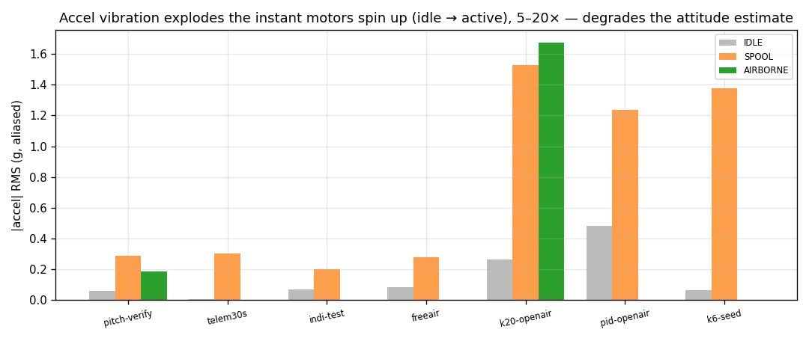

# Sensor & timing analysis

The IMU path was audited to rule it in or out as a driver of the instability.
Net: **timing and gyro are clean; accel vibration is real and elevated but
secondary** (a likely estimate-degrader, not the source of the limit cycle).

The high-rate IMU is reconstructed at its true ~48 Hz from `ImuRaw` keyframes
(~1.7 Hz) plus `ImuCompressed` f16 deltas (`_pipeline.py`), the same path
`udp_telem_sniff.py --mag-csv` uses.

## Loop timing — perfect

`inner_dt` = **1.00 ms, jitter 0.00 ms** across all 9 captures. The 1 kHz rate
loop is rock-steady. No scheduling, decimation, or sample-timing contribution to
the oscillation.

## Gyro — clean

Quiet at idle, and shows only genuine body motion when active. The pitch-rate
energy lives at the controller's limit-cycle frequency
([control-loop](control-loop-analysis.md)), not at a fixed mechanical resonance
— consistent with a control-driven cycle rather than a sensor artefact.

## Accel — vibration explodes under power

`|accel|` deviation (magnitude removes the gravity-projection of attitude, so
what remains is vibration + linear accel) jumps from **~0.05–0.3 g RMS at idle to
0.2–1.5 g RMS the instant motors spin up** — a 5–20× step. The accelerometer
feeds the attitude estimator's levelling, so this *does* inject noise into the
roll/pitch estimate.

Two caveats keep this **secondary**, not the prime cause:

- **Aliasing.** Telemetry IMU is only ~36–48 Hz, so prop-band vibration
  (50–300 Hz) folds unpredictably into 0–24 Hz. The *amplitude* is trustworthy;
  the *spectrum* is not.
- **Confounding.** Much of the largest amplitude (the 1.5 g k20-openair bars) is
  the airframe physically banging the ground between hops, not pure prop
  imbalance — the cleaner short bench logs (telem30s, indi-test) show 0.2–0.3 g
  in steady spool.

Decisive point: the oscillation frequency tracks the *controller* (PID 2 Hz,
INDI k20 3.7 Hz), so vibration is not setting it. Vibration is worth fixing
(prop balance / soft-mount, [recommendations.md](recommendations.md)) to make
the attitude estimate trustworthy in aggressive flight, but it is not why the
craft won't hover.

## Baro / vertical

`VerticalState.agl` (baro-derived) is too noisy at sub-metre altitude to gate
"airborne" reliably, so segmentation uses absolute-altitude rise above a running
ground floor instead (`_segment.py`). Absolute altitude does resolve the real
climbs (e.g. k6-seed 502→512 m), which is enough to separate hops from ground
time.
