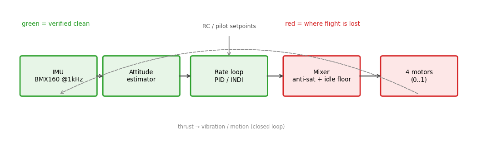
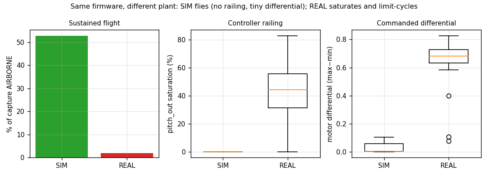
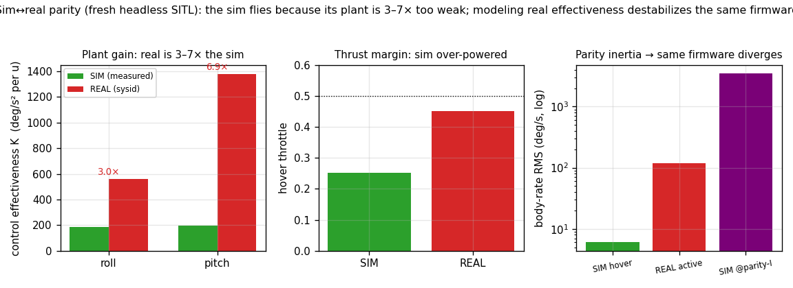
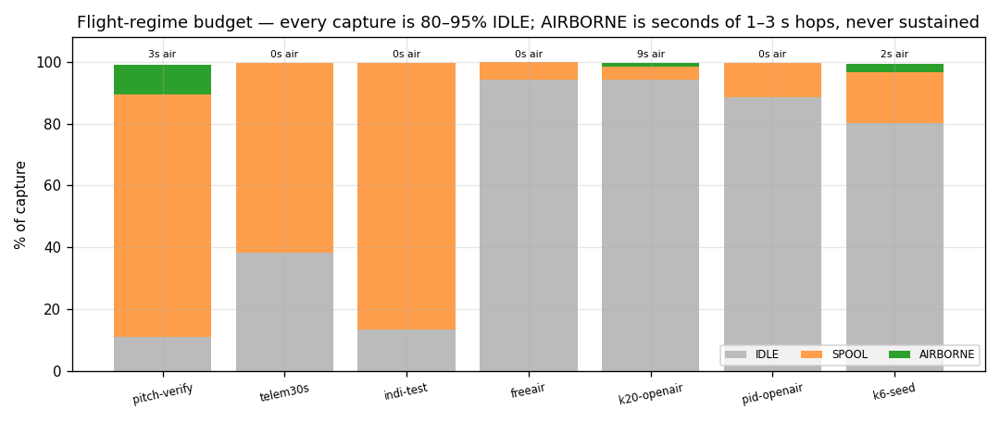
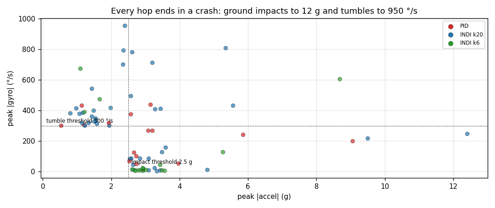

# Session analysis — combined overview & verdict

A single segmented sensor→actuator analysis across all 9 campaign captures,
answering the question each individual log only circled: **why is there no
stable open-air flight, under either PID or INDI, at any gain?**

## Method — deliberately not blanket

Averaging a whole `.bin` mixes a disarmed drone, a drone bouncing on its skids,
a 2 s hop, and a tumble into one meaningless number. Instead every capture is
**segmented into flight regimes on the control loop's own 1 kHz clock**, and
every metric is computed *inside* a homogeneous regime or single active window:

| regime | definition |
|---|---|
| `IDLE` | throttle ≤ 0.15 (disarmed / ground idle) |
| `SPOOL` | throttle > 0.15 but no sustained altitude gain — motors up, on the ground |
| `AIRBORNE` | throttle > 0.15 **and** altitude ≥ 1 m above the running ground floor |
| impact/upset | `|acc|` > 2.5 g or `|gyro|` > 300 °/s shocks — annotated as events |

Reproduce everything: `python3 analyze_campaign.py` (loader `_pipeline.py`,
segmenter `_segment.py`, inventory `_census.py`, figures `make_plots.py`).

## The pipeline under test

Green = verified clean. Red = where flight is lost. Timing, gyro and the rate
estimate are all clean; the failure is at the **mixer/actuator** stage.

## Verdict

**The flight controller is not the limiting factor; the real airframe's
actuators are.** The same firmware flies cleanly in SITL (below), so the control
law is sound. On real hardware, in every active window the attitude loop demands
a motor differential (≈0.6–0.8 of full range) far larger than the throttle
leaves room for, so one mixer side saturates and the firmware's anti-saturation
scaler *discards attitude authority* (`angle_rate_controller.c:435–466`). The
result is a one-sided bang-bang **actuator limit cycle whose frequency is set by
the controller, not the airframe** — invariant to PID gains and present under
INDI too. **This is a control-authority / hardware problem, not a tuning
problem.** Detail: [sim-vs-real](#but-it-flies-in-the-simulator--so-the-firmware-is-correct),
[motor](motor-analysis.md), [control-loop](control-loop-analysis.md).

## But it flies in the simulator — so the firmware is correct

Running the **same segmented analysis on SITL logs** (`20260620-053528`,
`20260621-053142`) settles where the fault is. SITL runs the *byte-identical*
flight firmware — same 1 kHz loop, same cascade, same mixer with the same idle
floor and anti-sat scaler (`vsim_inproc.cpp` drives the real
`angle_rate_controller` from the same geometry source; [seam contract]). Yet:

| metric | SIM | REAL |
|---|---:|---:|
| capture spent AIRBORNE | **45–60 %** (sustained 8–20 s) | 1–3 % (1–3 s hops) |
| pitch_out saturation | **0 %** | 26–83 % |
| commanded motor differential (max−min) | **0.00–0.10** | 0.6–0.8 |
| pitch-angle tracking error | **< 1°** | 7–20° |
| hover throttle | ~0.35 | ~0.35–0.5 |

Same code, same hover throttle, opposite outcome ⇒ **the difference is the
plant, not the controller.** In sim the controller commands tiny differentials,
never approaches the motor limits, and holds attitude to under a degree. The
limit cycle, the saturation, the headroom clip — none of them appear, because
the loop never enters the saturated regime.

What the sim plant does **not** have, that the real airframe does:

1. **Healthy, identical actuators.** Sim has four matched motors (equal
   `k_thrust`, first-order `tau ≈ 12.5 ms`). The real craft has a previously
   **burned/weak motor** and a pitch axis identified at `K` = 2.45× roll —
   asymmetric, mis-matched effectiveness.
2. **A benign idle.** The sim motor model responds proportionally and instantly
   even near zero; `MOTOR_IDLE_FLOOR = 0.005` is harmless. On real ESCs a
   near-zero command **stalls / desyncs** the motor, and re-spool lag injects
   phase lag the loop then chases.
3. **Clean-enough sensing & full thrust margin.** Real flight adds 1.5 g
   vibration into the estimate and a tighter thrust margin.

So the causal chain is: **the real plant doesn't respond as the model/tuning
assume → large persistent rate error → the loop over-commands (differential
~0.7) → motors hit floor/rail → the anti-sat scaler clips authority → the cycle
locks in and can't recover.** Saturation/headroom (the [motor](motor-analysis.md)
doc) is the *lock-in* mechanism that makes the cycle gain-invariant and
un-recoverable; the *trigger* is the real-hardware plant gap the sim is missing.
The sim proves the firmware and control law are sound — the work is on the
airframe and actuators ([recommendations.md](recommendations.md)).

[seam contract]: ../../../scratch/resource-ownership-map.md

## Closing the gap — parity parameters measured from fresh sim runs

To quantify the plant gap (not from old logs), the headless harness was driven
fresh with the GCS-conf geometry and the sim plant measured the same way the real
sysid did — a single-tone excitation on a rig, fitting `K = ωdot/u` by lock-in,
plus a free hover. Full method + scripts: [`sim_parity/`](sim_parity/README.md).

| quantity | SIM (fresh) | REAL | gap |
|---|---:|---:|---|
| control effectiveness `K_roll` | 187 | 563 | sim **0.33×** |
| control effectiveness `K_pitch` | 199 | 1381 | sim **0.14×** |
| hover throttle | 0.252 | ~0.45 | sim over-powered ~1.8× |
| pitch_out saturation (hover) | 0 % | 26–83 % | — |
| pitch-rate RMS (hover) | 6 dps | 50–194 dps | — |

**The sim flies because its plant is 3–7× too weak and over-powered.** When the
sim inertia is scaled to the real `K` (`I_xx ×0.33`, `I_yy ×0.14`; `K ∝ 1/I`)
and the **same firmware** is re-run, the rig **diverges to 3000–4000 °/s** — i.e.
the controller is effectively tuned for a plant 3–7× weaker than reality, so on
the real airframe the loop gain is 3–7× too high → over-correction → the
saturation limit cycle. The rig diverges (pinned, no aero) where the real craft
saturates into a *bounded* ~2 Hz cycle — same instability, bounded differently.

Modeled parity parameters (apply to the vsim geometry):

| param | sim default | parity value | basis |
|---|---|---|---|
| `I_xx` (roll inertia) | 0.00683 | **0.0023** (×0.33) | match `K_roll` |
| `I_yy` (pitch inertia) | 0.00739 | **0.0011** (×0.14) | match `K_pitch` (encodes the 2.45× pitch/roll asymmetry) |
| thrust margin | hover 0.25 | hover **0.45** (`k_thrust ×0.31` or `mass ×3.2`) | real airborne throttle |
| actuator `tau` | 12.5 ms | **~21 ms** | onhw roll sysid τ |
| per-motor `k_thrust` | equal | weaken burned arm | real trim + props-off bench |
| idle-stall / deadband | none (linear) | thrust→0 below ~0.05–0.08 duty + re-spin lag | real motors floored at 0.005 stall |
| vibration injection | minimal | accel σ ≈ 0.3–1.5 g w/ thrust | real `|acc|` 0.06 g idle → 1.5 g active |

**What actually sets the real limit cycle — full plant ID.** Identifying the real
plant from the limit cycle (the persistent oscillation is strong excitation) and
validating against the known controller by describing function shows the pitch
plant sits at **−175° at 1.9 Hz** — ~109 ms of **transport delay** beyond a
rigid-body integrator + 21 ms actuator. The crossover law is exact: 0 ms delay →
loop never reaches −180° → *stable* (the sim); ~100 ms → −180° at **1.99 Hz** =
the observed cycle. The delay is physically the **motor stall / re-spin at the
0.005 idle floor** — and it hits *pitch* (floors 95 % of the cycle) but not
*roll* (rarely floors), which is why roll stays rock-solid. Decisive: giving the
sim the real *gain alone* oscillates at the **wrong 18 Hz** mode; a bigger `τ`
pole self-stabilises; only a true **transport-delay element** (which the sim
lacks) reproduces the real 2 Hz cycle. Full identification, the digital-twin
parameter set, the exact `vsim` code changes, and validation acceptance tests:
**[`plant_id/README.md`](plant_id/README.md)**.

## There was never sustained flight

| log | controller | span | IDLE | SPOOL | AIRBORNE | longest air | impacts |
|---|---|---:|---:|---:|---:|---:|---:|
| pitch-verify | PID | 30 s | 11 % | 78 % | 10 % | 2.9 s | 1 |
| telem30s | PID | 30 s | 38 % | 62 % | 0 % | — tethered | 1 |
| indi-test (010249) | INDI k20 | 60 s | 13 % | 86 % | 0 % | — bench 0.6 thr | 0 |
| indi-freeair | INDI k20 | 118 s | 94 % | 6 % | 0 % | 3.0 s | 10 |
| k20-openair | INDI k20 | 636 s | 94 % | 4 % | **1 %** | 3.1 s | 31 |
| pid-openair | PID | 42 s | 89 % | 11 % | 0 % | 4.7 s | 14 |
| k6-seed | INDI k6 | 61 s | 80 % | 16 % | **3 %** | 1.6 s | 17 |

No window of *sustained* (>5 s) altitude-holding flight exists anywhere in the
campaign. The k20-openair "10-minute flight" is 636 s of ground time containing
~8.6 s of actual air in ≤3 s fragments.

## Every hop ends in a crash

Each airborne fragment terminates in a ground impact (to 12 g) and/or a tumble
(to 950 °/s). Important nuance the segmentation exposes: the k6-seed "calm"
window (t50–59) shows 2.5–3.6 g shocks at only **6–20 °/s gyro** — that is the
craft *bouncing vertically on its skids with the body held still*, i.e. sitting
on the ground, **not** flying. "Seed works" means "stopped fighting", not "flew".

## Per-capture, one line each

- **pitch-verify** (PID v3): SPOOL-dominated; clean 1.7–1.8 Hz floor-saturated cycle, low motor floored 81–91 %.
- **throttle-up**: 100 % IDLE — no armed-active content; idle/vibration baseline only.
- **telem30s** (PID): the canonical cycle — 2.0 Hz, pitch_out sat 62–81 %, low motor floored 95–98 %, sticks still.
- **indi-test 010112/010249** (INDI k20 bench): reached 0.6 throttle → saturation flips to the **rail** (79–95 %); hunts at 3.7 Hz = bandwidth.
- **indi-freeair** (INDI k20): 10 ground-impact upsets to 955 °/s; brief hops only.
- **k20-openair**: 636 s, ~8.6 s air in ≤3 s hops; both mixer ends saturating 30–80 %; 31 impacts incl. 12 g.
- **pid-openair**: sharp 2.35 Hz, low motor floored 90 %, ends in a 9 g impact.
- **k6-seed**: cycle amplitude collapses but it is bouncing on the ground, not flying; soft droop to −82°.

Continue: [control-loop](control-loop-analysis.md) ·
[motor](motor-analysis.md) · [sensor](sensor-analysis.md) ·
[recommendations](recommendations.md).
