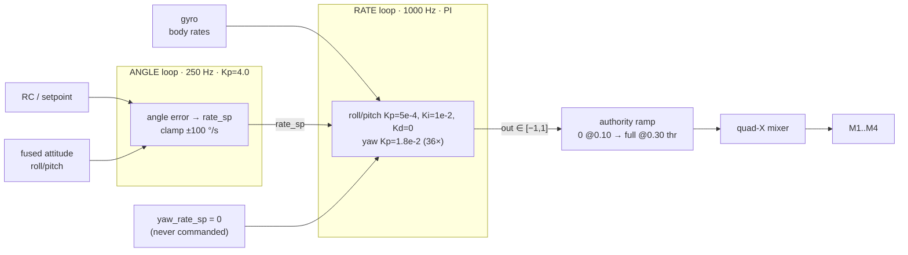
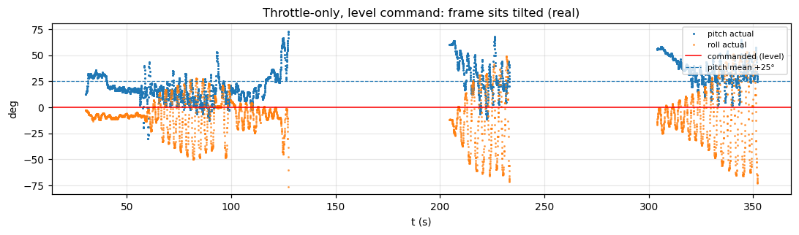
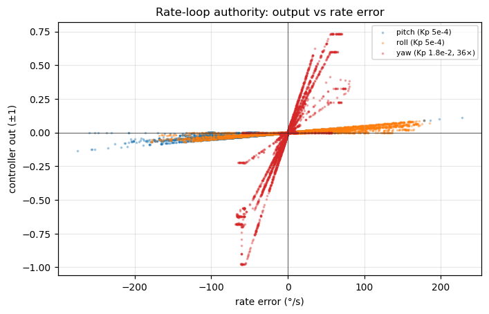
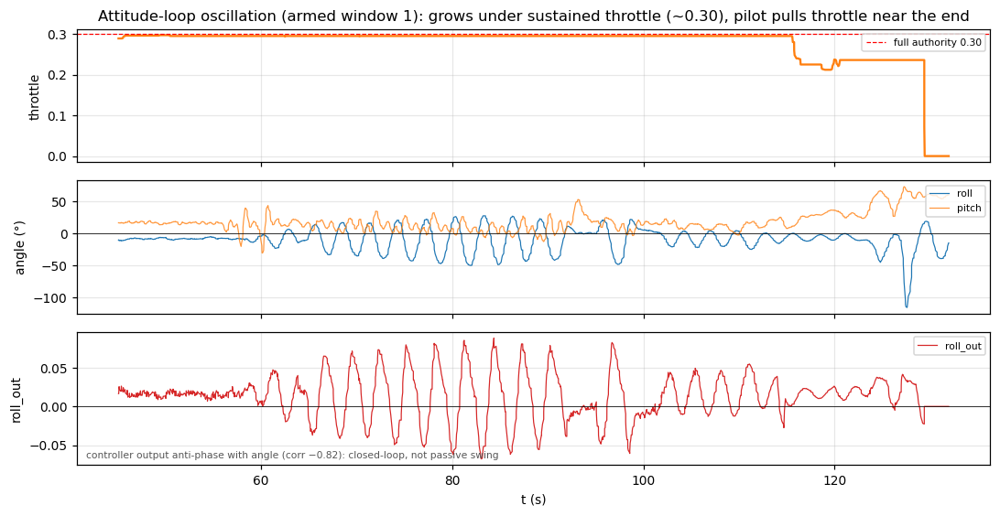
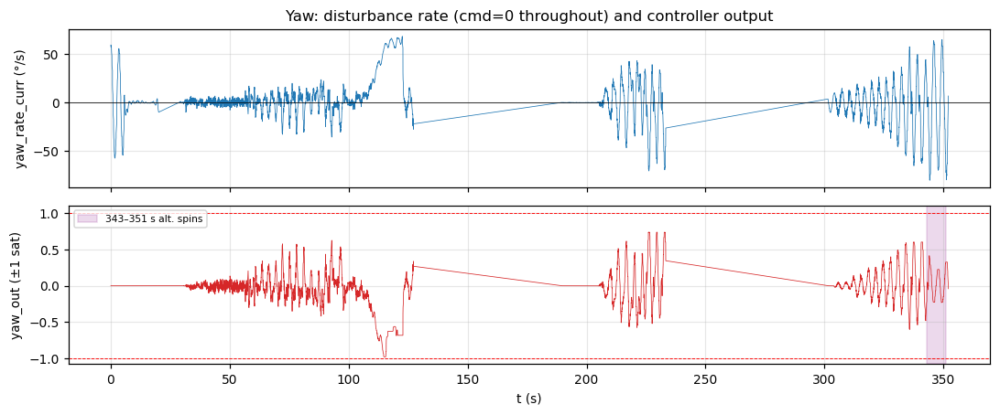

# Control-loop analysis — `export-20260617-124210.bin`

Cascade controller behaviour from `ControlTrace` (msgid 1030, 7,450 frames),
restricted to the four **ARMED** windows. **Context (from the operator):** this
was a **bench-rig** run — the airframe never flew (`IN_AIR` never reached). The
rig is a *free pivot*: at rest the frame **hangs/swings to one side** (that is the
resting pose), and on throttle the controller **tries to level it, partly
succeeds, then breaks into a growing oscillation that forced the operator to pull
throttle**. Yaw was also hand-spun/clamped. The data backs every part of this —
see the [oscillation section](#the-oscillation-why-throttle-had-to-be-pulled).
Firmware refs ground every interpretation. Companion to
[`session-analysis.md`](session-analysis.md) and
[`motor-analysis.md`](motor-analysis.md).

Units (firmware `control_telemetry_t`, `include/variables.h:243`): **angles in
degrees, rates in deg/s, `*_out` ∈ [−1, +1]** feeding the mixer.

## Architecture (from firmware)

Cascade, two rates:



- Outer `OUTER_LOOP` = 250 Hz (`outer_dt` = 4.000 ms, **zero jitter** in log).
- Inner `INNER_LOOP` = 1000 Hz (`inner_dt` = 1.000 ms, **zero jitter**).
- Default gains (`include/variables.h`):
  - **Angle (outer):** roll/pitch Kp = 4.0, out clamp ±100 °/s. Yaw is
    rate-controlled (no outer angle loop in flight).
  - **Rate (inner):** roll/pitch **Kp = 0.0005**, Ki = 0.01, Kd = 0, i_max 0.2.
    **Yaw Kp = 0.018**, Ki = 0.008 — i.e. **yaw P-gain is 36× roll/pitch**.
  - **PID-authority ramp:** outputs scale from 0 at `MIN_ARMED_THROTTLE` (0.10)
    to full at `PID_FULL_AUTHORITY_THROTTLE` (0.30) to stop ground feedback.

## Loop timing — healthy

`outer_dt` = 4.000 ms and `inner_dt` = 1.000 ms with **zero variance** across all
7,450 frames. The 250 Hz / 1 kHz cascade is keeping schedule exactly (corroborated
by the kernel `EstPerf` 250 Hz and `PerfTask` timing — see
[`kernel-analysis.md`](kernel-analysis.md)). No timing pathology.

## The "level command but tilted" finding

With a **level command** (|roll_sp|, |pitch_sp| < 2°) and throttle up, the
airframe sat at:

| | mean | std |
|---|---:|---:|
| roll_angle_curr | **−9.7°** | 22.6° |
| pitch_angle_curr | **+25.1°** | 16.3° |

So pitch held ~**+25° nose-up** against a 0° command.



Tracing the cascade in these frames shows the controller is doing the *right
thing in the right direction* — it just has almost no authority:

```
pitch angle error  -25 deg     --[Kp=4]-->    pitch_rate_sp  -66 deg/s   (outer loop OK, commands nose-down)
pitch rate error   -66 deg/s   --[Kp=5e-4]--> pitch_out      -0.023      (inner loop output ~zero)
```

The inner-loop output is tiny **by design**: empirical output/error slope is
**0.00033** for pitch and **0.00034** for roll — matching the firmware
`Kp = 0.0005` (the rest leans on the slow Ki = 0.01 integral, clamped at 0.2).
With Kd = 0 there is no rate damping either. Net: roll/pitch have very low
proportional authority.

The authority asymmetry is stark when you plot controller output against rate
error per axis — roll/pitch barely leave zero while yaw spans the full ±1:



This is compounded by the **authority ramp**: armed throttle averaged **0.25 and
was below the 0.30 full-authority threshold 100 % of the time**, so roll/pitch
output was *additionally* attenuated (≈0.5×) the entire session.

**Conclusion.** The mean +25° pitch / −10° roll is partly the rig's natural
**resting hang** (the operator notes the frame settles to one side at rest) and
partly the swing of the oscillation below. The tilt is *real* (fused attitude
matches gravity — see [`sensor-analysis.md`](sensor-analysis.md) §Fusion). The
earlier reading that "the controller can't move a constrained frame" was **wrong**:
the rig is a free pivot, the controller *does* move it, and as authority comes up
with throttle it drives the frame into a **growing oscillation** rather than
settling level. That instability — not a lack of authority — is the real story.

## The oscillation (why throttle had to be pulled)

This is the key finding. In every armed window, once throttle is held up the
roll/pitch attitude **builds into a sustained, growing oscillation**, and the only
thing in the log that stops it is the operator **cutting throttle**.



Window 1 (above) is the clearest: throttle is held at ~0.30 from t≈48 s; roll
starts near ±5° and **grows to ±40–50°** (a −115° excursion by t≈128 s) at a
dominant **~0.3 Hz** (≈3 s period); pitch carries a faster ~0.7–1.2 Hz component.
The operator then pulls throttle (t≈115–128 s) and the system rings down into the
disarm. The same build-up repeats in window 2 (roll envelope grows to ~60–67°,
throttle ~0.25, pulled at t≈276 s) and window 3 (roll grows 12°→58°, throttle
~0.22, pulled at t≈344 s).

**It is a closed-loop limit cycle, not passive rig swing:**

- The controller output is **anti-phase with the angle** — `roll_out` vs
  `roll_angle_curr` correlate **−0.82** over the build-up — i.e. negative feedback
  actively driving the motion, and the motors modulate with it (M1 swings
  0.00–0.56 in the same window).
- The oscillation **scales with PID authority**: it appears and grows at
  flight-relevant throttle (≈0.22–0.30, where the authority ramp opens up) and
  decays once throttle drops below it. (A per-window throttle↔amplitude
  correlation is weak/noisy because the build-up and ring-down lag throttle by
  tens of seconds — it's a slow divergence with hysteresis, not an instantaneous
  gain.)

**Likely cause.** The roll/pitch rate loop runs **Kp = 0.0005 with Kd = 0 and an
integral-dominant Ki = 0.01** (i_max 0.2). With essentially no proportional or
derivative (damping) term, the loop leans on the integrator, which lags the error
— classic recipe for a low-frequency limit cycle against a pendulum-like plant.
As the authority ramp raises the effective loop gain with throttle, the closed
loop becomes underdamped and oscillates. The ~0.3 Hz period is consistent with an
integral-driven oscillation on the rig's slow pivot dynamics.

**Caveats.** The rig is a constrained pendulum, so the exact frequency/amplitude
won't match free hover — but a controller that *diverges into oscillation under
its own feedback* on the bench is a genuine red flag, and the anti-phase output
proves it's the loop, not the fixture. Re-tune before flight: add rate **Kd** for
damping, raise **Kp** off the integrator, and reduce **Ki**/`i_max`; then re-test.

## Yaw — disturbance rejection, saturation, and the hand-clamp episodes

Yaw was **rate-controlled with `yaw_rate_sp` = 0 for the entire session** (pilot
never commanded yaw). Every bit of yaw motion is therefore a *disturbance* — the
rig being spun by hand, which the user confirms ("yaw suddenly starts to rotate,
which I sometimes hand-clamped"). `yaw_rate_curr` ranged **−80…+68 °/s**.



Detected yaw episodes (|rate| > 40 °/s) fall in two regimes:

- **t = 0–5 s, ±55–59 °/s, `yaw_out` = 0.00.** Free swings with *no* control
  response — because throttle was near idle, the authority ramp gated the output
  to zero. The frame spins freely on the rig.
- **t = 112–123 s, 216–233 s, 330–351 s, up to ±80 °/s, `yaw_out` ±0.6…0.76.**
  Here the controller fights hard. `yaw_out` saturates (|·| > 0.9) in 0.5 % of
  armed frames, and the **343–351 s** stretch is a run of alternating ±65–80 °/s
  spins on a ~2 s period — consistent with repeated hand-spin → clamp cycles
  (and/or a yaw limit-cycle as the strong yaw loop, Kp 0.018, fights the rig).

Because yaw's gain is 36× roll/pitch, yaw is the only axis with meaningful
authority in this log — which is exactly why yaw shows large `*_out` while
roll/pitch sit near zero. The empirical yaw slope (0.0117) matches `Kp = 0.018`
(reduced by integral/clamp/ramp).

## Takeaways

1. **The roll/pitch attitude loop is unstable on the bench** — it diverges into a
   ~0.3 Hz limit cycle (roll to ±50–67°) whenever throttle is held up, and the
   operator had to pull throttle to stop it, three times. Output is anti-phase
   with angle (corr −0.82), so it is the *control loop*, not passive rig swing.
   **Address this before any flight attempt.**
2. **Likely fix is rate-loop tuning:** Kp = 5e-4 with **Kd = 0** and integral-
   dominant Ki = 0.01 gives almost no proportional/damping authority — add Kd for
   damping, raise Kp off the integrator, lower Ki/`i_max`, re-test on the rig.
3. **Resting pose:** at idle the frame hangs to one side (rig is a free pivot);
   that tilt is real and not a sensor/fusion error (fusion matches gravity).
4. **Timing is perfect** (4 ms / 1 ms, zero jitter) — the instability is a tuning
   problem, not a scheduling/loop-rate one.
5. **Yaw loop is ~36× stronger** and saturates against the hand-spin disturbances;
   the 343–351 s alternating spins may be a separate yaw limit-cycle — re-check
   after the roll/pitch fix.
6. Next capture: after re-tuning, validate on the rig that throttle-up no longer
   oscillates, *then* fly (`IN_AIR`) with stick inputs.
