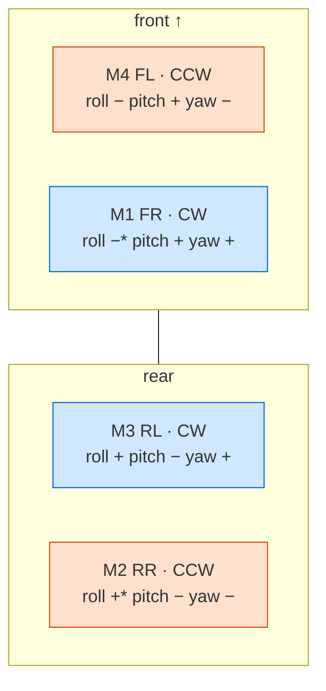
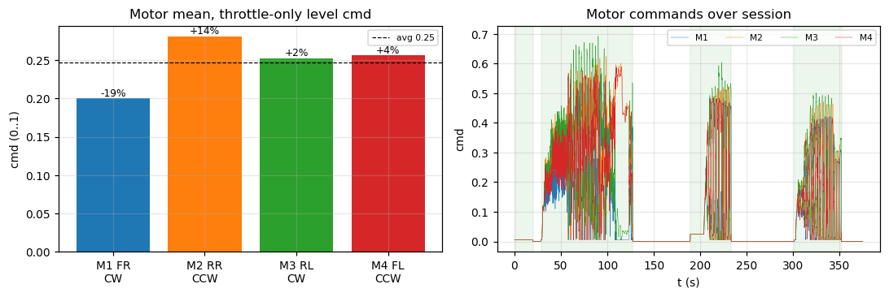

# Motor analysis — `export-20260617-124210.bin`

Motor-output behaviour from `MotorTelemetry` (msgid 1029, 6,562 frames),
restricted to **ARMED** windows, cross-referenced with `ControlTrace` and the
firmware mixer. Bench-rig run (never `IN_AIR`). Companion to
[`control-loop-analysis.md`](control-loop-analysis.md).

## Mixer & geometry (from firmware)

Quad-X mixer (`src/control/angle_rate_controller.c`, `include/actuator/actuator.h`):

```
out_i = throttle  +  roll·s_roll[i]  +  pitch·s_pitch[i]  +  yaw·s_yaw[i]      (clamped 0..1)
s_roll  = {-1, -1, +1, +1}     s_pitch = {+1, -1, -1, +1}     s_yaw = {+1, -1, +1, -1}
```

`MotorTelemetry.cmd[0..3]` = M1..M4, normalized **0..1** (idle floor 0.005):

| idx | `cmd[]` | position | spin | yaw sign |
|---|---|---|---|---|
| 0 | M1 | front-right | CW | + |
| 1 | M2 | rear-right | CCW | − |
| 2 | M3 | rear-left | CW | + |
| 3 | M4 | front-left | CCW | − |

Layout (front = ↑), with each motor's mix signs `(roll, pitch, yaw)`:


<sub>*roll signs per firmware `s_roll = {−1,−1,+1,+1}` for M1..M4. CW = M1,M3; CCW = M2,M4.</sub>

## Output levels — no saturation, low throttle

All ARMED frames:

| motor | min | max | mean |
|---|---:|---:|---:|
| M1 FR | 0.00 | 0.56 | 0.165 |
| M2 RR | 0.00 | 0.62 | 0.233 |
| M3 RL | 0.00 | 0.69 | 0.208 |
| M4 FL | 0.00 | 0.59 | 0.213 |

Peak 0.69, **0 frames above 0.95** — never saturated, never close. Mean ~0.20
matches the ~0.25 pilot throttle (below the 0.30 full-authority point the whole
time, see control-loop doc). This is gentle bench running, not a hover (hover
would need all four sustained near ~0.5).

## Balance under a level, throttle-only command

The decisive test for "tilted with just throttle": with roll/pitch commanded ~0
and throttle up, the four motors *should* be near-equal. They aren't:

| motor | mean | vs average (0.247) |
|---|---:|---:|
| M1 FR | 0.200 | **−19 %** |
| M2 RR | 0.281 | **+14 %** |
| M3 RL | 0.252 | +2 % |
| M4 FL | 0.256 | +4 % |



The spread is the **mixer injecting the controller's (small) corrections**, not a
raw hardware imbalance — it is fully explained by the logged `roll_out`/`pitch_out`/
`yaw_out`:

- **Pitch:** front pair (M1+M4 = 0.456) < rear pair (M2+M3 = 0.533) by 0.063.
  Rear thrust > front ⇒ nose-down torque — the controller *is* pushing against the
  +25° nose-up tilt, just weakly (pitch_out ≈ −0.023; see control-loop doc for why
  it's so small). Direction correct, magnitude tiny.
- **Yaw:** CW pair (M1+M3) − CCW pair (M2+M4) = **−0.072**, a persistent yaw
  differential — the strong yaw loop (Kp 0.018) holding against the rig's
  hand-induced spin.
- **Roll:** right pair slightly reduced vs left, consistent with the −9.7° roll.

So the motor imbalance is a *symptom* of the real tilt + rig yaw disturbance being
mixed in, not an independent actuator fault. Because the corrections themselves are
small (low roll/pitch authority), the imbalance is small and the frame stays
tilted.

## What this log can and can't tell us about the motors

- ✅ Mixer wiring/signs look correct: pitch/roll/yaw corrections map to the right
  motor groups with the right signs.
- ✅ No saturation, no zero/stuck motor, no obvious dead actuator (all four span a
  sensible 0→0.6 range).
- ⚠️ **Cannot assess thrust matching / motor health from a rig run.** Equal-command
  thrust symmetry needs an *unconstrained* hover (or a thrust-stand per motor).
  The differences here are control corrections, so a genuinely weak/strong motor
  would be masked by the loop.
- ℹ️ `MotorTelemetry` carries 8 slots (`cmd[4..7]`); only 0–3 are used (quad).

## Recommendations

1. To rule out a real hardware imbalance behind the tilt, do a **per-motor thrust
   check** (thrust stand or props-off current draw) — the rig log can't separate
   actuator asymmetry from control action.
2. Re-capture in an actual hover above 0.30 throttle to see true equal-command
   balance and motor headroom.
3. Mixer signs/geometry verified against firmware — no change needed there.
