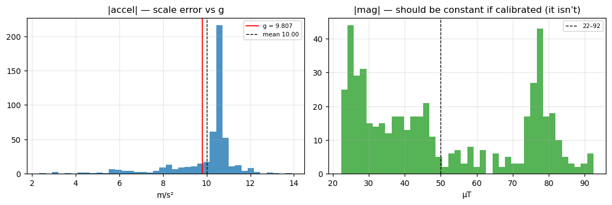
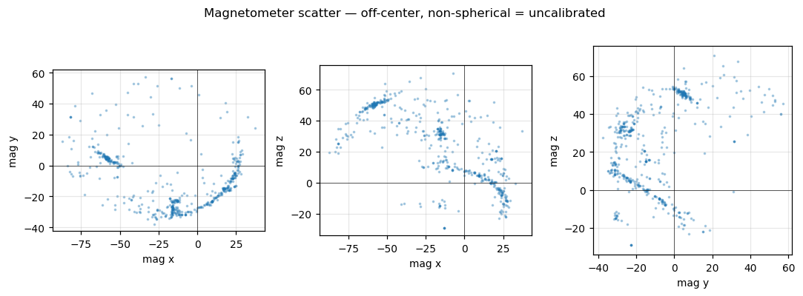
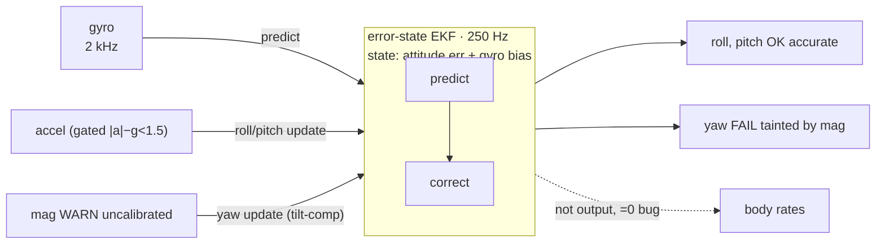
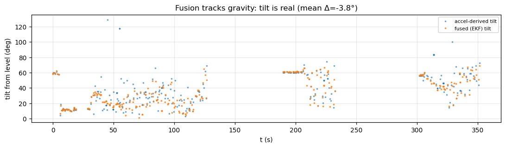

# Sensor & fusion report — `export-20260617-124210.bin`

Focused look at the **sensors and the attitude fusion**: calibration fidelity,
estimator accuracy, and reporting quality. Source is the `ImuRaw` (full snapshot)
and `ImuCompressed` (delta) streams, `AttitudeEuler` (fused output), plus
`SystemHealth`/`Heartbeat` context. All numbers reproducible via
`../parse_log.py`. Companion to the [session analysis](session-analysis.md) and
[`control-loop-analysis.md`](control-loop-analysis.md).

## Verdict at a glance

| Sensor / stage | Calibration / accuracy | Reporting | Verdict |
|---|---|---|---|
| **Gyroscope** | bias < 0.1 °/s, noise 0.3–0.5 °/s | clean | OK **good** |
| **Accelerometer** | **+8 % scale error** at rest | clean | WARN **needs scale cal** |
| **Magnetometer** | **uncalibrated** (hard+soft iron) | reported but unusable | FAIL **fail** |
| **Temperature** | 35.6–37.1 °C, sane drift | clean | OK **good** |
| **Fusion: roll/pitch** | matches gravity within −3.8° | body rates = 0 WARN | OK **trustworthy** |
| **Fusion: yaw/heading** | fed by uncalibrated mag | — | FAIL **do not trust** |

**No calibration was performed or captured in this session** — zero
`CalibrationStatus` messages and `nav_state` never entered `CALIBRATING`. The
sensors ran on default/whatever-was-stored calibration, which is consistent with
the accel/mag errors below. Units in use: **gyro °/s, accel m/s², mag µT,
temp °C** (the codec field comment guessing "rad/s" for gyro is wrong — verified
against `ControlTrace.*_rate_curr`, abs max ~100 either way).

## Gyroscope — good

Measured over the cleanest stationary window (177–205 s, 36 samples, board
still):

| axis | bias (°/s) | noise σ (°/s) |
|---|---:|---:|
| x | +0.092 | 0.348 |
| y | −0.013 | 0.279 |
| z | +0.033 | 0.548 |

Bias is **< 0.1 °/s on every axis** and noise is sub-degree — a well-behaved,
well-zeroed gyro. Full-session range is ±~100 °/s during handling, with no
clipping or stuck values. This is the one sensor that is clearly trustworthy.

## Accelerometer — ~8 % scale error

Gravity magnitude `|acc|` should read **9.807 m/s²** at rest. It doesn't:

| condition | samples | mean `|acc|` | error vs g |
|---|---:|---:|---:|
| static, **motors OFF** | 52 | 10.571 | **+7.8 %** |
| static, **motors ON** | 32 | 10.105 | +3.0 % |

The over-read is **largest with motors off**, so it is **not** vibration
rectification (that would push the motors-on figure higher, not lower) — it is a
genuine **scale-factor / calibration error of ~8 %**. Per-axis noise at rest is
low (σ 0.04–0.08 m/s²), so the sensor is quiet; it's just mis-scaled. A 6-side
accelerometer calibration should bring this in line. Until then, anything that
trusts accel magnitude (level estimation, gravity vector, vertical accel) is
biased high by ~8 %.

> The motors-on figure being *closer* to g is a coincidence of orientation/linear
> motion in those samples, not better calibration — treat the **+7.8 % motors-off**
> number as the real static error.

The left panel makes the accel scale error visible (the `|accel|` mass sits right
of the g line); the right panel shows `|mag|` smeared across 22–92 µT instead of a
single calibrated value.

## Magnetometer — uncalibrated (do not use as-is)

A calibrated magnetometer reads a near-**constant** field magnitude (Earth's
field, ~25–65 µT) in every orientation. Here `|mag|` swings **22.3 → 92.4 µT**, a
spread of **140 % of the mean** — the signature of an uncorrected hard- and
soft-iron field. Per-axis min/max imply large hard-iron offsets:

| axis | min | max | hard-iron offset | half-span |
|---|---:|---:|---:|---:|
| x | −87.2 | +37.0 | **−25.1** | 62.1 |
| y | −37.7 | +57.2 | **+9.7** | 47.5 |
| z | −29.1 | +70.7 | **+20.8** | 49.9 |

Non-zero centers (offsets up to 25 µT) and unequal half-spans (47–62 µT) mean
both hard-iron (bias) and soft-iron (scale/skew) correction are missing. The data
*is* present and plausibly scaled (µT), but **unusable for heading** until a full
ellipsoid-fit magnetometer calibration is run. (Note: this session also ran
motors, whose current adds field distortion — calibrate *with the frame powered*
and ideally characterize throttle-dependent interference.)

A calibrated mag scatters as a sphere centered on the origin. These projections
are off-center, squashed clouds — the visual signature of hard+soft iron:

## Temperature — good

IMU `temp` reads **35.6 – 37.1 °C** with a gentle warm-up drift
(35.9 → 36.4 °C over the session). Sensible absolute values and smooth — no
glitches. (No evidence of temperature compensation being applied to gyro/accel,
but the channel itself reports correctly.)

## Sensor fusion (attitude estimation)

The fused attitude (`AttitudeEuler`, msgid 1026) is produced by an **error-state
EKF** (6-state: attitude error + gyro bias) running at **250 Hz** (IMU decimation
8 from 2000 Hz). Accel pins **roll/pitch** via the gravity direction (gated when
`|a| − g| > 1.5 m/s²` to reject dynamic accel); the magnetometer pins **yaw only**
(tilt-compensated); gyro bias is estimated online. Output is degrees, NED, with a
body→world quaternion (firmware `src/est/ekf.c`, `src/est/attitude_task.c`).

### Roll/pitch fusion is accurate — the bench tilt is real

The key cross-check for the "tilted with just throttle" observation: does the
estimator actually track gravity, or is it inventing a tilt? Comparing the **fused
total tilt** to the **accelerometer-derived tilt** (angle of the accel vector from
the at-rest gravity direction, derived from frames the EKF believed level) over
all ARMED IMU samples:

| | mean | std |
|---|---:|---:|
| accel-derived tilt | 37.5° | 21.3° |
| fused tilt | 33.7° | 18.3° |
| **fused − accel** | **−3.8°** | 14.7° |

The estimator tracks the gravity vector to within ~4° on average. **The tilt is
real**, not a fusion artifact — so the airframe genuinely rested at ~25–37° on the
rig, and the (weak) attitude controller is what failed to pull it level (see
[`control-loop-analysis.md`](control-loop-analysis.md)). The 14.7° spread is
because most rig samples are *dynamic* (hand motion/spin) — the accel reference
itself is noisy there, and the EKF correctly gates those samples out and coasts on
the gyro. (A first level frame at t≈60 s read accel `(+1.3, +1.4, −10.1)` against
fused `(−4.5°, +0.7°)` — consistent once the board's z-down convention is applied;
a naïve roll = atan2(ay, az) without that convention flips ~180°, which is a
decode-convention trap, not a fusion error.)

### Yaw/heading is not trustworthy

Yaw is pinned by the magnetometer, and **the magnetometer is uncalibrated**
(`|mag|` swings 22–92 µT, hard-iron offsets to 25 µT — see §Magnetometer). An
uncorrected mag drags the yaw update toward a distorted heading, so **the fused
yaw / heading in this log should not be relied on**. Roll/pitch are unaffected
(they come from accel + gyro, not mag). This matters less in ANGLE/ACRO flight
(yaw is rate-controlled off the gyro), but any heading-hold or nav use needs the
mag calibrated first.

### Estimator health & the +8 % accel scale

- The estimator never forced a failsafe: all `FAILSAFE` transitions correlate with
  **RC loss**, not estimator `degraded` (see session report) — so the EKF stayed
  healthy throughout despite the aggressive rig handling.
- The **+8 % accel scale error** biases the gravity-vector magnitude but not its
  *direction*, so roll/pitch are largely unaffected; however it eats into the
  `|a|−g| > 1.5 m/s²` accept gate (at rest |a|≈10.6 ⇒ |a|−g≈0.8, already over half
  the gate), so once calibrated the estimator will accept *more* static samples and
  lean less on gyro coasting. Worth fixing for fusion robustness, not just for the
  raw channel.
- Online gyro-bias estimation has little to do here — the raw gyro bias is already
  < 0.1 °/s.

## Reporting fidelity

The IMU uses a **keyframe + delta** scheme:

| stream | rate | payload | role |
|---|---:|---|---|
| `ImuRaw` | ~1.6 Hz (median dt 621 ms, **max gap 2.44 s**) | 10× f32 (acc,gyr,mag,temp) | absolute keyframe |
| `ImuCompressed` | ~38 Hz (median dt 26 ms) | 10× f16 delta | high-rate deltas |

8,764 delta frames vs 508 keyframes (**17.3×**). The delta half-floats decode to
real, non-trivial values, so the compression path is alive. **But two reporting
bugs undercut it:**

1. **`ImuCompressed.ref_seq` is stuck at 0** for all 8,764 frames (only one
   distinct value). The whole point of `ref_seq` is to bind each delta to the
   keyframe it was differenced against; with it pinned to 0, a consumer **cannot
   reliably reconstruct absolute IMU** from the compressed stream — it can't tell
   which of the 508 keyframes a delta belongs to. Combined with keyframe gaps up
   to 2.44 s, blind delta accumulation will drift. **This is a fidelity bug, not
   just cosmetic.**
2. **`ImuRaw.sample_time_us` is always 0.** No per-sample hardware timestamp, so
   IMU frames can only be timed by their telemetry-arrival `t_us` (jittery,
   subject to the link stalls noted in the session report). Real sample timing is
   lost.

Also relevant to "sensor reporting": **`AttitudeEuler` body rates
(`rollspeed/pitchspeed/yawspeed`) are always 0** — the fused-attitude angular
rates aren't populated, even though the raw gyro carries them (see the
[session report](session-analysis.md), issue #1).

## Recommendations (sensor priority order)

1. **Run accelerometer calibration** (6-side) — remove the ~8 % scale error
   before trusting any accel-derived estimate.
2. **Run magnetometer calibration** (ellipsoid fit, frame powered) — current mag
   is unusable for heading; characterize motor-current interference while at it.
   This is also a **fusion** fix: the EKF pins yaw from the mag, so fused heading is
   untrustworthy until the mag is calibrated (roll/pitch are unaffected).
3. **Fix `ImuCompressed.ref_seq`** to carry the real keyframe seq so the delta
   stream is reconstructable; consider a faster `ImuRaw` keyframe cadence (the
   2.4 s gaps are large for a 38 Hz delta stream).
4. **Populate `ImuRaw.sample_time_us`** so IMU samples can be time-aligned from
   their own payload.
5. **Capture a calibration session** (drive `CALIBRATING` + `CalibrationStatus`)
   and re-log so the stored cal can be verified against fresh data.
6. Gyro and temperature need no action — they're reporting correctly.
