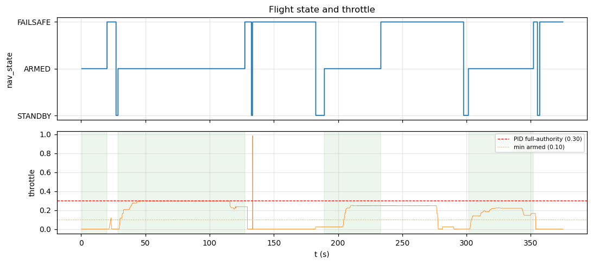
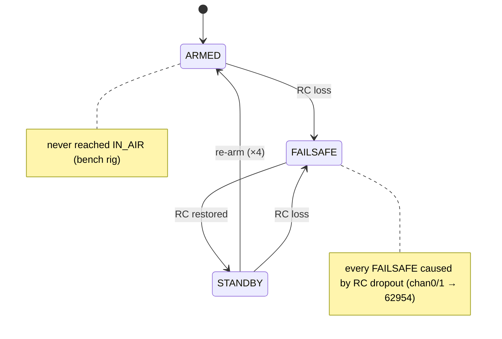
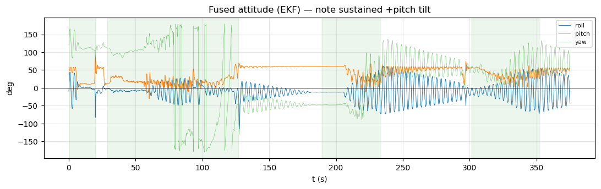

# Log analysis — `export-20260617-124210.bin`

First analysis of a **real-hardware** telemetry capture. Decoded with
`../parse_log.py` via the generated NavLink v2 codec — every figure below is
reproducible from the archived `.bin` in this folder.

```sh
# from repo root
python3 docs/log-analysis/parse_log.py docs/log-analysis/20260617-124210/export-20260617-124210.bin
```

## TL;DR

- **Healthy link decode.** 38,292 frames, **0 CRC errors** across 6.25 min — the
  wire format, framing and CRC are solid end-to-end on hardware.
- **The aircraft never flew.** `nav_state` reached `ARMED` four times but **never
  `IN_AIR`**; throttle stayed ≤ 0.3 and motors ≤ 0.69. This is a **bench /
  handheld bring-up session**, so attitude/controller numbers reflect the board
  being tilted by hand, not flight.
- **RC-loss → FAILSAFE works.** Every RC dropout (chan 0/1 → 62954) lined up with
  a `FAILSAFE` transition (615/620 spike frames). Safety path behaves correctly.
- **Four telemetry data-quality bugs** worth fixing (details below): three
  always-zero fields and one unit mismatch.
- **Telemetry link is saturated.** `tx_overflow` grew ~612 → 2680 (~2,068 dropped
  TX buffers) at ~33.5 kbps average; 9 link stalls > 200 ms.

## Session overview

| | |
|---|---|
| Container | `VREC` format v1, protocol v1 |
| Start wall clock | 1781680333706 ms → **2026-06-17 07:12:13 UTC** |
| Duration | **375.2 s** (6.25 min) |
| Records (byte chunks) | 38,292 |
| Decoded frames | 38,292 |
| **CRC errors** | **0** |
| Unknown msgids | none |
| Avg telemetry rate | 1,572,547 payload bytes → ~4.2 kB/s (**33.5 kbps**) |

### Message mix

| message | count | rate (Hz) | notes |
|---|---:|---:|---|
| ImuCompressed | 8,764 | 23.4 | delta IMU |
| ControlTrace | 7,450 | 19.9 | PID/loop trace |
| MotorTelemetry | 6,562 | 17.5 | 4 motors used |
| AttitudeEuler | 3,520 | 9.4 | body rates **all 0** ⚠ |
| RcChannels | 3,458 | 9.2 | 14 channels |
| PerfTask | 3,173 | 8.5 | vaios scheduler |
| Heartbeat | 1,078 | 2.9 | nav state |
| PerfFifo | 1,062 | 2.8 | |
| FlightMode | 1,015 | 2.7 | |
| SystemHealth | 969 | 2.6 | `cpu_load` **all 0** ⚠ |
| ImuRaw | 508 | 1.4 | `sample_time_us` **all 0** ⚠ |
| PerfGlobal | 372 | 1.0 | |
| EstPerf | 284 | 0.8 | estimator timing |
| TimeSync | 77 | 0.2 | |

No `Statustext`, `CommandAck`, or `Param*` traffic in this session.

## Flight timeline



Observed `nav_state` machine (transitions seen in this log; `IN_AIR`, `PREARM`,
`TERMINATED`, `CALIBRATING` never reached):



`nav_state` (from `Heartbeat`) and flight mode (`FlightMode`), times relative to
first frame:

```
 t=  0.5s  ARMED                      mode ANGLE (RC)
 t= 20.1s  FAILSAFE     ← RC loss
 t= 27.1s  STANDBY
 t= 28.7s  ARMED                      (longest window, 98.7 s)
 t=127.4s  FAILSAFE     ← RC loss
 t=132.5s  STANDBY → FAILSAFE (133.4s, RC still out until 182.6s)
 t=182.6s  STANDBY
 t=185.1s  ───────────  mode ACRO (RC)
 t=189.3s  ARMED
 t=218.7s  ───────────  mode ANGLE (RC)
 t=233.3s  FAILSAFE     ← RC loss (until 297.7s)
 t=301.4s  ARMED
 t=352.1s  FAILSAFE → STANDBY → FAILSAFE (end)
```

Four **ARMED** windows totalling ~213 s: 19.6 s, 98.7 s, 44.0 s, 50.7 s.
The system **never entered `IN_AIR`**. A brief switch to **ACRO** mode at
185–219 s is the only excursion from ANGLE. All mode changes were `source=RC`.

The fused attitude over the whole session — note the sustained positive pitch
(the frame rested nose-up on the rig) and the full-range yaw wander:



## Controller behaviour (ARMED windows only)

Restricting `ControlTrace` to the four ARMED windows (4,225 frames). **Angles are
in degrees, rates in deg/s** (see unit note below):

| signal | min | max | mean | rms |
|---|---:|---:|---:|---:|
| roll angle error (°) | −53.5 | 81.2 | 9.0 | 23.3 |
| pitch angle error (°) | −85.3 | 30.3 | −27.4 | 33.1 |
| throttle out | 0.0 | 0.3 | 0.2 | 0.2 |

Motor commands during ARMED (0–1 scale): each of motors 0–3 mean ≈ 0.2, max
≈ 0.6–0.69, **never saturated** (0 frames > 0.95). Sustained ~0.2 throttle with
big, slow attitude errors is the fingerprint of **handheld bench testing** — the
operator tilts the frame (±80°) while the angle setpoint sits near level, so the
"tracking error" is partly hand motion. **Do not read these as flight-tuning
metrics.** Loop timing is rock-solid: `outer_dt` = 4.000 ms (250 Hz),
`inner_dt` = 1.000 ms (1 kHz), zero jitter.

> Deep-dives split out by subsystem:
> [`control-loop-analysis.md`](control-loop-analysis.md) (the real +25° tilt &
> low roll/pitch authority, yaw spins),
> [`motor-analysis.md`](motor-analysis.md) (mixer & balance),
> [`kernel-analysis.md`](kernel-analysis.md) (RTOS health),
> [`sensor-analysis.md`](sensor-analysis.md) (sensors + EKF fusion).

## RC link & failsafe (works correctly)

`RcChannels`: `count=14`, `rssi=0` (RSSI not wired). Channels 2–5 look like normal
PWM (1000–2000 µs); chan 3 constant 1500.

Channels **0 and 1 jump to 62954 / 62940** in 620 frames — **615 of them while
`nav_state == FAILSAFE`**. `62954` interpreted as `int16` is **−2582**, i.e. these
two channels carry signed stick values in a `u16`, and the receiver emits an
out-of-range sentinel on RC loss. The FC correctly detects this and transitions
to `FAILSAFE` every time. **This is correct, expected safety behaviour**, not a
bug — but a consumer plotting `chan[0..1]` raw must treat them as signed and mask
the failsafe sentinel.

## Health, timing, link

- **`SystemHealth.tx_overflow` 612 → 2680.** ~2,068 telemetry TX-buffer
  overflows during the session: the downlink can't keep up with the telemetry
  rate. `imu_drop = 0`, `log_wrap = 0` (good).
- **9 record gaps > 200 ms** (max 312 ms) — link stalls, consistent with the TX
  overflow pressure. Average throughput 33.5 kbps.
- **`EstPerf`:** estimator runs at a steady **250 Hz**, mean 709 µs, peak 891 µs —
  comfortable headroom inside the 4 ms budget (~22 % peak).
- **IMU:** `temp` 35.6–37.1 °C (sane). `acc` ≈ m/s² (vector ~g). `gyr` is in
  **deg/s** (abs max ~97, matching `ControlTrace.roll_rate_curr` max ~102), not
  rad/s as the field comment guesses.

## Data-quality issues found (firmware-side telemetry bugs)

These are populate/units bugs in what the FC *sends*, not decode errors:

1. **`AttitudeEuler.{rollspeed,pitchspeed,yawspeed}` are always 0** (0/3520
   nonzero). Body rates are not being filled in. This matches the deferred
   "attitude under-read" issue (`docs/...` attitude diagnosis). The data exists —
   `ControlTrace.*_rate_curr` and `ImuRaw.gyr` carry real body rates — so the
   ATTITUDE_EULER producer just isn't copying them.
2. **`SystemHealth.cpu_load` is always 0.** CPU load isn't populated here; real
   timing lives in `EstPerf`/`PerfGlobal`. Either wire it up or stop advertising it.
3. **`ImuRaw.sample_time_us` is always 0.** Per-sample timestamp not set, so IMU
   frames can't be time-aligned from their own payload (we fall back to the
   container `t_us`).
4. **Angle-unit inconsistency between messages.** `ControlTrace` angles are in
   **degrees** while `AttitudeEuler` angles are in **radians** (verified: at
   matched timestamps `AttitudeEuler.roll × 180/π` ≡ `ControlTrace.roll_angle_curr`,
   ratio 1.00). Pick one convention (the spec/NED norm is radians) or document the
   per-field units explicitly, or a consumer will mis-scale by 57×.

## Recommended follow-ups

- Fix the three always-zero fields (#1–#3) — #1 (body rates) is the most
  impactful for any attitude consumer/replay.
- Resolve the °/rad inconsistency (#4) in `dialect.json` field docs and the
  firmware producers.
- Investigate the telemetry **TX saturation** (2k overflows): either raise the
  downlink bitrate, decimate the high-rate streams (ImuCompressed 23 Hz +
  ControlTrace 20 Hz + MotorTelemetry 17 Hz dominate), or apply the proposed
  stream-rate control packet (`0x2007`) to throttle on-air rates.
- Next capture: get it actually airborne (`IN_AIR`) so controller-tuning metrics
  become meaningful.
