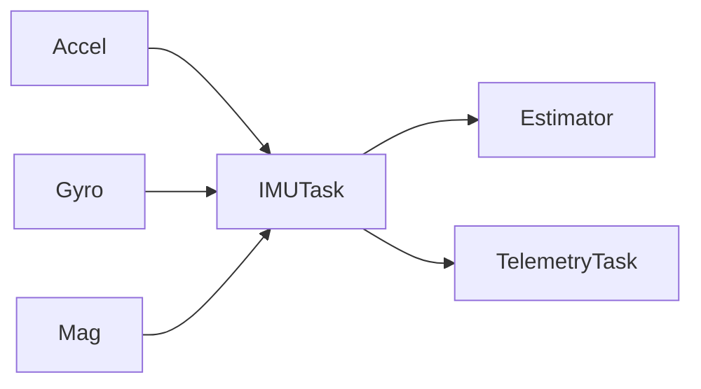
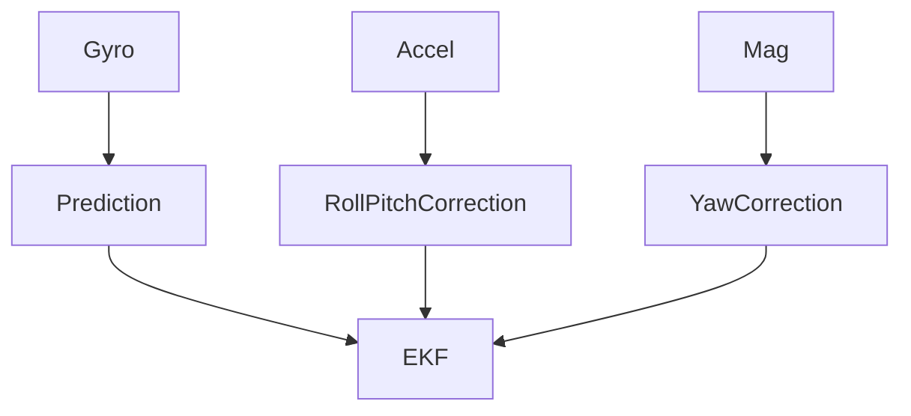

# Vayu Flight Controller

# Telemetry & Logging Protocol Specification

**Document Version:** 1.0
**Update:** IMU message extended to include Magnetometer

---

# 6. IMU Telemetry Message (0x01)

## 6.1 Overview

The IMU telemetry message includes:

* Accelerometer
* Gyroscope
* Magnetometer

All values are transmitted as **scaled int16** to reduce bandwidth while maintaining sufficient precision for debugging and analysis.

---

# 6.2 Payload Structure (Updated)

| Field | Type  | Size | Scaling        |
| ----- | ----- | ---- | -------------- |
| ax    | int16 | 2B   | accel_g × 1000 |
| ay    | int16 | 2B   | accel_g × 1000 |
| az    | int16 | 2B   | accel_g × 1000 |
| gx    | int16 | 2B   | dps × 10       |
| gy    | int16 | 2B   | dps × 10       |
| gz    | int16 | 2B   | dps × 10       |
| mx    | int16 | 2B   | µT × 10        |
| my    | int16 | 2B   | µT × 10        |
| mz    | int16 | 2B   | µT × 10        |

---

## 6.3 Payload Size

```text
9 values × 2 bytes = 18 bytes
```

---

## 6.4 Total Frame Size

```text
10 bytes overhead
18 bytes payload
----------------
28 bytes total
```

---

## 6.5 Bandwidth Calculation

### At 100 Hz:

```text
28 × 100 = 2800 bytes/sec
```

Still very light even at 115200 baud.

---

# 6.6 Why int16 is Safe

### Accelerometer

* ±16g range
* 1g resolution → 1000 scaling
* Range fits in int16

### Gyroscope

* ±2000 dps typical
* Scaling ×10
* Fits safely in int16

### Magnetometer

* Earth magnetic field ≈ 25–65 µT
* Scaling ×10
* Range easily fits in int16

You still get sub-degree yaw precision for logging.

---

# 6.7 Updated Data Flow



---

# 6.8 Updated C Struct

```c
#pragma pack(push, 1)
typedef struct {
    int16_t ax;
    int16_t ay;
    int16_t az;

    int16_t gx;
    int16_t gy;
    int16_t gz;

    int16_t mx;
    int16_t my;
    int16_t mz;
} imu_payload_t;
#pragma pack(pop)
```

---

# 6.9 Estimator Integration Note

Your estimator should:

* Use gyro for prediction
* Use accel for pitch/roll correction
* Use magnetometer for yaw correction



---

# 6.10 Recommended Telemetry Rate

| Data                | Rate  |
| ------------------- | ----- |
| Full IMU (with mag) | 50 Hz |
| Attitude            | 50 Hz |
| GPS                 | 5 Hz  |

You don’t need 100 Hz magnetometer over telemetry.
50 Hz is more than enough.

---

# 6.11 Optional Optimization (Pro Level)

If bandwidth becomes tight:

* Send mag at 20 Hz
* Send gyro+accel at 100 Hz
* Split message types:

| Type | Meaning      |
| ---- | ------------ |
| 0x01 | Accel + Gyro |
| 0x07 | Magnetometer |

This reduces unnecessary transmission.

---

# 🚀 Final Result

New IMU frame:

```text
28 bytes per frame
Magnetometer included
Still deterministic
Still lightweight
Still RTOS safe
```
