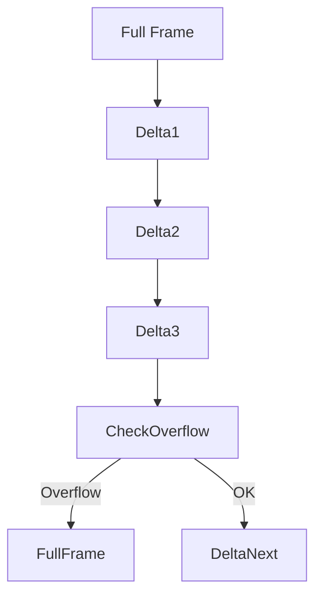
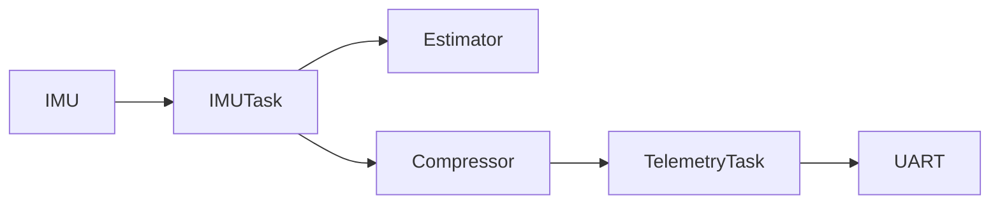

# Sensor Block Compression Scheme (SBCS v1.0)

---

# 1️⃣ Problem

Raw IMU frame (with mag):

```
9 values × int16 = 18 bytes
+ 10 byte header
= 28 bytes per frame
```

At 100 Hz → 2800 B/s

Good — but we can do much better.

---

# 2️⃣ Key Insight

IMU data between consecutive samples changes only slightly.

Instead of sending full values every frame:

👉 Send full frame occasionally
👉 Send delta frames most of the time

This is called **Delta Encoding**.

Used in:

* MAVLink log compression
* PX4 ulog
* Blackbox flight logs

---

# 3️⃣ Proposed Compression Strategy

We define two frame types:

| Type | Meaning         |
| ---- | --------------- |
| 0x01 | Full IMU Frame  |
| 0x11 | Delta IMU Frame |

---

# 4️⃣ Full IMU Frame (Baseline)

Sent at:

* 1 Hz (for resync)
* On request
* After packet loss detection

Payload (same as before):

```
ax ay az gx gy gz mx my mz
```

Size: 18 bytes

---

# 5️⃣ Delta IMU Frame (Compressed Mode)

Instead of sending full 16-bit values:

We send **int8 deltas**.

## 5.1 Delta Payload Structure

| Field | Type | Size |
| ----- | ---- | ---- |
| dax   | int8 | 1B   |
| day   | int8 | 1B   |
| daz   | int8 | 1B   |
| dgx   | int8 | 1B   |
| dgy   | int8 | 1B   |
| dgz   | int8 | 1B   |
| dmx   | int8 | 1B   |
| dmy   | int8 | 1B   |
| dmz   | int8 | 1B   |

Payload size = 9 bytes

---

# 6️⃣ How It Works

Let:

```
current_value = previous_value + delta
```

Delta is computed as:

```
delta = (current - previous)
```

But limited to:

```
-128 to +127
```

If any delta exceeds int8 range:

→ Send full frame instead.

---

# 7️⃣ Compression Result

### Old frame:

```
18 bytes payload
```

### New delta frame:

```
9 bytes payload
```

That’s **50% reduction**.

---

# 8️⃣ Updated Frame Size

Delta frame:

```
10 bytes overhead
9 bytes payload
= 19 bytes
```

At 100 Hz:

```
19 × 100 = 1900 B/s
```

Previously:

```
2800 B/s
```

~32% bandwidth reduction overall
More if you lower full-frame frequency.

---

# 9️⃣ Advanced Version (Block Mode)

Instead of per-frame:

Group 5 samples into one block.

---

## Block Structure

```text
+------+--------+--------+------------------+--------+
| SOF  | Type   | Count  | Delta Samples    | CRC16  |
| 1B   | 1B     | 1B     | 9 × N bytes      | 2B     |
+------+--------+--------+------------------+--------+
```

If Count = 5:

```
9 × 5 = 45 bytes
```

Instead of:

```
18 × 5 = 90 bytes
```

50% compression.

---

# 🔁 Resync Strategy



Every:

* 1 second → send full frame
* On delta overflow → send full frame
* On packet drop → next full frame resyncs

---

# 🔟 Optional Super Mode: Mixed Precision

Even more aggressive compression:

| Sensor | Type         |
| ------ | ------------ |
| Accel  | int12 packed |
| Gyro   | int12 packed |
| Mag    | int10 packed |

Packed into bitstream.

BUT:

⚠ Harder to debug
⚠ More CPU cost
⚠ More error-prone

For flight firmware, delta encoding is safer.

---

# 1️⃣1️⃣ C Implementation Sketch

### Sender

```c
bool send_delta_frame(imu_t current, imu_t previous) {

    int16_t dx = current.ax - previous.ax;

    if (dx < -128 || dx > 127)
        return send_full_frame(current);

    int8_t dax = (int8_t)dx;
    ...
}
```

---

### Receiver

```c
current.ax = previous.ax + delta.ax;
```

Store last full frame.

---

# 1️⃣2️⃣ Memory Requirements

| Item               | Size     |
| ------------------ | -------- |
| Previous IMU frame | 18 bytes |
| Delta buffer       | 9 bytes  |

Extremely lightweight.

Perfect for your microcontroller.

---

# 1️⃣3️⃣ When To Use This?

Use delta compression when:

* Telemetry over radio
* Long-range communication
* Bandwidth limited
* Logging to onboard flash

Do NOT use delta compression:

* For SD card raw logging
* For estimator internal data

Internal control loop must always use raw values.

---

# 1️⃣4️⃣ Optional Improvement: Timestamp Delta

Instead of 4-byte timestamp:

Use:

```
uint16 dt_us
```

If running at fixed rate.

Saves 2 bytes more per frame.

---

# 🚀 Final Architecture



---

# 📊 Expected Final Bandwidth (Realistic)

If:

* 1 full frame per second
* 99 delta frames per second

Approx bandwidth:

```
(28 bytes × 1) + (19 bytes × 99)
= 28 + 1881
= 1909 B/s
```

From original 2800 B/s

≈ 32% improvement.

If block compression used:
≈ 45–50% improvement.
