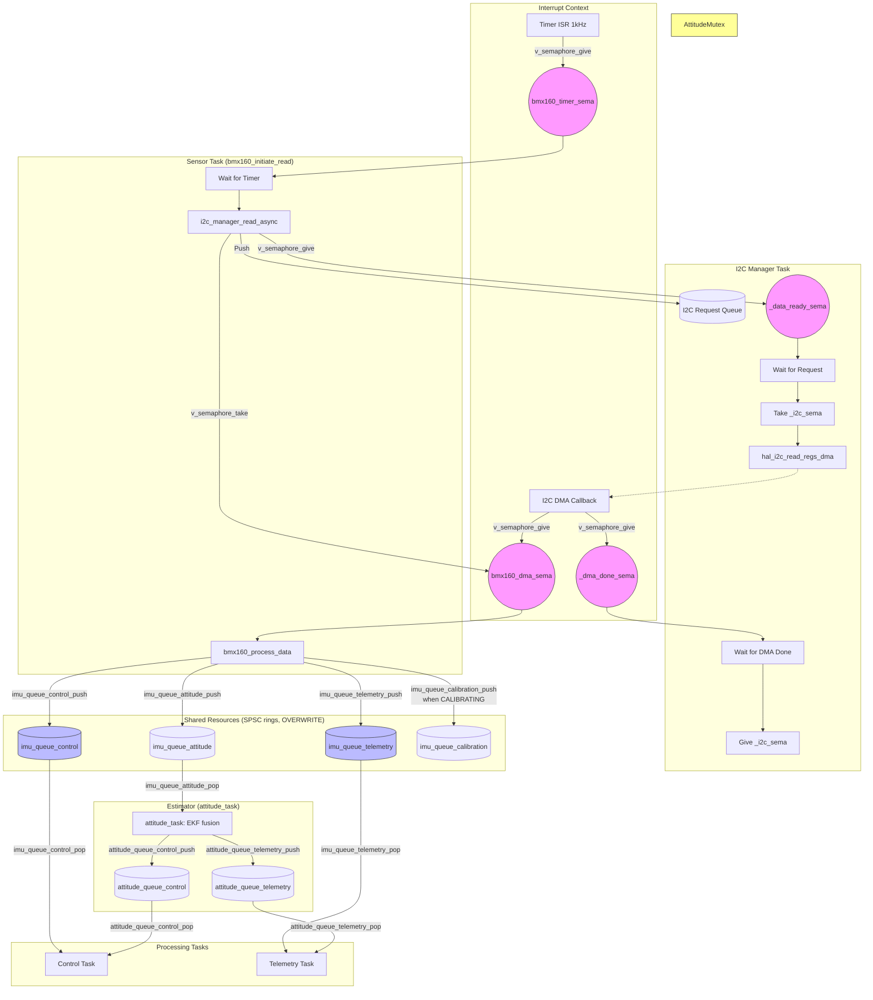
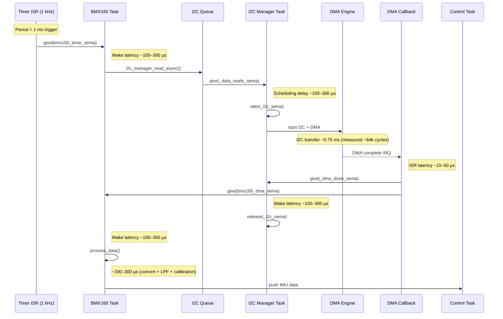

# Vayu Sensor Data Flow Map

This document maps the path of sensor data from the BMX160 hardware to the processing tasks (Control and Telemetry), highlighting shared buffers and synchronization primitives.

## Data Path Overview

## Shared Resources & Synchronization

| Resource | Implementation | Sync Primitive | Producer | Consumer(s) | Notes |
| :--- | :--- | :--- | :--- | :--- | :--- |
| **I2C Bus** | Physical Bus | `_i2c_sema` (Binary Semaphore) | I2C Manager Task | Any Task calling I2C | Ensures exclusive access during transactions. |
| **I2C Request Queue**| `i2c_queue_t` | `_queue_sema` + `_data_ready_sema` | BMX160 Task | I2C Manager Task | Queue for async I2C operations. |
| **I2C DMA Buffer** | `_rx_data` in [i2c_manager.c](../../../src/sensor/i2c_manager.c) | `_dma_done_sema` (Binary Semaphore) | I2C DMA ISR | I2C Manager Task | Hardware buffer protected by task blocking. |
| **Sensor DMA Done** | `bmx160_dma_sema` | Binary Semaphore | I2C Manager Callback | BMX160 Task | Signals sensor task to start processing. |
| **IMU control ring** | `imu_queue_control` (SPSC) | Lock-free + wake semaphore | BMX160 Task | Control Task | OVERWRITE policy; rate-loop PID feedback. |
| **IMU telemetry ring** | `imu_queue_telemetry` (SPSC) | Lock-free + wake semaphore | BMX160 Task | Telemetry Task | OVERWRITE; logging / remote monitoring. |
| **IMU attitude ring** | `imu_queue_attitude` (SPSC) | Lock-free + wake semaphore | BMX160 Task | `attitude_task` | OVERWRITE; feeds the estimator. |
| **Attitude estimate** | `attitude_queue_{control,telemetry}` (SPSC) | Lock-free + wake semaphore | `attitude_task` (EKF) | Control, Telemetry | Euler/quaternion from the EKF fusion (not the driver). |

## Detailed Sequence

1.  **Trigger**: Every 1ms, a high-frequency timer ISR signals `bmx160_timer_sema`.
2.  **Request**: The **BMX160 Task** wakes up and calls [i2c_manager_read_async()](../../../src/sensor/i2c_manager.c), which pushes the request into `I2CQueue` and signals `_data_ready_sema`.
3.  **Acquisition**: The **I2C Manager Task** wakes up, takes `_i2c_sema` (bus mutex), initiates an asynchronous DMA read, and waits on `_dma_done_sema`.
4.  **Completion**: When the DMA transfer finishes, the **I2C DMA Callback** (ISR context):
    -   Copies data to the local sensor buffer.
    -   Signals `bmx160_dma_sema` to notify the sensor task.
    -   Signals `_dma_done_sema` to notify the manager task.
5.  **Task Resumption**:
    -   The **I2C Manager Task** unblocks and releases `_i2c_sema`.
    -   The **BMX160 Task** unblocks and calls [bmx160_process_data()](../../../src/sensor/bmx160.c).
6.  **Processing**: The **BMX160 Task** converts raw values and applies Low-Pass Filters (LPF) + calibration. Attitude fusion is **not** done here — it runs in a separate `attitude_task` (see below).
7.  **Distribution**: the processed sample is pushed to the per-consumer SPSC rings: `imu_queue_control`, `imu_queue_telemetry`, `imu_queue_attitude`, and (while CALIBRATING) `imu_queue_calibration`.
8.  **Fusion**: `attitude_task` pops `imu_queue_attitude`, runs the **EKF** (`src/est/`), and publishes the estimate to `attitude_queue_control` and `attitude_queue_telemetry`.
9.  **Consumption**:
    -   **Control Task** pops `imu_queue_control` and `attitude_queue_control`.
    -   **Telemetry Task** pops `imu_queue_telemetry` and `attitude_queue_telemetry`.
