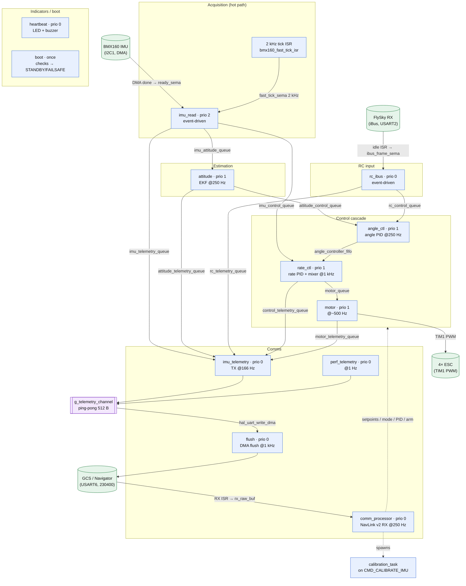
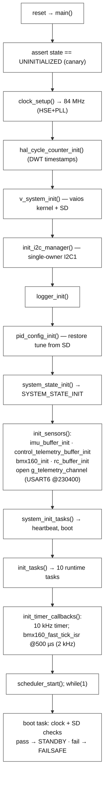
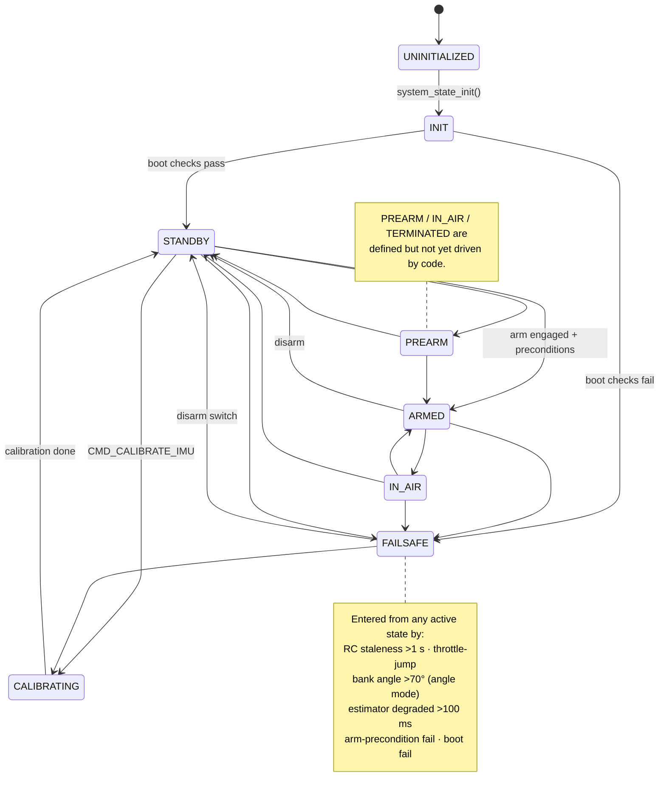
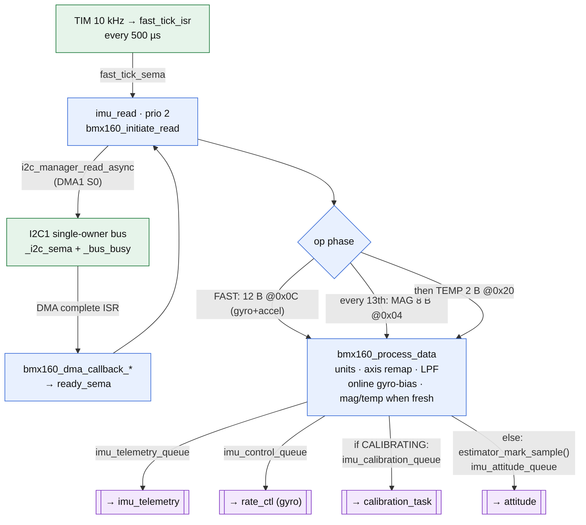
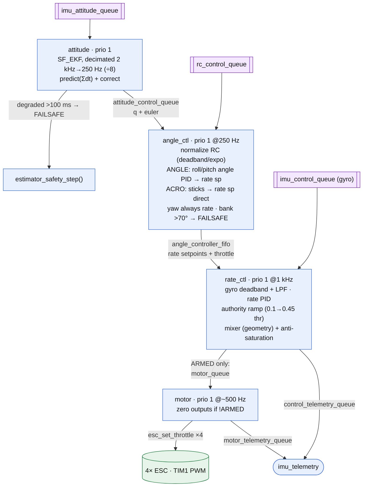
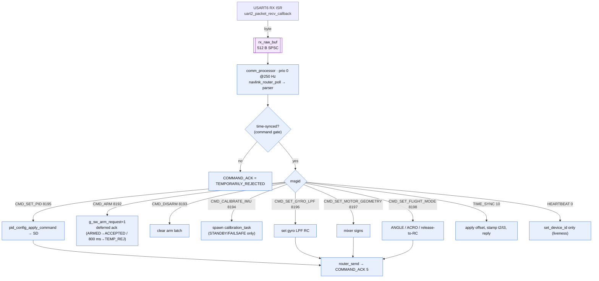
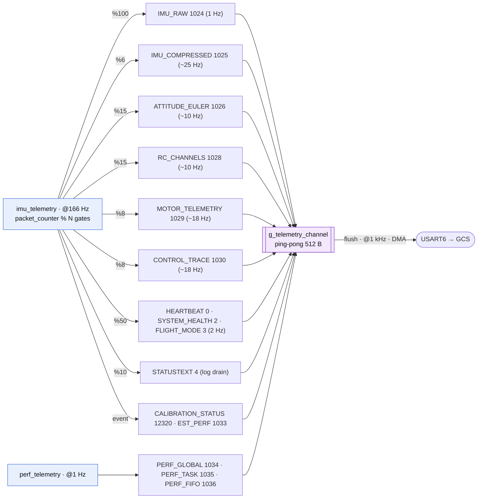

# Firmware software flow

A complete, current map of how the Vayu flight-controller firmware runs: the boot
sequence, every RTOS task, the IPC that connects them, and the four hot paths
(sensing → estimation → control → actuation, plus comms). Everything here is
drawn from the source (`src/`, `include/`); see the per-section file pointers.

> Supersedes the legacy hand-drawn `journal/legacy-soft-flow.drawio` (pre-NavLink-v2,
> pre-modular-refactor, Mahony-era). For prose detail see
> [firmware-control.md](firmware-control.md) and [pipeline-overview.md](pipeline-overview.md);
> for the wire format see [navlink-v2-spec.md](../../navlink/docs/reference/navlink-v2-spec.md).

**Platform:** STM32F401RE @ 84 MHz, **vaios** in-house RTOS (`task_create_named`,
`v_semaphore_*`, `task_delay_until`). Higher numeric priority = more urgent.

## How to read these diagrams

- **Rounded boxes** = RTOS tasks (with priority + rate). **Cylinders** = hardware/peripherals.
- **Double-bordered nodes** = lock-free SPSC ring buffers / channels (the IPC).
- Edge labels name the **queue / semaphore / signal** carrying the data and its rate.
- `prio N` is the vaios task priority; `@F` is the loop frequency.

---

## 1. System overview

Every task and the IPC between them. Single producer per queue; queues are
overwrite-policy rings (newest wins) so a slow consumer never blocks a fast producer.

State and arm latches (`_system_current_status`, `g_sw_arm_request`) are volatile
globals read across tasks (vaios R8.6 lock-free scalars), shown as dashed influence
rather than queues.

*Source: `src/main.c:84-123` (task creation), `src/sensor/imu_buffer.c` (queues),
`src/comm/channel.c` (`g_telemetry_channel`).*

---

## 2. Boot & init (`main()` → scheduler)

*Source: `src/main.c:42-160`.*

---

## 3. System state machine

One-hot bitmask states. Transitions are validated against a static allow-table;
**FAILSAFE is reachable from any active state** (safety overrides protocol).

*Source: `include/sys/state.h:6-16`, `src/sys/state.c:30-73`, `src/comm/rc_safety.c`,
`src/sys/boot.c`.*

---

## 4. IMU acquisition & fan-out (the 2 kHz hot path)

A 10 kHz timer paces a 2 kHz tick. The `imu_read` task owns a 3-phase split-rate
read over the single-owner I2C DMA bus, then fans the processed sample out to four
consumers.

*Source: `src/sensor/bmx160.c:852-1275`, `src/sensor/i2c_manager.c`,
`src/sensor/imu_buffer.c`. Sample rate `IMU_SAMPLE_FREQ_HZ` (`variables.h:218`).*

---

## 5. Estimation & control cascade

Attitude estimate (EKF) → outer **angle** loop → inner **rate** loop + mixer →
motors. The outer loop produces rate setpoints; the inner loop closes on the gyro.
Motors are driven **only while ARMED**.

Flight modes: **ANGLE** (self-levelling) / **ACRO** (rate) toggled by RC ch6 or a
GCS override, arbitrated by `flight_mode_resolve_acro`. Arm transition hard-resets
all rate PIDs and LPF state.

*Source: `src/est/attitude_task.c`, `src/control/angle_controller.c`,
`src/control/angle_rate_controller.c`, `src/actuator/motor.c`. Rates:
`OUTER_LOOP_FREQ_HZ=250`, `INNER_LOOP_FREQ_HZ=1000` (`variables.h:207-230`).*

---

## 6. Command RX & dispatch (GCS → FC)

Pure NavLink v2 uplink. A command gate **rejects every command until the clock is
time-synced**; `COMMAND_ACK` is emitted automatically for ack-requiring commands.

*Source: `src/comm/serializer.c`, `src/comm/navlink_router.c:120-308`,
`src/comm/comm_processor.c:42-142`. Heartbeat RX is liveness/device-id only — no
clock jam (that is the dedicated TIME_SYNC path).*

---

## 7. Telemetry TX (FC → GCS)

`imu_telemetry_task` runs a 166 Hz base loop and gates each message by
`packet_counter % N`. Output is buffered in `g_telemetry_channel` (ping-pong) and
DMA-flushed by `flush_task`. `perf_telemetry_task` emits kernel/IPC stats at 1 Hz.

`imu_telemetry_task` also runs `time_sync_discipline_tick()` every loop to slew the
disciplined clock between sync handshakes.

*Source: `src/comm/telemetry_task.c:26-135`, `src/comm/navlink_tx.c`,
`src/comm/perf_telemetry.c`, `src/comm/channel.c`. Msgids per
[`navlink/dialect.json`](../../navlink/dialect.json).*

---

## Reference tables

### Tasks

| Task | Entry | Stack | Prio | Rate / trigger |
|------|-------|------:|:----:|----------------|
| `comm_processor` | `comm_processor_task` | 2048 | 0 | poll @~250 Hz |
| `imu_read` | `bmx160_initiate_read` | 1536 | 2 | event (2 kHz tick + DMA sema) |
| `attitude` | `attitude_task` | 2048 | 1 | event (imu_attitude_queue) |
| `rc_ibus` | `rc_ibus_task` | 1024 | 0 | event (USART2 idle ISR) |
| `angle_ctl` | `angle_controller_task` | 2048 | 1 | periodic 250 Hz |
| `rate_ctl` | `angle_rate_controller_task` | 2048 | 1 | periodic 1000 Hz |
| `motor` | `motor_task` | 1024 | 1 | poll @~500 Hz |
| `imu_telemetry` | `imu_telemetry_task` | 2048 | 0 | poll @~166 Hz |
| `flush` | `flush_task` | 1024 | 0 | poll @~1 kHz |
| `perf_telemetry` | `perf_telemetry_task` | 2048 | 0 | 1 Hz |
| `heartbeat` | `heartbeat_task` | 1024 | 0 | ≥250 ms |
| `boot` | `boot_task` | 1024 | 0 | once → exit |
| `calibration_task` | (on demand) | 8192 | 0 | spawned by CMD_CALIBRATE_IMU |

### Key IPC (all SPSC overwrite rings unless noted)

| Queue | Producer → Consumer |
|-------|---------------------|
| `imu_telemetry_queue` | imu_read → imu_telemetry |
| `imu_control_queue` (+sema) | imu_read → rate_ctl |
| `imu_attitude_queue` (+sema) | imu_read → attitude |
| `imu_calibration_queue` | imu_read → calibration_task |
| `attitude_control_queue` (+sema) | attitude → angle_ctl |
| `attitude_telemetry_queue` | attitude → imu_telemetry |
| `angle_controller_fifo` | angle_ctl → rate_ctl |
| `motor_queue` | rate_ctl → motor |
| `motor_telemetry_queue` | motor → imu_telemetry |
| `control_telemetry_queue` | rate_ctl → imu_telemetry |
| `rc_control_queue` / `rc_telemetry_queue` | rc_ibus → angle_ctl / imu_telemetry |
| `rx_raw_buf` | USART6 RX ISR → comm_processor |
| `g_telemetry_channel` (ping-pong) | all TX tasks → flush → USART6 |

---

## Notes & caveats (verified honesty)

- **ESC PWM rate:** `motor_task`'s software cadence is ~500 Hz; the actual ESC PWM
  rate is set by the TIM1 config in `esc_init` and is **not asserted here** (not read).
- **EKF internals** (`src/est/ekf.c`) are summarised at the dispatch level only.
- **Telemetry UART:** the channel opens on **USART6**, but `flush_channel` special-cases
  USART2/DMA1-Stream6; on USART6 it currently falls back to a blocking byte write — a
  latent inconsistency to confirm, not architecture.
- **Stale in-source comments** in `attitude_task.c` (decimation target) and both
  controllers (`imu_queue_control_wait` vs the actual `task_delay_until`) describe older
  behavior; the diagrams above follow the **code**, not those comments.
- `PREARM` / `IN_AIR` / `TERMINATED` states exist in the enum but have no live driving
  transition yet.
