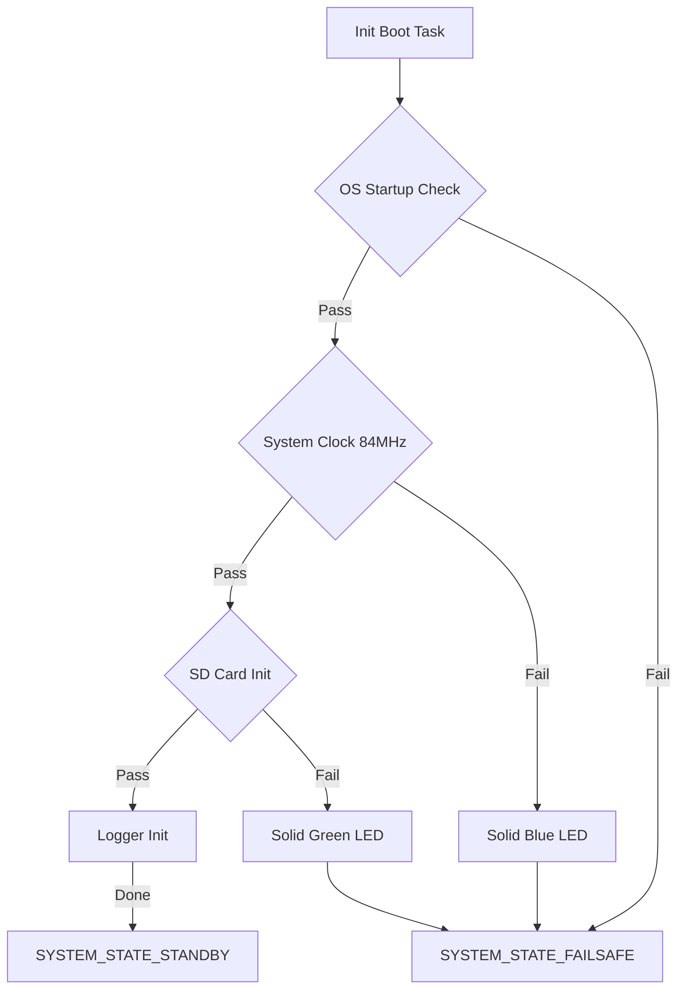

# Boot Check Status

The Boot Check system uses a bitmask to track the progress and results of initialization tasks performed in `src/sys/boot.c`.

## Visual Representation

## Status Flags

| Flag                                 | Value  | Description                                |
| :----------------------------------- | :----- | :----------------------------------------- |
| `BOOT_CHECK_NO_CHECK`                | `0x1`  | Initial state.                             |
| `BOOT_CHECK_STARTUP_CHECK_PASS`      | `0x2`  | OS and Tasking system is operational.      |
| `BOOT_CHECK_STARTUP_CHECK_FAIL`      | `0x4`  | (Reserved) Failed to start basic services. |
| `BOOT_CHECK_SYSTEM_CLOCK_CHECK_PASS` | `0x8`  | System clock verified at 84MHz.            |
| `BOOT_CHECK_SYSTEM_CLOCK_CHECK_FAIL` | `0x10` | Clock frequency mismatch detected.         |
| `BOOT_CHECK_SD_CARD_CHECK_PASS`      | `0x20` | SDIO card initialization successful.       |
| `BOOT_CHECK_SD_CARD_CHECK_FAIL`      | `0x40` | SDIO card missing or failed to handshake.  |

## Diagnostic LED Codes (FAILSAFE Mode)

When the system enters `SYSTEM_STATE_FAILSAFE` due to a boot error, the following LEDs indicate the specific failure:

- **Solid Blue**: `BOOT_CHECK_SYSTEM_CLOCK_CHECK_FAIL`
- **Solid Green**: `BOOT_CHECK_SD_CARD_CHECK_FAIL`
- **Blinking Red + Buzzer**: Master Failsafe Indication.
