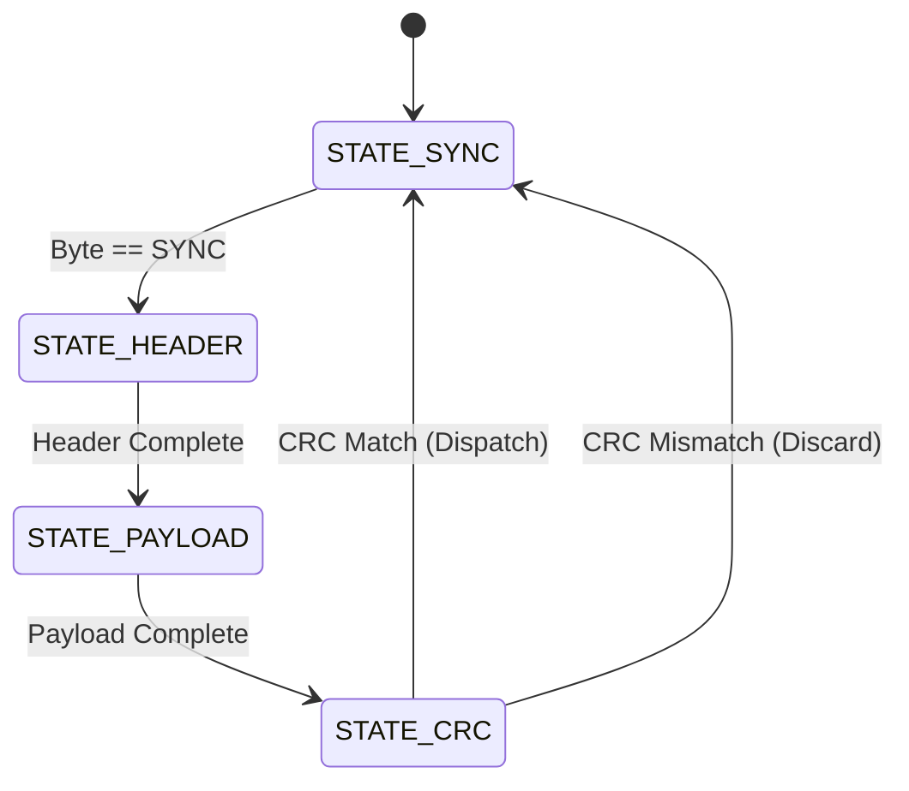

# Packet Deserializer State Machine

Used to parse the custom binary telemetry protocol over serial/UART.

## Visual Representation

## States

| State           | Description                                              |
| :-------------- | :------------------------------------------------------- |
| `STATE_SYNC`    | Waiting for the start-of-frame synchronization byte(s).  |
| `STATE_HEADER`  | Reading the packet header (ID, Length, Type).            |
| `STATE_PAYLOAD` | Accumulating the raw bytes into the packet buffer.       |
| `STATE_CRC`     | Verifying the trailing CRC-16 against the received data. |

## Flow

1. **SYNC**: If byte == `PACKET_SYNC_BYTE`, move to **HEADER**.
2. **HEADER**: Once `HEADER_SIZE` is met, move to **PAYLOAD**.
3. **PAYLOAD**: Once `packet.length` bytes are read, move to **CRC**.
4. **CRC**: If CRC matches, dispatch packet and return to **SYNC**. If failure, discard and return to **SYNC**.
