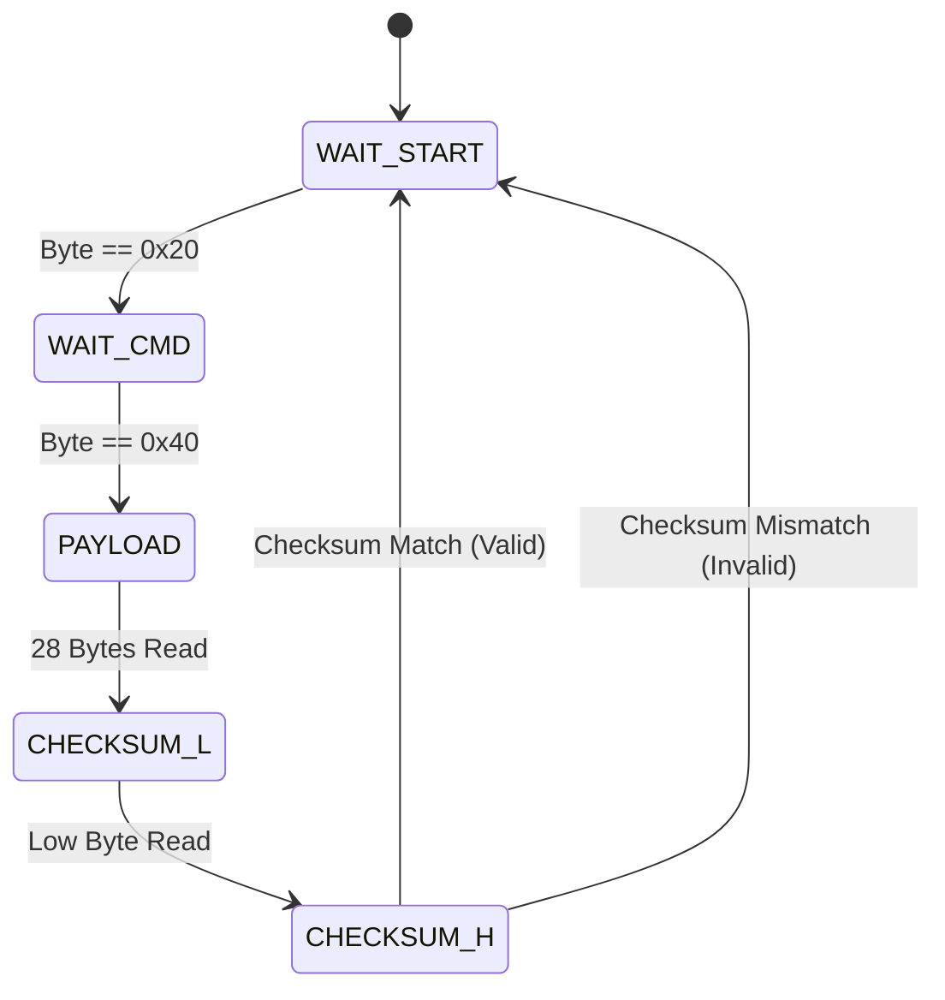

# IBUS Protocol State Machine

Decodes the FlySky IBUS protocol from the RC receiver.

## Visual Representation

## States

| State                   | Description                                                |
| :---------------------- | :--------------------------------------------------------- |
| `IBUS_STATE_WAIT_START` | Waiting for start byte `0x20`.                             |
| `IBUS_STATE_WAIT_CMD`   | Waiting for command byte `0x40`.                           |
| `IBUS_STATE_PAYLOAD`    | Reading 28 bytes of channel data (14 channels \* 2 bytes). |
| `IBUS_STATE_CHECKSUM_L` | Reading low byte of the checksum.                          |
| `IBUS_STATE_CHECKSUM_H` | Reading high byte of the checksum.                         |

## Specifications

- **Packet Size**: 32 bytes.
- **Baud Rate**: 115200.
- **Check**: Sum of all bytes (excluding checksum) negated.
