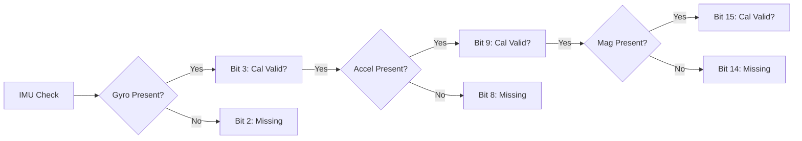

# IMU Health Check Status

The IMU Health Check system tracks the availability and calibration status of the onboard sensors (Gyroscope, Accelerometer, Magnetometer).

## Visual Representation

## Status Bitmask

| Bit | Hex Value | Flag                                  | Description                           |
| :-- | :-------- | :------------------------------------ | :------------------------------------ |
| 0   | `0x1`     | `IMU_HEALTH_NO_CHECK`                 | No checks performed yet.              |
| 1   | `0x2`     | `IMU_HEALTH_GYRO_PRESENT`             | Gyroscope identified on I2C/SPI bus.  |
| 2   | `0x4`     | `IMU_HEALTH_GYRO_NOT_PRESENT`         | Gyroscope missing or unresponsive.    |
| 3   | `0x8`     | `IMU_HEALTH_GYRO_CALIBRATION_VALID`   | Gyro offsets are within normal range. |
| 4   | `0x10`    | `IMU_HEALTH_GYRO_CALIBRATION_INVALID` | Gyro requires recalibration.          |
| 5   | `0x20`    | `IMU_HEALTH_GYRO_TEMP_VALID`          | Gyro temperature sensor working.      |
| ... | ...       | ...                                   | ...                                   |
| 7   | `0x80`    | `IMU_HEALTH_ACCEL_PRESENT`            | Accelerometer identified.             |
| ... | ...       | ...                                   | ...                                   |
| 13  | `0x2000`  | `IMU_HEALTH_MAG_PRESENT`              | Magnetometer identified.              |

_(See `include/sys/state.h` for the full list of flags up to `0x40000`)_
