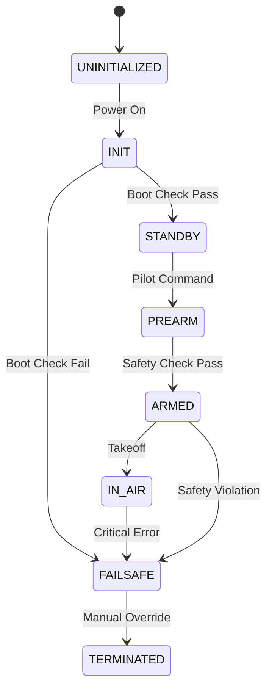

# System State Machine

The System State Machine governs the high-level behavior and safety modes of the drone.

## Visual Representation

## States

| State                        | Hex Value | Description                                                                  |
| :--------------------------- | :-------- | :--------------------------------------------------------------------------- |
| `SYSTEM_STATE_UNINITIALIZED` | `0x1`     | Power-on default. Kernel not yet running.                                    |
| `SYSTEM_STATE_INIT`          | `0x2`     | Running `boot_task`. Performing hardware checks.                             |
| `SYSTEM_STATE_STANDBY`       | `0x4`     | Boot passed. Ready for arming. Green LED toggling.                           |
| `SYSTEM_STATE_PREARM`        | `0x8`     | Arming sequence initiated. Checking safety conditions.                       |
| `SYSTEM_STATE_ARMED`         | `0x10`    | Motors active. Ready for takeoff.                                            |
| `SYSTEM_STATE_IN_AIR`        | `0x20`    | Flight mode active.                                                          |
| `SYSTEM_STATE_FAILSAFE`      | `0x40`    | Critical error detected (e.g. boot check failed). Red LED blinking + Buzzer. |
| `SYSTEM_STATE_TERMINATED`    | `0x80`    | Post-flight or emergency shutdown complete.                                  |

## Transitions

- **INIT -> STANDBY**: Triggered by `boot_task` when all required checks pass.
- **INIT -> FAILSAFE**: Triggered by `boot_task` if a mandatory check (Clock, SD Card) fails.
- **STANDBY -> PREARM**: Triggered by RC input or GCS command.
- **...**
