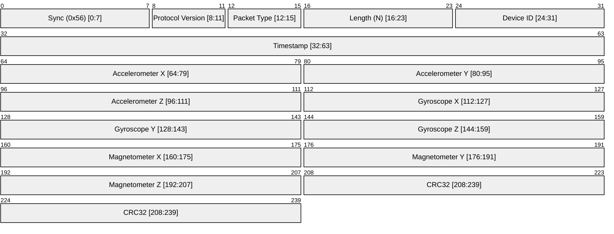

# IMU Data

IMU Data is a packet that is sent from the device to the navigator to indicate the IMU data. It is sent at a rate of 100 Hz.

There are two types of IMU data packets:

1. Full IMU Data - Packet Code 0x1
2. Delta IMU Data - Packet Code 0x2

## Packet Structure

## Changelog

|Date|Author|Description|
|----|----|----|
|06/03/2026|Ashutosh Vishwakarma|Initial version|