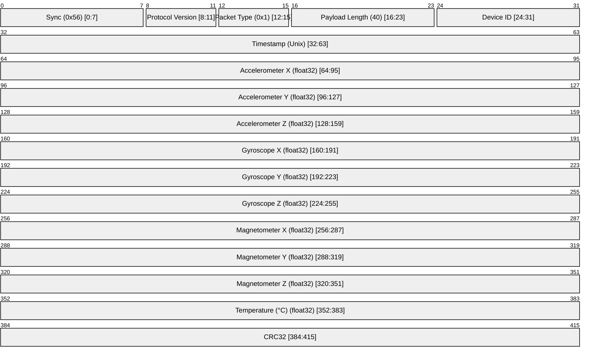
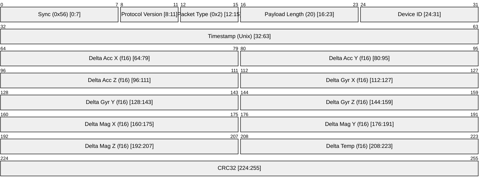

# IMU Data

IMU Data is a packet that is sent from the device to the navigator to indicate the IMU data. It is sent at a rate of 100 Hz.

There are two types of IMU data packets:

1. Full IMU Data - Packet Code 0x1
2. Delta IMU Data - Packet Code 0x2

## Packet Structure

IMU packets use an 8-byte header followed by the payload and a 4-byte CRC32.

### Full IMU Data (Type 0x1, N=40)

Sent every 10 samples or when delta exceeds threshold. Payload consists of 10 IEEE 754 32-bit floats.

### Delta IMU Data (Type 0x2, N=20)

Sent for intermediate updates. Payload consists of 10 IEEE 754 16-bit half-precision floats (`f16`). These represent the difference from the last Full IMU Data packet.

## Changelog

| Date       | Author               | Description     |
| ---------- | -------------------- | --------------- |
| 06/03/2026 | Ashutosh Vishwakarma | Initial version |
