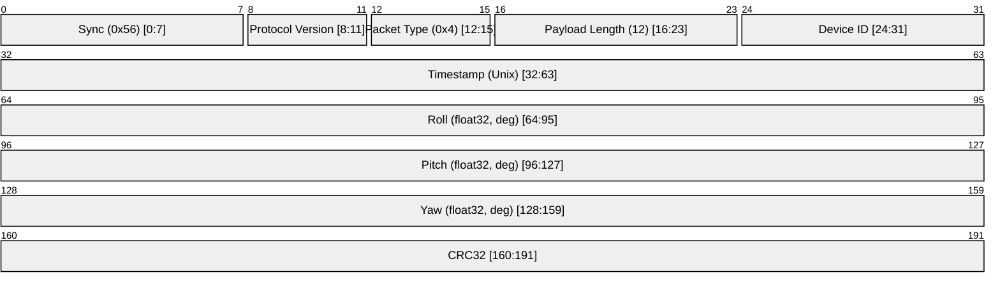

# Attitude Data

Attitude Data is a packet that contains the calculated orientation of the drone (Roll, Pitch, Yaw) in degrees. It is typically sent at 10-20 Hz.

## Packet Structure (Type 0x4, N=12)

The payload consists of three IEEE 754 32-bit floats.

## Changelog

| Date       | Author      | Description     |
| ---------- | ----------- | --------------- |
| 11/03/2026 | Antigravity | Initial version |
