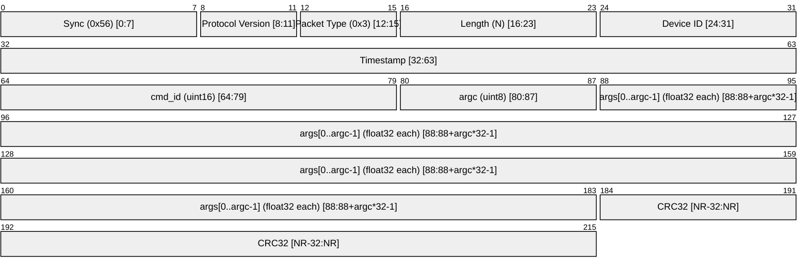

# Command Packet (0x3)

A **Command** packet is sent **GCS → Drone** to trigger an action or update a parameter. It carries one mandatory 16-bit command ID and up to 15 optional `float` arguments.

---

## Packet Structure

### Payload Layout (`command_payload_t`)

| Offset | Size | Field    | Description                                       |
| ------ | ---- | -------- | ------------------------------------------------- |
| 0      | 2    | `cmd_id` | Command identifier (see table below)              |
| 2      | 1    | `argc`   | Number of valid `float` args that follow (0 – 15) |
| 3      | 4×N  | `args[]` | `argc` little-endian IEEE-754 floats              |

> **Minimum payload length:** 3 bytes (`cmd_id` + `argc`, no args).  
> **Maximum payload length:** 63 bytes (3 + 15 × 4).  
> The `length` field in the packet header **must** equal `3 + argc * 4`.

---

## Command IDs

| `cmd_id` | Name                | `argc` | Arguments                                                                                 | Description                                                                 |
| -------- | ------------------- | ------ | ----------------------------------------------------------------------------------------- | --------------------------------------------------------------------------- |
| `0x0001` | `CMD_ARM`           | 0      | —                                                                                         | Arm the drone                                                               |
| `0x0002` | `CMD_DISARM`        | 0      | —                                                                                         | Disarm the drone                                                            |
| `0x0003` | `CMD_SET_THROTTLE`  | 1      | `args[0]` = throttle (0.0 – 1.0)                                                          | Set motor throttle level                                                    |
| `0x0004` | `CMD_SET_ATTITUDE`  | 3      | `args[0]` = roll (°), `args[1]` = pitch (°), `args[2]` = yaw (°)                          | Set target attitude                                                         |
| `0x0005` | `CMD_REBOOT`        | 0      | —                                                                                         | Soft-reboot the flight controller                                           |
| `0x0006` | `CMD_CALIBRATE_GYR` | 0      | —                                                                                         | Trigger gyro bias re-calibration (drone must be stationary)                 |
| `0x0007` | `CMD_SET_PID`       | 4      | `args[0]` = axis (0=roll, 1=pitch, 2=yaw), `args[1]` = Kp, `args[2]` = Ki, `args[3]` = Kd | Update a PID gain set                                                       |
| `0x0008` | `CMD_CALIBRATE_ACC` | 0      | —                                                                                         | Trigger accelerometer bias calibration (drone must be stationary and level) |

> Packets with an unrecognised `cmd_id` or a `length` inconsistent with `argc` are **silently dropped** by the firmware.

---

## Wire Example — ARM command

| Byte  | Value       | Meaning                             |
| ----- | ----------- | ----------------------------------- |
| 0     | `0x56`      | Sync                                |
| 1     | `0x31`      | Type=0x3 (command), Version=0x1     |
| 2     | `0x03`      | Length = 3 (cmd_id + argc, no args) |
| 3     | device_id   | Device ID                           |
| 4–7   | timestamp   | Unix timestamp (LE)                 |
| 8–9   | `0x01 0x00` | cmd_id = 0x0001 (ARM, LE)           |
| 10    | `0x00`      | argc = 0                            |
| 11–14 | CRC32       | Computed over bytes 0–10            |

---

## Wire Example — SET_PID command

Payload sets Roll Kp=1.5, Ki=0.01, Kd=0.3:

| Byte(s) | Value                 | Meaning                    |
| ------- | --------------------- | -------------------------- |
| 0–1     | `0x07 0x00`           | cmd_id = 0x0007 (LE)       |
| 2       | `0x04`                | argc = 4                   |
| 3–6     | `0x00 0x00 0x00 0x00` | args[0] = 0.0f (roll axis) |
| 7–10    | `0x00 0x00 0xC0 0x3F` | args[1] = 1.5f             |
| 11–14   | `0x0A 0xD7 0x23 0x3C` | args[2] = 0.01f            |
| 15–18   | `0x9A 0x99 0x99 0x3E` | args[3] = 0.3f             |

Total payload = 19 bytes → `length` field = 19.

---

## Adding New Commands

1. Add a new enumerator to `command_id_t` in `include/comm/comm_types.h`.
2. Add a `case` branch and a handler function in `src/comm/comm_processor.c`.
3. Update this table.

---

## Changelog

| Date       | Author      | Description     |
| ---------- | ----------- | --------------- |
| 15/03/2026 | Antigravity | Initial version |
