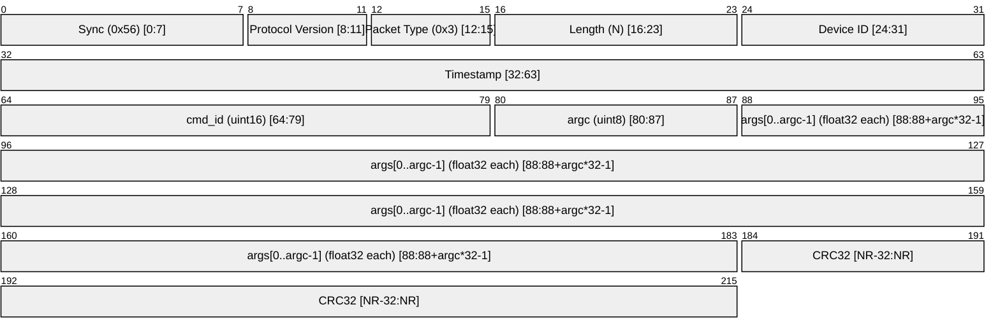

# Command Packet (0x3) [GCS → FC]

A **Command** packet is sent **GCS → Drone** to trigger an action or update a parameter.

---

## Packet Structure

### Payload Layout (`command_payload_t`)

| Offset | Size | Field    | Description                                       |
| ------ | ---- | -------- | ------------------------------------------------- |
| 0      | 2    | `cmd_id` | Command identifier (see table below)              |
| 2      | 1    | `argc`   | Number of valid `float` args that follow (0 – 15) |
| 3      | 4×N  | `args[]` | `argc` little-endian IEEE-754 floats              |

> **Minimum payload length:** 3 bytes (`cmd_id` + `argc`, no args).  
> **Maximum payload length:** 63 bytes (3 + 15 × 4).  
> The `length` field in the packet header **must** equal `3 + argc * 4`.

---

## Command Set Specification

The following table defines the standard commands supported by the Vayu firmware. Commands are transmitted as `PACKET_TYPE_COMMAND` (0x3) with a payload consisting of a 2-byte Command ID (Little-Endian) followed by zero or more 4-byte floating-point arguments.

| ID       | Mnemonic            | ARGC   | Arguments                    | Description                                           |
| :------- | :------------------ | :----- | :--------------------------- | :---------------------------------------------------- |
| `0x0001` | `CMD_CALIBRATE_IMU` | 0 or 2 | `[0]`: IMU ID `[1]`: Type | Trigger IMU calibration or cancel ongoing operations. |

### Command Details

#### CMD_CALIBRATE_IMU (0x0001)

This command manages the internal calibration procedures for the onboard sensors.

- **Arguments** (if `argc == 2`):
  - `args[0]` **IMU ID**:
    - `1.0`: Accelerometer
    - `2.0`: Gyroscope
    - `3.0`: Magnetometer
  - `args[1]` **Calibration Type**:
    - For `Accelerometer` and `Gyroscope`:
      - `0.0`: Bias-only (Zeroing)
      - `1.0`: Full (Scale & Offset)
    - For `Magnetometer`:
      - `0.0`: Hard-Iron Calibration
      - `1.0`: Soft-Iron Calibration
      - `2.0`: Full (Hard-Iron + Soft-Iron)
- **Cancellation**:
  - Sending `CMD_CALIBRATE_IMU` with `argc == 0` will immediately terminate any active calibration task and return the system to `STANDBY` state.

> [!IMPORTANT]
> The drone must remain stationary and level on a flat surface during all calibration procedures. Unexpected motion may result in invalid bias calculations.

> Packets with an unrecognised `cmd_id` or a `length` inconsistent with `argc` are **silently dropped** by the firmware.

