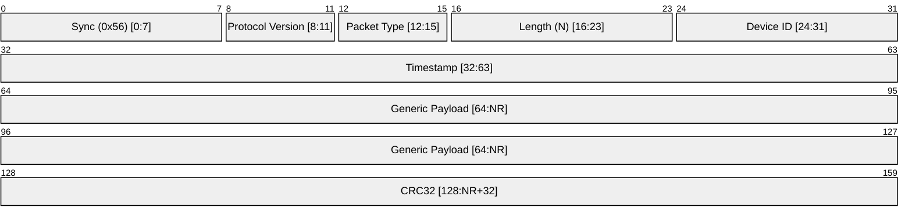

# Telemetry & Logging Protocol Specification (NAVLINK 1.0)

**Document Version:** 1.0

**Date:** 06/03/2026

**Purpose:** This document specifies the telemetry and logging protocol for the Vayu flight controller.

---

## Packet Structure

The packets sent from and recieved by Vayu is of following standard format:

**Sync** is used to synchronize the receiver with the sender. It is a 8-bit value that is used to identify the sync. Only value it has is 0x56.

**Protocol Version** is used to identify the protocol version. It is a 4-bit value that is used to identify the protocol version. This will start from 1 and will increment by 1 for each new version till 0xE. 0xF is reserved for future use.

**Packet Type** is used to identify the packet type. It is a 4-bit value that is used to identify the packet type. So current model supports 16 different packet types.

**Length** is used to identify the length of the payload. It is a 8-bit value that is used to identify the length of the payload. 0x0 means the payload is empty and it's just a header only packet.

**Device ID** is used to identify the device ID. It is a 8-bit value that is used to identify the device ID. The Navigator assigns this device id when devices connect for the first time to it. It is dynamic.

**Timestamp** is used to identify the timestamp. It is a 32-bit value that is used to identify the timestamp. The Navigator sends the timestamp when device is connected and then sync it will 1Hz update cycle.

**Payload** is the generic payload. It is a variable length field that is used to identify the payload. The length of the payload is determined by the length field.

**CRC32** is used to identify the CRC32. This is CRC value for all the above bytes.

---

## Packet Types

- [Heartbeat](heartbeat.md) (0x0)
- [IMU Data](IMU_data.md) (0x1, 0x2)
- [Attitude Data](attitude.md) (0x4)
- [RC Data](rc_channels.md) (0x5)

---

## Changelog

| Date       | Author               | Description                        |
| ---------- | -------------------- | ---------------------------------- |
| 06/03/2026 | Ashutosh Vishwakarma | Initial version                    |
| 11/03/2026 | Antigravity          | Added Attitude and RC Data packets |
