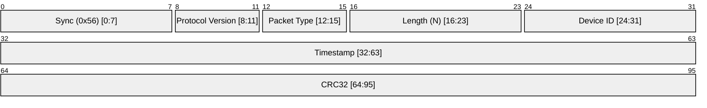

# Heartbeat

Heartbeat is a packet that is sent from the device to the navigator to indicate that the device is alive and well. It is sent at a rate of 1 Hz.

This is a header only packet. It does not have any payload. The length of the payload is 0.

## Packet Structure

## Changelog

|Date|Author|Description|
|----|----|----|
|06/03/2026|Ashutosh Vishwakarma|Initial version|