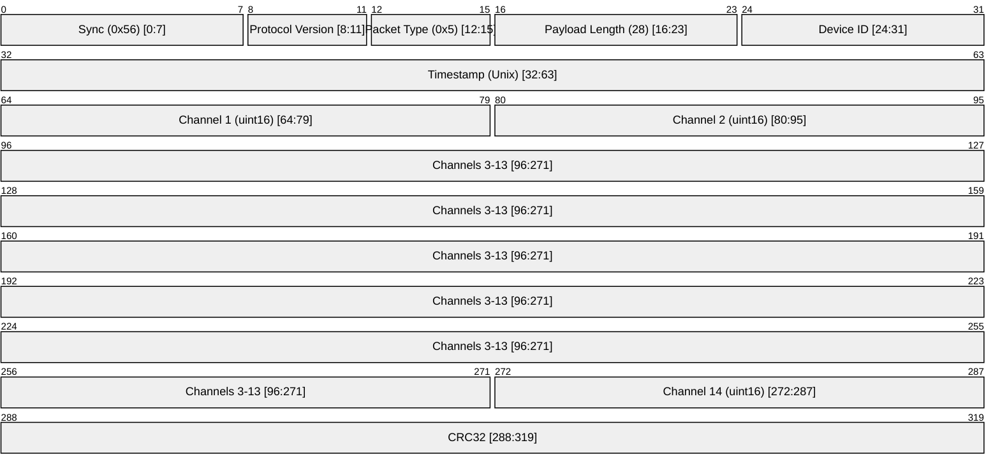

# RC Data

RC Data is a packet that contains the raw values of the Remote Control channels received via iBus. It is sent at 10 Hz.

## Packet Structure (Type 0x5, N=28)

The payload consists of 14 unsigned 16-bit integers representing microsecond (µs) values for each channel.

## Failsafe Detection

If Channel 1 is 0, the receiver is in Failsafe mode or disconnected.

## Changelog

| Date       | Author      | Description     |
| ---------- | ----------- | --------------- |
| 11/03/2026 | Antigravity | Initial version |
