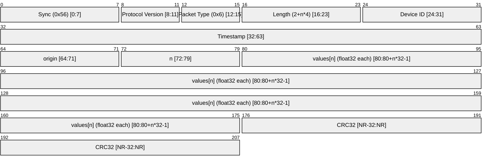

# System Status Packet (`PACKET_TYPE_SYSTEM_STATUS = 0x6`)

Drone → GCS structured event/status packet. Used to report subsystem state — in particular, calibration progress — back to the navigator.

---

## Wire Format



**Note:** If any process want to send any other format for args it has to pad the values[n] with 4 byte alignment. Extra bytes are to be added at the end.

---

## Origins (`system_status_origin_t`)

| ID   | Name                        | Description                         |
| ---- | --------------------------- | ----------------------------------- |
| 0x01 | `SYSTEM_ORIGIN_CALIBRATION` | Calibration routine progress/result |
| 0x02 | `SYSTEM_ORIGIN_HEALTH`      | System health / sensor diagnostics  |
| 0x03 | `SYSTEM_ORIGIN_MOTOR`       | Motor / ESC status                  |

---

## Values Layout by Origin

### `SYSTEM_ORIGIN_CALIBRATION` (0x01)

Emitted at 0%, 25%, 50%, 75%, and 100% during `calibrate_imu_start_gyr` or `calibrate_imu_start_acc`.

| Index | Meaning      | Units      | Notes                              |
| ----- | ------------ | ---------- | ---------------------------------- |
| 0     | progress_pct | %          | 0.0 – 100.0                        |
| 1     | bias_x       | dps / m/s² | Only valid when progress_pct = 100 |
| 2     | bias_y       | dps / m/s² | Only valid when progress_pct = 100 |
| 3     | bias_z       | dps / m/s² | Only valid when progress_pct = 100 |

---

## Wire Example (Gyro calibration, 50% progress)

```
56 61 12 00 00 00 00 00   sync, type=0x6, len=18, dev_id=0, ts=0
01 04                     origin=SYSTEM_ORIGIN_CALIBRATION, n=4
00 00 48 42               50.0f (progress)
00 00 00 00               0.0f
00 00 00 00               0.0f
00 00 00 00               0.0f
XX XX XX XX               CRC32
```
