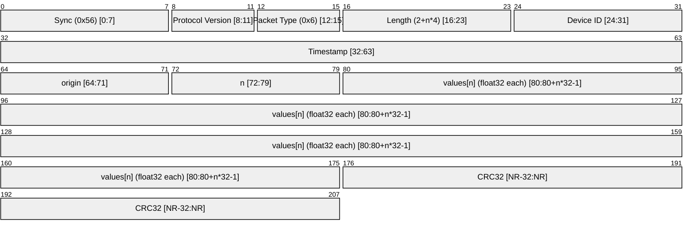

# System Status Packet (`PACKET_TYPE_SYSTEM_STATUS = 0x6`)

Drone → GCS structured event/status packet. Used to report subsystem state — in particular, calibration progress — back to the navigator.

---

## Wire Format

**Note:** If any process want to send any other format for args it has to pad the values[n] with 4 byte alignment. Extra bytes are to be added at the end.

---

## Origins (`system_status_origin_t`)

| ID   | Name                        | Description                         |
| ---- | --------------------------- | ----------------------------------- |
| 0x01 | `SYSTEM_ORIGIN_CALIBRATION` | Calibration routine progress/result |
| 0x02 | `SYSTEM_ORIGIN_HEALTH`      | System health / sensor diagnostics  |
| 0x03 | `SYSTEM_ORIGIN_MOTOR`       | Motor / ESC status                  |
| 0x04 | `SYSTEM_ORIGIN_SYS_STATE`   | Global system state machine status  |

---

## Values Layout by Origin

### `SYSTEM_ORIGIN_CALIBRATION` (0x01)

This packet provides real-time feedback during sensor calibration procedures. It informs the GCS of the current progress or instructs the operator to position the drone in a specific orientation.

#### Payload Format

| Byte | Field         | Type    | Description                                         |
| :--- | :------------ | :------ | :-------------------------------------------------- |
| 0    | `update_type` | `uint8` | Calibration update type (see table below).          |
| 1-4  | `data`        | `float` | Context-specific value (e.g., progress percentage). |

#### Update Types

| Value  | Mnemonic                   | Description                                        |
| :----- | :------------------------- | :------------------------------------------------- |
| `0x00` | `CALIB_UPDATE_PROGRESS`    | Progress update (data = percentage 0.0–100.0).     |
| `0x01` | `CALIB_UPDATE_NOSE_UP`     | Place drone nose up (X axis aligned with +g).      |
| `0x02` | `CALIB_UPDATE_NOSE_DOWN`   | Place drone nose down (X axis aligned with -g).    |
| `0x03` | `CALIB_UPDATE_RIGHT_DOWN`  | Right side down (Y axis aligned with +g).          |
| `0x04` | `CALIB_UPDATE_LEFT_DOWN`   | Left side down (Y axis aligned with -g).           |
| `0x05` | `CALIB_UPDATE_UPRIGHT`     | Upright (Z axis aligned with +g).                  |
| `0x06` | `CALIB_UPDATE_UPSIDE_DOWN` | Upside down (Z axis aligned with -g).              |
| `0x07` | `CALIB_UPDATE_FREE_ROT`    | Rotate freely in all directions (Mag calibration). |

#### Expected Measurement (Developer Reference)

The following table lists the approximate accelerometer readings expected for each pose to help with debugging and validation.

| Pose            | Expected accel (approx) |
| :-------------- | :---------------------- |
| **Nose Up**     | (+g, 0, 0)              |
| **Nose Down**   | (-g, 0, 0)              |
| **Right Down**  | (0, +g, 0)              |
| **Left Down**   | (0, -g, 0)              |
| **Upright**     | (0, 0, +g)              |
| **Upside Down** | (0, 0, -g)              |

---

### `SYSTEM_ORIGIN_SYS_STATE` (0x04)

Emitted whenever the system state machine transitions (e.g. INIT -> STANDBY).

| Index | Meaning   | Units | Notes                               |
| ----- | --------- | ----- | ----------------------------------- |
| 0     | sys_state | enum  | See `state_machine/system_state.md` |
